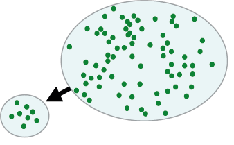
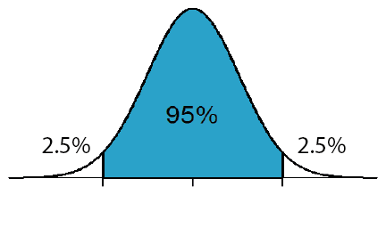
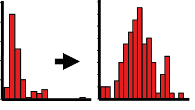

---
output:
  html_notebook: default
  html_document: default
---

```{r,echo=F,warning=FALSE, message=FALSE}
library(ggplot2)
library(dplyr)
library(knitr)
```

A. Introduction to statistical analyses
=======================================
Week 2
------------------------

**Assoc. Prof. Alistair Poore**

This practical provides an introduction to using samples for estimating the properties of populations, the logic of null hypothesis significance testing, and some simple statistical tests. You will also be introduced to using the software package R Studio to access the programming language R.

This practical includes lecture material covered in Week 2 (questions 1-4) and Week 3 (questions 5-8).

At the end of Section A, you should be able to:  
* use descriptive statistics (mean, variance, standard deviation, standard error) to describe populations and samples  
* calculate confidence intervals for a population mean  
* conduct one sample and two sample t-tests  
* transform data to meet assumptions of parametric tests  
* use two sample test by randomisation  
* use the $\chi^2$ statistic to conduct goodness of fit tests and contingency analyses  
* start to become familiar with the user interface in R Studio  


### Getting started in R Studio


R Studio is a nicely designed software package that allows you to run commands in the language R. We will use this throughout the course for data analyses and graphics. You can read a quick explanation of the layout of R Studio, and get links for installing this free software on your home computer on our page for [Installing R and R Studio](http://environmentalcomputing.net/installing-r-r-studio/).

Before we start making graphs and analysing data, we need to have a plan for storing all the work you do in the practical sessions. Follow these steps to ensure that all your data files and R scripts will be saved at the end of each practical.

1. Create a folder in your directory called BEES2041
2. Create a folder within BEES2041 called Introduction_practical
3. Copy all the data files needed for this section of the course from Moodle into that folder. All files are in .csv format.
4. Create an R Studio notebook for the Introductory practical. To do this, open R Studio and create a new notebook from the top menu with File > New File > R Notebook.
5. Save this notebook as Introduction_notebook in the Introduction_practical folder you just created.


R Studio notebooks are files that include:  
* plain text where you can write down the number of the questions, add explanations that will describe to you what any bits of code are doing  
* executable R code. These are put into the notebook file as "chunks" and are easily distinguished from your text explanations  
* the output of any code that you run (analyses, graphics etc.)

There is obviously lots more to learn about how R works, but we can get started straight away and learn that as we go. If you haven't used R before, have a read of our advice for [Getting started with R](http://environmentalcomputing.net/getting-started-with-r/) after the practical.


### Q1) Samples and populations




Understanding the relationship between populations and the samples used to estimate their properties is essential for understanding the logic of statistical tests. We will use data from a population of known properties and examine how well samples of that population can represent the population.

Import the data file 'Population.csv' into R.

While you can do this with the menus, it is best to have a line of code to do this so that you can repeat your work very quickly later on (e.g. if you make a mess of things).

To this create a chunk of code in your notebook (Insert > R at the top right of your notebook file), copy the following line of code into your empty chunk.

```{r} 
Population <- read.csv(file = "Population.csv", header = T)
```

You can execute the code with the little green arrow to the right of the chunk. In this case, `read.csv` is the function that imports a .csv file. The data has been assigned (the <- symbol) to an object in R called Population. This object is a data frame and will now be visible in the Data window on the top right. There are other sorts of objects in R that we will learn as we go along, but we will use data frames throughout the course. These are just like spreadsheets where every column is a variable and every row is an observation.

The Sampling data frame consists of just one column named 'Size' with 200 individual measurements. Imagine these as the sizes of... *[insert your favourite animal, vegetable or mineral]*.


Visualise the size variation in your population by graphing the size variable using a frequency histogram and a box plot.

For graphing in this course, we are going to use the very flexible R package called ggplot2. Create a chunk right up the top of your notebook and insert this code that uses the `library` function to load the package.
by running the following code:

```{r}
library(ggplot2)
```

To get a frequency histogram, we use:

```{r, eval=F}
ggplot(Population, aes(Size)) + geom_histogram()
```

The syntax of `ggplot` is a bit weird to begin with but there are three essential elements:
1. which object holds the data (in this case, Population)  
2. what variable(s) do you want to plot in the `aes()` function (in this case, Size)  
3. what sort of graph do you want, added after the + as a `geom` (in this case, a histogram)  


**Q1a)** What is $\mu$, the mean value of your population?

$$\mu=\sum_{i=1}^{N}\frac{X_{i}}{N}$$


```{r,eval=FALSE}
mean(Population$Size)
```

The $ sign tells R to use the variable Size from the data frame Population.

**Q1b)** What is the variance of your population? 


$$\sigma^2= \sum_{i=1}^{N}\frac{(X_{i}-\mu )^{2}}{N}$$


The built in `var` function gives you the variance of a sample (slightly different formula), so we need to write some code to get the population variance. By doing this, hopefully you will see population variance as a measure of how much individual data points differ, on average, from the population mean.

Create a new chunk which will calculate the population variance according to that formula above, and assign it to an object pop.var.


```{r,eval=F}
pop.var <- mean((Population$Size-mean(Population$Size))^2)
```


Now calculate the standard deviation of your population. This is simply the square root of the variance.

$$\sigma=\sqrt{\sigma^2}$$

```{r,eval=FALSE}
sqrt(pop.var)
```

Note that is it better coding practice to use the object that holds the value of the variance (pop.var) rather than typing in the actual number. The reason for this, is that if you imported another data set with different values, you could then reuse the code to get the new standard deviation.

**Q1c)** What is the standard deviation of your
population?


Now let's **sample** this population. Given that we can very rarely measure all individuals of any population of interest, we are mostly limited to studying small samples from larger populations. Statistics gives us measures of the confidence with which we can use these samples to answer questions about populations. If we could measure everything, we wouldn't need to learn inferential statistics!


To do this we are going to use the package dplyr, which is excellent for all sorts of data manipulation.Again we need to load this package using the `library` function. Add the following code to your chunk that you have already created to load ggplot2 (above).

```{r, warning=FALSE}
library(dplyr)
```


The function `sample_n` will give us a randomly selected subset of rows of chosen size. 

To create a new data frame with just five size measures, use:

```{r}
Sample5 <- sample_n(Population, 5)
```


Repeat this for samples of 10, 20 and 50 individuals. 

```{r}
Sample10 <- sample_n(Population, 10)
Sample20 <- sample_n(Population, 20)
Sample50 <- sample_n(Population, 50)
```

**Q1d)** Calculate the mean, variance and standard deviation for each of these samples. 

$$\bar{x}=\sum_{i=1}^{n}\frac{x_{i}}{n}$$

$$s^2=\sum_{i=1}^{n}\frac{\left (x_{i}-\bar{x}\right)^2}{n-1}$$

$$s=\sqrt{s^2}$$ 

Use the functions `mean`, `var` and `sd` to calculate and enter the mean, variance and standard deviation for each of these samples.

Note that these built-in functions in R (and most other software) for variance and standard deviation are those for samples, not populations.

Note that you will get different answers to your neighbours because each of you has taken different random samples from the population.

```{r, echo = F,eval=F}

mean(Sample5$Size)
sd(Sample5$Size)
var(Sample5$Size)

mean(Sample10$Size)
sd(Sample10$Size)
var(Sample10$Size)

mean(Sample20$Size)
sd(Sample20$Size)
var(Sample20$Size)

mean(Sample50$Size)
sd(Sample50$Size)
var(Sample50$Size)
```


**1e)** How close are the estimates to the population mean and standard deviation? How do they vary with increasing numbers of replicates?


### Q2) Confidence intervals



Assuming a normal distribution, we can use measures from a sample to give a likely range for the population mean (usually unknown).

**2a)** Calculate the 95% confidence intervals for each of the four samples you took from your population in Question 1.

lower: $$\bar{x} - t_{0.05,n-1}SE$$
upper: $$\bar{x} + t_{0.05,n-1}SE$$


where *SE* is the standard error

$$SE=\frac{s}{\sqrt{n}}$$

*n* is the sample size (5, 10, 20 or 50)

*t* is a value from the *t* distribution such that 95% of the values in the distribution fall within the range of  *-t* to *t* (i.e., 2.5% will be larger than the calculated value). Remember that the shape of the *t* distribution varies with sample size so we need to calculated this for each of the four samples, with differing degrees of freedom (n-1). We can find these values with the `qt` function: 
Using these formulae, the lower and upper confidence intervals for the sample of 5 values, will be:

```{r,eval=FALSE}
mean(Sample5$Size) - (qt(0.975, df = 4) * sd(Sample5$Size)/sqrt(5))
mean(Sample5$Size) + (qt(0.975, df = 4) * sd(Sample5$Size)/sqrt(5))
```

Modify that code to get the lower and upper confidence intervals for your larger samples of 10, 20 and 50 values.


```{r, echo = F, eval=FALSE}

mean(Sample10$Size) - (qt(0.975, df = 9) * sd(Sample10$Size)/sqrt(10))
mean(Sample10$Size) + (qt(0.975, df = 9) * sd(Sample10$Size)/sqrt(10))
                    
mean(Sample20$Size) - (qt(0.975, df = 19) * sd(Sample20$Size)/sqrt(20))
mean(Sample20$Size) + (qt(0.975, df = 19) * sd(Sample20$Size)/sqrt(20))

mean(Sample50$Size) - (qt(0.975, df = 49) * sd(Sample50$Size)/sqrt(50))
mean(Sample50$Size) + (qt(0.975, df = 49) * sd(Sample50$Size)/sqrt(50))
```


**Q2b)** What is the effect of increased sampling on our estimate of the population mean? What
is the probability that the actual population mean lies beyond the confidence intervals you
calculated?


### Q3) One sample *t*-test


An environmental scientist has been monitoring stream pH in a forested catchment. Several years of study have yielded normally distributed data with a mean pH of 7.5. Recently, she started sampling a new stream and was unsure of whether it belonged to the well studied catchment or a neighbouring catchment. She took 10 water samples and obtained the following data:

```{r,echo=F}
pH <- data.frame(pH=c(7.9, 7.1, 7.0, 7.2, 7.8, 8.1, 8.0, 7.7, 7.9, 7.5))
kable(pH)
```

We will use a one sample *t*-test to calculate the probability that this sample came from the known population.

**Q3a)** What are the null and alternative hypotheses?


First, make a vector of the data using the combine function `c`:

```{r}
pH <- c(7.9, 7.1, 7.0, 7.2, 7.8, 8.1, 8.0, 7.7, 7.9, 7.5)
```


Calculate the test statistic, *t*. 

$$t = \frac{\bar{x}-\mu}{SE}$$

To do this you will need to calculate the sample mean, know the population mean that you would like to compare this to (read the question again), and calculate the  standard error.


```{r,eval=F}
my.t <- (mean(pH) - 7.5)/(sd(pH)/sqrt(length(pH)))
my.t
```

Calculate the probability associated with your value of the test statistic. Use the `pt` function with your value of t and the degrees of freedom. 

Because this is a two tailed test (you hypothesised that your sample mean was different to the population mean (i.e., larger *or* smaller), we need to multiply the calculated probability by 2. The `lower.tail` = FALSE ensures that you are calculating the probability of getting a *t* value larger than yours (i.e., the upper tail, P[X > x]).

```{r,eval=FALSE}
pt(my.t, df = 9, lower.tail = FALSE)*2
```

Most statistical packages give you the test statistic and its associated probability in one output. Repeat the above test using the `t.test` function

```{r,eval=F}
t.test(pH, alternative = "two.sided", mu = 7.5)
```
 

**Q3b)** What are the values of *t* and *P*?

	
Interpret the probability and draw conclusions.

**Q3c)** Was the null hypothesis rejected? Is the new stream likely to belong to the known catchment?


More help with one sample *t*-tests on the Environmental Computing site [here](http://environmentalcomputing.net/one-sample-t-test/).


### Q4) Independent samples *t*-test


An agricultural scientist was interested in testing the effects of a new fertiliser on the growth of corn. Twenty plants in individual pots were brought into a greenhouse. Half were allocated to the fertiliser treatment, with the remaining half receiving the same conditions without any additional fertiliser.

**Q4a)** How should the plants be allocated to treatments and positions within the greenhouse?


After two months, a single head of corn was harvested from each of the plants and weighed. The resulting data (mass in grams) are in the data file 'Corn.csv'. Read these data into R.

```{r,eval=F} 
Corn <- read.csv(file = "Corn.csv", header = T)
```

View this object to understand the structure the data set.

```{r,eval=F} 
View(Corn)
```

Note the way that we have set up the data set: one column for the independent variable 'Treatment' (which is categorical with two levels, fertiliser and control) and one column for the dependent variable 'Mass' (which is continuous). Each replicate measure is on a separate row. Try and get into the habit of always entering data this way and you will save much time later on.

**Q4b)** If we are contrasting mass between the control and fertilised treatments, what are the null and alternative hypotheses? Are you testing a one-tailed or two-tailed hypothesis?


Visualise the data in R. Use a graph that will contrast both the central tendency and the variation in your dependent variables across levels of the independent variable. A box plot does this effectively.

```{r,eval==F}
ggplot(Corn, aes(Treatment, Mass)) + geom_boxplot()
```

Note the ggplot syntax here. Like above we specify the data set (in this case Corn), the variables to be plotted in `aes()` (in this case, Treatment as X, Mass as Y) and the type of plot (boxplot).


**Q4c)** Calculate the test statistic, *t*. 

The `t.test` function can be used again to run the independent samples *t*-test. To contrast mass in the two treatments, we would use

```{r,eval=F}
t.test(Mass~Treatment, data = Corn, alternative = "two.sided", var.equal = TRUE)
```

The `Mass~Treatment` part is a model formula, with the dependent (Y) variable on the left of the ~ and the independent (X) variable on the right. You will see these again in later weeks.

The output gives you the two sample means, the *t* value, the degrees of freedom, the P value and a confidence interval for the difference between the means. If this confidence interval overlaps zero, then there is little support for a difference. The two arguments specify a two-sided test and one that assumes equal variances.

Interpret the probability and draw conclusions.

**4d)** Was the null hypothesis rejected? Did the fertiliser affect corn growth?


More help with independent sample *t*-tests on the Environmental Computing site [here](http://environmentalcomputing.net/independent-samples-t-test/).


### Q5) Paired samples *t*-test


A soil scientist was successful in obtaining a research grant and was able to afford a shiny new machine for measuring nitrogen in her samples (a good predictor of soil fertility). To allow comparisons with her previous work, she contrasted nitrogen concentrations from the new machine with those obtained from an older machine she had been using. 10 soil samples were used. Each of the samples was measured twice, once with the new machine and once with the old. She obtained the following data ($\mu$ g N.g^-1^ of soil):

```{r, echo = FALSE}

SoilN <- data.frame(Sample = c(rep(1:10),rep(1:10)), Machine = c(rep("New", 10),rep("Old",10)),
Nitrogen = c(101,123,98,87,110,135,140,148,112,65,104,125,99,86,109,138,140,147,116,66))

kable(SoilN, align="c")
```

**Q5a)** Why is the data paired? How many soil samples would be required if you wanted to conduct an independent samples *t* -test to test whether the two machines differed?


For a paired *t*-test, *t* is:

$$t = \frac{\bar{d}-0}{SE_{d}}$$

Obviously the zero goes away, but we have shown it here to illustrate how this is really just another version of the one sample *t*- test you ran in question 3. You are comparing a sample of differences to an expected value of zero.

Calculate the differences between each pair of samples (i.e., new-old for each sample).

Create two vectors in R that hold the new and old data, and then one to hold the differences between each pair.

```{r}
new <- c(101,123,98,87,110,135,140,148,112,65)
old <- c(104,125,99,86,109,138,140,147,116,66)

pair.diff <- new - old
```

Calculate the mean of the differences and the standard error of the differences.

```{r}
diff.mean <- mean(pair.diff)
diff.se <- (sd(pair.diff))/sqrt(10)
```

Calculate the test statistic, *t*.

```{r}
soil.t <- diff.mean/diff.se
```

```{r,echo=F,eval=F}
diff.mean
diff.se
soil.t
```

**Q5b)** What is your value of *t*?

Calculate the probability associated with your value of the test statistic (as in Q4c) above, df = number of differences - 1.

```{r}
pt(soil.t, df = 9, lower.tail = FALSE)*2
```

What is your value of P?

Check your results using the `t.test()` function, with `paired = TRUE`.

```{r,eval=F}
SoilN <- read.csv(file = "SoilN.csv", header = T)
t.test(Nitrogen~Machine, data = SoilN, paired = TRUE)
```


**Q5c)** Interpret the probability and draw conclusions. Was the null hypothesis rejected? Did she waste her research funds?

	
More help with paired *t*-tests on the Environmental Computing site [here](http://environmentalcomputing.net/paired-t-tests/).	
	
	
	
	
### Q6) Transformations



Data often need transforming to new scales to meet the assumptions of normality and homogeneity of variance that are required by parametric tests (*t*-tests, analyses of variance etc.).

A physiologist was interested in how lizards coped with low temperatures in the alpine zone. He compared the temperature of 20 microhabitats in which lizards were recorded to 20 sites chosen at random within the habitat. The resultant temperature data are in the file 'Lizard_distribution.csv'.

```{r} 
Lizard_distribution <- read.csv(file = "Lizard_distribution.csv", header = T)
```

Use a frequency histogram to check whether the data are normally distributed.

```{r, eval=F}
ggplot(Lizard_distribution, aes(Temperature)) + geom_histogram()
```


Use a box plot to check whether the variance is similar in the two samples:

```{r, eval=F}
ggplot(Lizard_distribution, aes(Lizard,Temperature)) + geom_boxplot()
```

**Q6a)** Why do the data need transforming? What would happen to your tests if you chose not to?


Transform the temperature data with a square root transformation. Here we will use the function `mutate` from the package dplyr to make a new variable (more help on [creating new variables](http://environmentalcomputing.net/making-new-variables/)).


```{r}
Lizard_distribution <- mutate(Lizard_distribution, sqrtTemp = sqrt(Temperature))
```

This adds another column called sqrtTemp to the data set, with all values being the square root of the original temperature values.

Similarly, we can make a new variable with a logarithm transformation.

```{r}
Lizard_distribution <- mutate(Lizard_distribution, logTemp = log(Temperature))
```

Note that if you had any values of zero or less, you need to add some amount to your variable when you transform (i.e., the transformation becomes log(X+c), where c is a constant such that X+c is always positive.

Now recheck the assumptions for the transformed variables to see if you made things better or worse. As above, use frequency histograms to test the assumption of normality and box plots to test the assumption that the variation is similar between treatments.


```{r, echo = F,eval=F}
ggplot(Lizard_distribution, aes(sqrtTemp)) + geom_histogram()
ggplot(Lizard_distribution, aes(logTemp)) + geom_histogram()

ggplot(Lizard_distribution, aes(Lizard,sqrtTemp)) + geom_boxplot()
ggplot(Lizard_distribution, aes(Lizard,logTemp)) + geom_boxplot()
```

**Q6b)** Which transformation would you recommend? Why?


Now you can run an independent samples *t* test on the transformed variables.

```{r, echo = F, eval=F}
t.test(logTemp ~  Lizard, data = Lizard_distribution, alternative = "two.sided", var.equal = TRUE)
t.test(sqrtTemp ~  Lizard, data = Lizard_distribution, alternative = "two.sided", var.equal = TRUE)
```

**Q6c)** State the null and alternative hypotheses, *t* value and P value for the test you chose.


### Q7) Goodness of fit tests


A behavioural ecologist was studying Gouldian Finches. They occur in three colour morphs with yellow, red and black faces. The black faced morph is common (70% of individuals in the wild), the red morph (moderately common, 29%) and the yellow morph rare (1%). As the finches are an endangered species, she used individuals sourced from captive populations in her experiments and needed to test whether the colour morphs were in similar proportions as the field populations. Her captive population had 150 birds: 96 black, 49 red, and 5 yellow faced.

**Q7a)** What are the expected numbers of each colour morph in her captive population if they were in the same proportions as the wild population?


Using a calculator, test whether the captive population differed from the wild one using a $\chi^2$ goodness of fit test.

$$\chi^2 = \sum_{i=1}^{k} \frac{(O_{i}-E_{i})^2}{E_{i}}$$

where *O* and *E* are the observed and expected numbers in each of the categories from 1 to k.

**Q7b)** What is your value of $\chi^2$?

Calculate the probability associated with your value of the test statistic. Use the `pchisq()` function:  `pchisq(x, df,lower.tail = FALSE)` with x = your value of $\chi^2$, and df = number of groups-1. The lower.tail = FALSE bit gives you the probability that $\chi^2$ is greater than your value.

You can also get all of these in one go with the `chisq.test()` function 

```{r, eval = F}
chisq.test(x = c(96,49,5), p = c(0.7,0.29,0.01)) #ignore the warning message
```

where *x* is the observed range of numbers and *p* has the expected probabilities (note, not the expected numbers).

Interpret the probability.

**Q7c)** Do the captive-bred birds have colour morphs in similar proportions to the wild populations? If not, which colours are over or under represented in the captive sample.


The researcher was also concerned about possible sex biases in her experiments. The red birds included 30 males and 19 females.

**Q7d)** Does the sex ratio in the red birds differ from an expected equal number of males and females? How many males would need to be in the sample of 49 birds to obtain a significant $\chi^2$ test?


More help with paired *t*-tests on the Environmental Computing site [here](http://environmentalcomputing.net/goodness-of-fit-tests/)


### Q8) Contingency tables


A council worker was monitoring water quality adjacent to stormwater drains in Sydney Harbour. Each of three drains was monitored each month and records kept on how often the bacterial contamination was above or below accepted limits. The monitoring program resulted in the following data for two years:


```{r,echo = FALSE}
Stormwater <- data.frame(AboveBelow = c("Above","Below"), EdwardsBeach = c(12,12), BalmoralBeach = c(14,10),SharkBay = c(21,13))
kable(Stormwater, align="c")
```

**Q8a)** Why is this data categorical? How could hypotheses about levels of contamination be tested with continuous data?


Calculate the expected values for the number of surveys in each of the combinations of categories under the null hypothesis that two categorical variables (site and test result) have no association. The expected values can be calculated from the row and column totals, where:

$$E_{i,j} = \frac{C_{j}R_{i}}{N}$$

**Q8b)** Enter the expected values in the table provided.


Using a calculator, calculate the test statistic, $\chi^2$  and the probability associated with this test statistic. Use the formula above with df = (number of rows-1) x (number of columns-1).


**Q8c)** What is your value of $\chi^2$?


Again, we can use the `chisq.test` function to check your results.

First, make a matrix with the observed values and view the object just to check it is formatted correctly.

```{r}
drain <- matrix(c(12,12,14,10,21,3), nrow=2)

drain
```

Second, we run the `chisq.test` function on this matrix

```{r,eval=F}
chisq.test(drain, correct=F)
```


Interpret the probability.

**8d)** Was the null hypothesis rejected? Write a sentence that explains the result in plain language.

	

More help with paired *t*-tests on the Environmental Computing site [here](http://environmentalcomputing.net/contingency-tables/).
