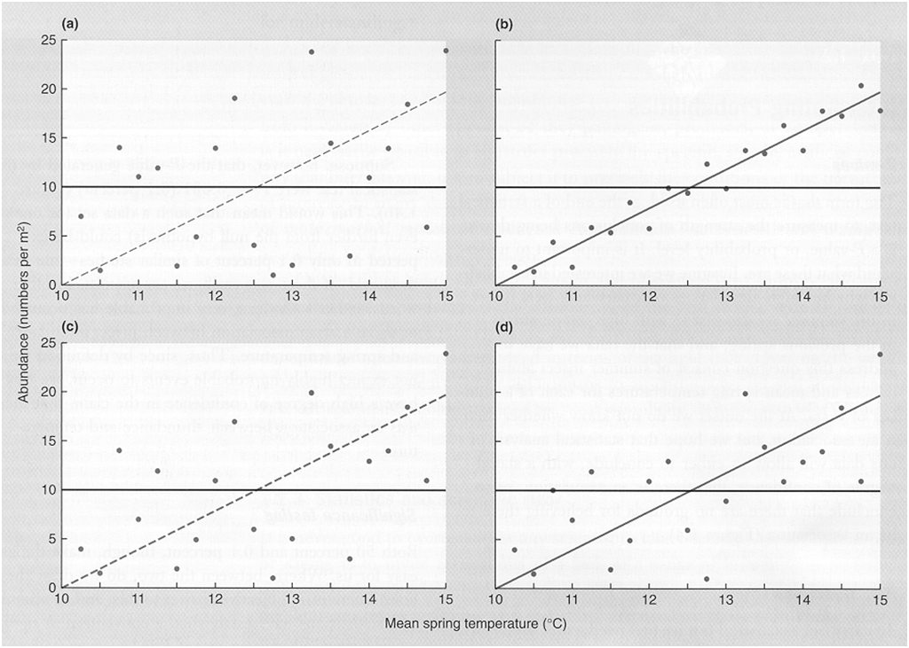

```{r}
library(knitr)
library(ggplot2)
library(dplyr)
```

This week's practical is intended to familiarise you with the most simple linear model to test for data trends, the 'regression' model, where one examines the effect of a continuous predictor variable (X) on the response variable of interest (Y). The model takes the form $Y = a + bX$, where a is the intercept (value of Y when X=0) and b is the slope (amount of change in Y for each unit of X). In the latter parts of the practical we will explore ways to determine if we have fitted valid models to the data, and whether important assumptions have been met in order for the fitted parameter values, and p-values to be valid.

Recommended reading:

* McKillup 2012. Chapters 16-17, or
* McKillup and Dyar 2010. 15-16


Before you start: 

1. Create a folder within your BEES2041 directory called Linear_models
2. Copy all the data files needed for this section of the course from Moodle into that folder. All files are in .csv format.
3. Create an new R Studio notebook for Section B of the course (this and the next two practicals on linear models). To do this, open R Studio and create a new notebook from the top menu with File > New File > R Notebook.
4. Save this notebook as Linear_models_notebook in the Linear_models folder you just created.


### 1) Size of pest populations vs. temperature




The figure above shows four hypothetical data sets on the relationship between the population size of an insect pest in summer and the mean temperature (Temp) in the previous spring (Townsend CR, Harper & Begon (2000) *Essentials of Ecology*, Blackwell, p. 14).

The horizontal line represents the null hypothesis that there is no association between population and temperature, and thus the best estimate of expected insect population, irrespective of spring temperature - this is the mean insect abundance overall, and could be calculated as the familiar arithmetic mean.

The second line is the line of best fit to the data (the 'regression' line), which in each case offers some suggestion that abundance rises as temperature rises. However, whether we can be confident in concluding that population does rise with temperature depends on statistical tests applied to the data sets. The statistical test asks the question, does the regression explain significantly more of the variation in the data than the null model?. Note that in each graph, the intercept and slope are the same, but it is the variation about the line that differs. Look at the data sets illustrated in figures (a), (b), (c) and (d).

**1a)** Which of these four data sets looks like the strongest relationship? In other words, which appears most likely to be significant, and therefore real?


**1b)** Which looks like the weakest relationship?


Now rank the 4 data sets by eye from weakest to strongest

Now you will analyse the four data sets using linear regression within R. To do so, read the data "InsectPopTemp.csv" into R.

```{r}
Bug.pop <- read.csv(file = "InsectPopTemp.csv", header = TRUE)  
```

In that data frame you will see columns of data for population size and temperature, with separate columns for each population (i.e. 'Popna', 'Popnb', 'Tempa', 'Tempb' etc).

To test whether temp has an effect on pest population size, we will fit the linear model $Popn = a + b(Temp)$. As discussed in the lecture, we will essentially ask whether this model explains more variation in the data than does a 'null' model where Popn does not vary with temp, i.e. is constant (Popn = a). 

To do so, use the `lm` function in R. You need to correctly specify your response (Y) and predictor variable (X). For population A:

```{r}
popA.lm <- lm(Popna ~ Tempa, data = Bug.pop)
```

This creates an object, `popA.lm` in R that holds the results from the analysis. You now use the `summary' function to inspect the output.

```{r,eval=F}
summary(popA.lm)
```

**1c)** Run regressions for each data set to complete the table below. 

Most of the needed information can be found in the output from `summary`, however to calculate the 'Residual sum of squares' (sum of the squared difference of each actual score from the predicted score) you'll need to call:

```{r}
sum(summary(popA.lm)$residuals^2)
```

To calculate the 'Regression sum of squares' (the square of the difference of each predicted value from the overall mean), use:

```{r}
sum((predict(popA.lm) - mean(Bug.pop$Popna))^2) 
```

Total sum of squares = Residual sum of squares + Regression sum of squares

```{r, echo=F, eval = FALSE}

kable(data.frame("Terms" = c("Fitted eqn: Popn = a + b*Temp",
                               "Regression Sum of Squares",
                               "F-value",
                               "Is the relationship significant?",
                               "If so, what is level of significance",
                               "R2 value",
                               "Estimated value of slope (also known as 'regression coefficient')",
                               "Standard error in regression coefficient",
                               "t-value for regression coefficient",
                               "Significance level (i.e. p value)"), "PopA_answers" = c("Popn = 1.758*Temp - 13.946",
                  904.3402,
                  128.3835,
                  2.555,
                  "No",
                  0.1243,
                  1.758,
                  1.099,
                  1.599,
                  0.127)))

```

**1d)** If the *t*-value for the regression coefficient is significant, what does this tell us?

Another way to consider whether the slope is significantly different to zero or not is to calculate the 95% confidence intervals for the slope parameter. This is easy in R, just use the `confint` function. For example, the confidence intervals for the slope and intercept of the regression for population a:

```{r}
confint(popA.lm)
```


**1e)** In which population is most of the variation in population abundance explained by temperature? 

	
	
**1f)** Did you notice how R^2 value and P-value seem to be related? Can you explain this intuitive pattern?


  
### 2) Freestyle swimming records


Over the last century, the winning times in Olympic Games swimming competitions have improved greatly. Below are the winning times (in seconds) for the Women's 100 metres freestyle event between 1912 and 2016 (data from [here](https://www.olympic.org/swimming/100m-freestyle-women).)


```{r,echo=F}
Swim.records <- read.csv(file = "Swim.records.csv", header = TRUE)
kable(Swim.records)
```

Read these data into R and produce a scatter plot of Winning time versus Year. Remember that the first step of any analysis is to plot the data (do not print this graph).

```{r,eval=F}
Swim.records <- read.csv(file = "Swim.records.csv", header = TRUE)

library(ggplot2)
ggplot(Swim.records, aes(Year,Time)) + geom_point()
```


A bit misleading with the Y axis not at zero, so let's set upper and lower limits to the ggplot (with `+ ylim`).

```{r,eval=F}
ggplot(Swim.records, aes(Year,Time)) + geom_point() + ylim(c(0,85))
```


To find the equation for the regression line:

```{r}
swim.lm <- lm(Time~Year, data = Swim.records)
summary(swim.lm)
```

You can plot this line of best fit on the scatter plot by adding a linear smoother to the ggplot (with `+ geom_smooth(method="lm")`.

```{r,eval=F}
ggplot(Swim.records, aes(Year,Time)) + geom_point() + ylim(c(0,85)) + geom_smooth(method="lm")
```


**2a)** Write down the equation fitted that describes the linear trend between Winning Time (response variable) and Year (predictor variable)

Winning Time = ....... + ....... X Year

Examine the fit of this equation to the data. Does it look as if this equation fits the data well?   
	
**2b)** Explain the equation in your own words (hint: interpret the slope and what this value tells us):
	

**2c)** Use that model and your calculator to predict what the winning time will be at the 2020 Olympics.


We can interrogate the model objects in R to do this directly for us:

```{r,eval=F}
predict(swim.lm,list(Year=2020))
```


**2d)** What is the F-value calculated from your regression analysis? (use the `summary()` function to find the F-value as you did in Q1)

**2e)** What is the P value associated with that F-value? Is there any chance that swimmers are not getting any better?


In the next lecture, we will discuss this statistical model more, its validity, whether any assumptions are violated, and whether it is useful as a predictive tool to forecast future winning times. Have a think about these questions now, so you can participate in discussion during the lecture.


	
### 3) Life expectancy vs. infant mortality rate

The data file 'UNpopstats.csv' contains human population data from 208 countries. The file contains the following columns of data: country, infant mortality (per thousand), life expectancy at birth, percentage adult illiteracy, percentage of population that is under 15 yrs age, and gender (where females=0 and males=1). Read these data into R.


```{r}
UN.pop <- read.csv(file = "Unpopstats.csv", header = TRUE)
```


Graphs of life expectancy of men and women versus infant mortality rate, shown below, indicate that Life Expectancy is reduced in countries with high infant mortality. 


```{r, warning = FALSE, fig.width = 10}
library(ggplot2)
UN.pop = read.csv(file = "UNpopstats.csv", header = TRUE)  
ggplot(UN.pop, aes(y = LifeExp, x = InfMort)) + geom_point(aes(colour = as.factor(Gender))) + 
  ylab("Life expectancy at birth (yrs)") + xlab("Infant mortality rate") +
  geom_smooth(size = 0.5, method = "lm", alpha = 0.3, colour = "black", aes(group = Gender)) +
  theme(legend.title=element_blank()) + 
  scale_colour_discrete(name="Gender", breaks=c(1, 0), labels=c("Male","Female"))
```


**3a)** Run a separate regression analyses, one for females and one for males. To do these separate analyses by sex you'll need to subset the data. We can use the `filter` function from dplyr to subset rows (more help with subsetting [here](http://environmentalcomputing.net/subsetting-data/)).

```{r}
library(dplyr)
UN.pop.female <- filter(UN.pop, Gender == "female")
UN.pop.male <- filter(UN.pop, Gender == "male")
```

For each analysis, complete the following table:

```{r, echo = FALSE, results = 'asis'}
library(xtable)
sex.mat = matrix(nrow = 4, ncol = 2)
rownames(sex.mat) = c("Fitted eqn: Life Expect = a + b * Infant Mortality","Is the relationship significant?","If so, what is the level of significance","R2 value")
colnames(sex.mat) = c("Females", "Males")
print(xtable(sex.mat, align = "p{6cm}p{4cm}p{4cm}"), comment = FALSE, hline.after = c(0:4), type = format) 
```

Life expectancy differs between men and women, but how do we know if this difference is 'real', that is, significantly different? In later lectures and labs we'll show you how to test whether a relationship differs between two or more groups, using ANCOVA (Analysis of Covariance). 


The following exercises have an emphasis on examining residuals to test assumptions of regression and understand patterns of variation in linear relationships. In particular, we are most concerned about the assumption of linearity (no point fitting a line to data that are curved!), homogeneity of variance (even spread of data around regression line and residual plot), and normality of residuals (non-linearity, and outliers violate this assumption).


### 4) Boiling point of water vs. air pressure


In the 1840's, the Scottish physicist Dr James Forbes travelled to the Swiss Alps and made many measurements of how the boiling point of water varied with air pressure (which decreases with altitude). In his paper, Forbes also presented data collected on the measures of the same two quantities by [Dr Joseph Hooker](http://en.wikipedia.org/wiki/Joseph_Dalton_Hooker), famous botanist, explorer and friend of Charles Darwin. Unlike Forbes, however, Hooker took his measurements in the Himalayan Mountains, generally at higher altitudes.

The data we will explore here are a subset of Hooker's data giving n = 31 pairs of measurements on Temp = boiling point (degrees Fahrenheit) and Press = corrected barometric pressure (inches of mercury). Read the data into R.

```{r}
Hooker <- read.csv(file = "Hooker.csv", header = TRUE)
```

Use R to:
* create a scatter plot of Temp versus Press
* conduct the regression analysis Temp = a + b*Press.
* examine the plot of residuals versus fitted values from the regression 

In R, using the `plot()` function on a model object provides a series of graphical model diagnostics, including a graph of residuals versus fitted values, i.e.:

```{r, eval = FALSE}
plot(mymodel)
```

```{r, echo = F}
Hooker <- read.csv(file = "Hooker.csv", header = TRUE)
ggplot(Hooker, aes(Pressure,Temperature)) + geom_point()

Hooker.lm <- lm(Temperature ~ Pressure, data = Hooker)
plot(Hooker.lm)
```

**4a)** Discuss whether there is evidence of outliers, non-linearity or non-constant error variance.


Identify any outliers and delete them from further analysis. If you do delete any outliers, you will need to re-do the regression analysis before plotting residuals. One of the easiest ways to delete rows or columns in R is to make a new data frame using negative indexing. In dplyr, the function slice gives us a subset of rows by row number. Placing a minus sign in front of that number will give us all rows except that one listed. To remove row 7, we would use:

```{r}
Hooker_no.outliers <- slice(Hooker, -7)
```

Now work with the original data set, Hooker.csv, leaving the outliers in for now and examine what happens when you transform the data. Log-transform the values of Temp by creating a new column in the data frame with the function `mutate`. 

```{r}
Hooker <- mutate(Hooker, logTemp = log10(Temperature))
```

Do the same for pressure and then check the data frame to make sure you have the new transformed data columns.

Now, fit a linear regression model to log(Temp) versus log(Press) and examine the graph of Temp versus log(Press).

**4b)** Write down the fitted equation: log (Temp)  = ..............  + ............ x log(Pres).

What is the F-value?
What is the P value?
  
  
**4c)** Examine the residual plot `plot(mymodel)` and discuss how it differs from that obtained in (a). What do you conclude from the residual plot fitted to the log-transformed data?   
  

### 5) Growth rates vs. individual size


The file 'GrowthRate.csv' contains data on the relationship between individual growth rate of a wide range of organisms and average individual weight. The data set considers species whose size varies over 14 orders of magnitude from approx. 10^-9 to 10^6 g. You will consider whether a single regression can describe the relationship.

Use R to produce a scatter plot of Growth rate versus Body weight. (Do not print your graph.)

```{r, echo = F}
Growth <- read.csv(file = "GrowthRate.csv", header = TRUE)
ggplot(Growth, aes(BodyWt,GrowthRate)) + geom_point()
```

**5a)** What is the equation for the linear model you are considering here?

```{r, echo = F}
growth.lm <- lm(GrowthRate ~ BodyWt, data = Growth)
summary(growth.lm)
```


**5b)** Comment on any problem you see in fitting this linear model to these data.
```{r, echo = F}
plot(growth.lm)
```


**5c)** Transformations of the predictor (X) often fix problems of non-linearity - choose the correct transform for this type of data, and transform X. To create a new column of transformed data, follow the code for Q4. In addition to a log transform (`log10()`) You might like to try a square root transformation (`sqrt()`). 

Re-plot the graph using this new variable. Can we now fit a linear model to the data?


**5d)** Now try transforming the response (Growth rate) as well, and re-graph the residuals versus fitted values - how is the fit now?


**5e)** Rewrite your model as a non-linear equation relating growth rate to body weight. (Hint: see the lecture notes for examples of equivalent non-linear and linear relationships.)


	
### 6) Brain weight vs. body size	


The data file 'Brain.csv' contains data on average brain weight for 62 species of mammals. The file presents body weight (kg) and brain weight (g) for each species. 

We wish to consider the problem of modelling brain weight as a function of body weight. Use R to draw a scatter plot of Brain weight versus Body weight. (Do not print your graph.) Comment on any problem you see in fitting a linear model to these data.

```{r, echo = F}
Brain = read.csv(file = "Brain.csv", header = TRUE)
plot(BrainWt ~ BodyWt, data = Brain)

```

Find transformations of one or both variables so that on the transformed scale the regression is linear. Fit an appropriate linear regression model to the transformed data.

**6a)** What is the equation of your linear model fitted to the transformed data?


Rewrite your model as a non-linear equation relating brain weight to body weight. (Hint: see lecture notes for examples of equivalent non-linear and linear relationships.)

**6b)** Examine the graph of residuals from your model versus fitted values. (You do not need to print this graph.) Comment on your residual plot. 


**6c)** Humans are considered to be a big brained species. Is there evidence from the analysis to suggest that humans are an unusual species relative to the others? Could we consider it as an 'outlier'?
  	
	
	
Q27 - Amphipod fecundity example

```{r}
Amphipod.fecundity <- read.csv(file = "Amphipod_fecundity.csv", header = T)
```

```{r}
ggplot(Amphipod.fecundity, aes(Length, Eggs)) + geom_point()
```

	
```{r}
amph.lm <- lm(Eggs ~ Length, data = Amphipod.fecundity)
plot(amph.lm)
```

```{r}
summary(amph.lm)
```

