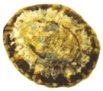

```{r}
library(knitr)
library(ggplot2)
library(dplyr)
```

Analysis of variance (ANOVA) is one of the most frequently used techniques in the biological and environmental sciences. As discussed in the preceding lecture, this analysis is based on the linear model that we first introduced for continuous predictors, but now we can use them for categorical predictors. We will be doing two main things in the lab today:

1. Calculating an ANOVA on the effects of incubation temperature on turtle egg hatching times by hand using a calculator.
2. Calculating a single factor ANOVA on the Maroubra data testing for differences in the abundance of a given species across zones.

Before you start, download the data files into your Linear_models folder and open your notebook from the last practical.

Recommended reading:

* McKillup 2012. Chapters 11, 12, and 14, or
* McKillup and Dyar 2010. 10, 11 and 13


### 7) Turtle hatching times vs. temperature


The data in the table below is an example dataset of days to hatching of individual turtle eggs incubated at different temperatures. It is well known that the temperature of egg incubation influences metabolism and growth rates of turtles in the egg, and that in the wild turtle nests vary markedly in temperature yet most eggs hatch synchronously. The purpose of this experiment was to determine if incubation temperature alone influences when animals hatch. Eggs came from four different females, with eggs randomly allocated to incubation treatments.

The data were collected from measuring the time (in days) from laying to hatching. 

Factor = Incubation Temperature: Groups *a* = 4: Sample size *n* = 10: Total Sample Size *an* = 40. Data are days until hatching.

**7a)** Fill in the missing parts of the table. Values for $25^{\circ}C$ and $30^{\circ}C$ have been done for you.


```{r,echo=FALSE}
options(knitr.kable.NA = '')
Fifteen <- c(37,43,45,54,56,65,62,73,74,75,NA,10,NA,43.1,NA)
Twenty <- c(30,31,34,35,35,47,53,54,63,64,NA,10,NA,"-","-")
TwentyFive <- c(21,23,48,52,52,54,54,61,62,65,49.2,10,2097,"-","-")
Thirty <- c(13,16,19,11,12,18,21,23,29,39,20.1,10,666.9,"-","-")
Eq <- c(NA,NA,NA,NA,NA,NA,NA,NA,NA,NA,"$\\bar{X}_{i}$","$n_{i}$","$\\sum(X_{ij}-\\bar{X}_{i})^{2}$","$\\bar{X}_{overall}$","$\\sum(\\bar{X}_{i}-\\bar{X}_{overall})^{2}$")

Turtles <- data.frame(Equation = Eq, Temp15 = Fifteen, Temp20 = Twenty, Temp25 = TwentyFive, Temp30 = Thirty)

kable(Turtles, align = c("c"), col.names = c("Temperature", "$15^{\\circ}C$", "$20^{\\circ}C$", "$25^{\\circ}C$", "$30^{\\circ}C$"))

```


**Step 1: Calculate the ANOVA**

**7b)** Fill out the ANOVA table below. You should note also that this ANOVA table has exactly the same structure as the output table we've seen for a simple linear regression with a single continuous predictor. 


```{r,echo=FALSE}
Source <- c("Among groups (model)","Within groups (residual)","Total")
SSFormulae <- c("$n\\sum(\\bar{X}_{i}-\\bar{X}_{overall})^{2}$", "$\\sum\\sum(X_{ij}-\\bar{X}_{i})^{2}$", "$\\sum\\sum(X_{ij}-\\bar{X}_{overall})^{2}$")

ANOVA_table1 <- data.frame("Source  of variation" = Source, "Formulae" = SSFormulae)

kable(ANOVA_table1, colnames = c("Source_of_variation", "SS formula"))
      

ANOVA_table2 <- data.frame("Source  of variation" = Source, SS = c(NA, NA, NA), MS = c(NA,NA,NA), F = c(NA, NA, NA), P = c(NA, NA, NA))
      
kable(ANOVA_table2)
      
```

To determine if P - the probability of obtaining your F ratio if the null hypothesis is true  - is less than or greater than 0.05, use the function `pf(q, df1, df2, lower.tail = FALSE)` where q is your value of F, df1 is the degrees of freedom for the numerator (i.e. the number of levels of your factor - 1) and df 2 is the degrees of freedom for the denominator (i.e., the residual degrees of freedom = a(n-1)).


**Step 2: Are the assumptions valid?**

We now need to see if our statistical model is valid by checking the assumption of homogeneity of variance (namely that the residuals are homogeneous, i.e., approximately equal), and normally distributed (even distribution of data about the mean, no wonky outliers).

We advocate a qualitative evaluation of the assumptions, rather than a formal test such as Cochran's test. For example, if one group's variance is more than twice that of another, then we may have a problem, a problem that may be helped by transforming the data. Otherwise, linear models in general are quite 'robust' for violating this assumption, within reason, as suggested above.

These assumptions can be checked graphically in R in just the same way as you did for linear regression last week. First we need to read the data into R and tell R that the temperature variable is a factor (not a numerical, continuous variable): 

```{r}
Turtles <- read.csv(file = "Turtles.csv", header = TRUE)

Turtles$Temperature <- factor(Turtles$Temperature)
```

We can then run a one-way ANOVA contrasting the time to hatching among our four temperatures. We will use the R function `aov`, but you can also use `lm` like you did last week.

```{r}
Turtles.ANOVA <- aov(Days ~ Temperature, data = Turtles)
```

This creates an object in R, 'Turtles.ANOVA' that we can use to check the assumptions of the analysis. 
The assumption of normality can be checked by a frequency histogram of the residuals.

```{r,eval=FALSE}
hist(Turtles.ANOVA$residuals)
```

The assumption of homogeneity of variance can be checked with a scatterplot of residuals vs. expected values (the first of the four plots provided):

```{r,eval=FALSE}
plot(Turtles.ANOVA)
```

Note that there are only four values on the fitted axis - these are the means of the four temperatures.

**7c)** Do these data meet the assumptions of normality and homogeneity of variance? Do you need to transform the days to hatching variable?


**Step 3: Conduct post-hoc tests**

If you detect any significant differences in the ANOVA, we are then interested in knowing exactly which groups differ from one another, and which do not. Remember that a significant P value in the test you just ran would reject the null hypothesis that hatching times were the same across all four temperatures, but not identify which were different from each other.

You can obviously get a sense of this by graphing the data, but a formal test is needed to state which treatments are different from each other, if any.

```{r, eval=FALSE}
ggplot(Turtles, aes(Temperature, Days)) + geom_boxplot()
```


To see which treatments differ, we will use a Tukey's test, Consult the lecture notes for further information about how to calculate Tukey's HSD.

$$q_{\alpha,v,k} = \frac{\bar{x}_{1}-\bar{x}_{2}}{SE_{anova}}$$


The standard error (SE) of the ANOVA can be calculated using: $SE = \sqrt{\frac{MS_{res}}{n}}$

The critical values of *q* for an "experiment wise" error rate of 0.05 can be obtained by the function `qtukey(0.95, nmeans, df)` where nmeans = the sample size for each mean and df = the number of means being compared.

Any differences between means larger than this critical difference are considered significantly different. Start by comparing the largest mean with the smallest, then the second smallest etc. Stop when there's a non-significant difference because all other comparison with smaller differences between means must also be non-significant. Then start on the next largest mean.

For example: 
If $15^{\circ}C$ vs. $30^{\circ}C$ is significantly different, then do $15^{\circ}C$ vs. $25^{\circ}C$; if not significant, do not continue as smaller differences will also be non-significantly different.

**7d)** Did mean time to hatching differ among different incubation temperatures?

If so which differed? Mark in the following table, which pair-wise contrasts were significantly different. Check that this matches up with your expectations from the plot you just made. If statistical results strongly contrast with a figure, then it may be that you've made a mistake somewhere.


**7e)** If groups raised at $20^{\circ}C$ and $25^{\circ}C$ don't significantly differ, even though their mean hatching times are more than 10% different, Why? What does it say about relative sizes of the two sources of variation in hatching times that we know about in this design? 


**Step 4: Ask yourself the questions below based on this ANOVA.**

These questions relate what you should have understood from the first few lectures. If you don't know the answers, now is a good time to ask! These general concepts are important.


**7f)** What does the $MS_{within}$ tell us about individual hatching times? What would a smaller value suggest?

  

**7g)** What sources of variation in hatching times among individual turtle eggs does the $MS_{among}$ estimate? What would it mean if this value was 50% bigger?

	


### 8) Gastropod abundance vs. height on the shore



We will use one-factor ANOVA to test the null hypothesis that the mean abundances of the gastropods that we counted at Maroubra do not differ between the zones on the shore (high vs mid vs low). We will do this separately for each species.

In other words, we are testing to see if the abundance of a given species of gastropods (Y) differs by zone (X), which has the following general linear model form: *Y* = a + *X*, and because there are three zones, we must fit three parameters to describe the mean response for each zone. If the computer fits the low zone as the intercept, then our linear model equation will have this form: *Y* = a + *b_{1}*Mid + *b_{2}*High.

**Step 1**

Read in the file 'MaroubraZones.csv' and look at it's properties using `str`, `names`, `head` etc.

```{r}
Gastropods <- read.csv(file = "MaroubraZones.csv", header = TRUE)
```


**Step 2. Visualising patterns in the abundance data**

For each species, create some graphs that contrast abundance across zones.

First, we need to reorder the levels of the factor Zone so that our plots are ordered low, mid then high. Otherwise, R will just put these in alphabetical order on the x axis.

```{r}
Gastropods$Zone <- factor(Gastropods$Zone, levels = c("Low", "Mid", "High"))
```


Now, use `filter` to create a new data frame for each species using subsets of the data, selecting by row values in the Species column (help on subsetting data [here](http://environmentalcomputing.net/subsetting-data/):

```{r}
Austrocochlea <- filter(Gastropods, Species == "Austrocochlea")
Cellana <- filter(Gastropods, Species == "Cellana")
Nerita <- filter(Gastropods, Species == "Nerita")
```

The quickest way to visualise these data in R is to use a box plot, e.g.,

```{r,eval=FALSE}
ggplot(Nerita, aes(Zone, Abundance)) + geom_boxplot()
```


More fiddly is to create bar graphs with error bars. Here is a function for ggplot that calculates means and standard errors. First run this code to give define the function.

```{r}
bar_witherrors <- function() {
  list(
    stat_summary(fun.y = "mean", geom = "bar", position=position_dodge(0.9), color="black"),
    stat_summary(fun.data = "mean_se", geom = "errorbar", position=position_dodge(width=0.8), width = 0.1)
  )
}
```

Second, you can use this function in your ggplot code to give a bar graph with standard errors.

```{r, eval=FALSE}
ggplot(Cellana, aes(Zone, Abundance)) + bar_witherrors()
```


Make sure you produce plots for all three species. Looking at the data this way will show where big differences due to Species might be occurring, and also if there's heterogeneity problems. But just looking is enough at this stage. 


**Step 3. Calculating the ANOVA**

Now we need to do an ANOVA that contrasts abundance across zones for each species using the `aov` function, e.g.,

```{r}
Nerita.ANOVA <- aov(Abundance ~ Zone, data = Nerita)
```

This creates an object in R, 'Nerita.ANOVA' that we can examine further for the results, and for checking the assumptions of the analysis.


**Step 4. Checking the assumptions of normality and homogeneity of variances**

Before you look at the ANOVA results, check the assumptions of the ANOVA.

If the frequency histogram of residuals is approximately normal, then the assumption of normality is met. If the data are highly skewed to the left or right, then a transformation will be necessary. 

```{r, eval=FALSE}
hist(Nerita.ANOVA$residuals)
```

Now check the homogeneity of variance assumption by looking at the residuals vs fits graph using the `plot` function (the first plot).

```{r, eval=FALSE}
plot(Nerita.ANOVA)
```

This allows you to check this assumption just like you did for regression models earlier. If the vertical spread of points is approximately equal for each of the three fitted values (one for each zone) then the assumption of homogeneity of variance is met. If not, transformations are necessary.


**Step 5. Transforming data**

If there is significant heterogeneity, or problems with normality, you must transform the data. Remember for this type of data (counts) you could first try the SQRT(X+1) transformation. 

To create a new column of transformed data, follow the methods used in Q5 and Q6 of last week's prac.


**Step 6. Interpreting the results**

Now look at the ANOVA results using the summary function, e.g.:

```{r, eval=FALSE}
summary(Nerita.ANOVA)
```

This gives you the ANOVA table with the sources of variation as Zone (i.e. among the groups) and the Residuals (the same as within groups). You will also get the degrees of freedom, mean Squares, and the F ratio along with the P value. P < 0.05 means a significant difference between some means. Write all this down

**Step 7. Interpreting the Tukey's test**

ANOVA tells you whether at least some of the groups have significantly different means, but to establish which groups are significantly different you need to do a Tukey's test. This is as simple as:

```{r, eval=FALSE}
TukeyHSD(Nerita.ANOVA)
```

The output should have the difference between each pair of means and a P value for each contrast. Write down which means differ, if any.

Once this is done, **repeat all the steps for the other two species**. This will give you three ANOVA tables, each contrasting a single species across the three zones. Make sure you have written down all the results before you leave. You'll need them for later practicals and your Practical reports.

```{r, echo=FALSE, eval=FALSE}
Cellana.ANOVA <- aov(Abundance ~ Zone, data = Cellana)
summary(Cellana.ANOVA)
TukeyHSD(Cellana.ANOVA)

Austrocochlea.ANOVA <- aov(Abundance ~ Zone, data = Austrocochlea)
summary(Austrocochlea.ANOVA)
TukeyHSD(Austrocochlea.ANOVA)
```


You will be required to formally present the results from these analyses in your practical report. For now, you should be able to answer the following questions:

**8a)** What is the null hypothesis we are testing with the one-way analyses of the Maroubra data?


**8b)** What is the alternative hypothesis? Did you reject it or accept it? 

    
**8c)** What does this mean about the abundances of each species in relation to height on the shore?


	
	

