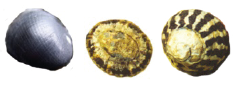
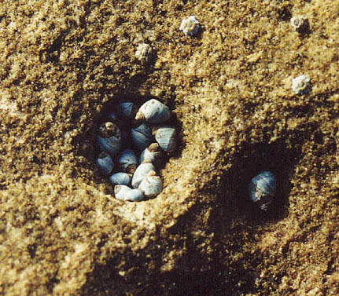

```{r}
library(knitr)
library(ggplot2)
library(dplyr)
```


**Associate Professor Katrin Meissner**

In this lab we will again make the linear model a little more complex, by adding more than one predictor to the model, and even adding 'interaction' terms to the model. When we have one categorical and one continuous predictor in the model, and an interaction, it is often called an ANCOVA. When we have two categorical predictors, and an interaction, we often call this a two-way ANOVA. When we have several predictor variables, this is usually called a multiple regression. In this course, we emphasize that all of these seemingly different analyses are simply linear models of varying complexity, where complexity varies by the number of predictors we add to the model to try and explain variation in the data.

Recommended reading:

* McKillup 2012. Chapters 13 and 15, or
* McKillup and Dyar 2010. Chapters 12 and 14


### 9) Gastropod abundance vs. height on the shore and species



On the rock platform at Maroubra, we collected data suitable for analysing with a two factor analysis of variance (ANOVA). So far we have calculated separate one-factor ANOVA's for the different species comparing across the zones. Now you can combine all into one, more powerful analysis.

This single analysis will test: 
* whether there are differences in abundance of organisms among the three zones, 
* whether there are any differences in abundance among the three species and 
* whether there is any interaction between height on the shore and species

**9a)** State the three null hypotheses that are being tested (because the aims above are not expressed as $H_{0}$'s)


**Step 1**

Read the data "MaroubraZones.csv" into R. This is the same data file as last week, but now we will be using the data for all three species in all three zones (not the subsets for each species).

```{r}
Gastropods <- read.csv(file = "MaroubraZones.csv", header = TRUE)
```

As with last week, reorder the levels of the factor Zone to stop R making the figures with our zones in alphabetic order.

```{r}
Gastropods$Zone <- factor(Gastropods$Zone, levels = c("Low", "Mid", "High"))
```

Visualise the data you are about to analyse. You don't need to make a presentation quality plot here (involves messing with lots of options in R) - just useful to see the results you will be analysing.

ggplot makes plotting grouped data quite easy. Here we have one response variable (Abundance), one predictor variable on the x axis (Species) and the second predictor as the fill colour.

```{r,eval=F}
ggplot(Gastropods, aes(Species, Abundance, fill=Zone)) + geom_boxplot()
```

Try making a bar plot with error bars using code from last week.

```{r, eval=F, echo=F}

bar_witherrors <- function() {
  list(
    stat_summary(fun.y = "mean", geom = "bar", position=position_dodge(0.9), color="black"),
    stat_summary(fun.data = "mean_se", geom = "errorbar", position=position_dodge(width=0.8), width = 0.1)
  )
}

ggplot(Gastropods, aes(Zone, Abundance, fill = Species)) + bar_witherrors()
```


**Step 2. Run the ANOVA**

For this analysis we will do a two-way ANOVA, with Abundance as the response (dependent variable), and Zone and Species as the categorical predictors (independent variables), as well as their interaction. This expresses the linear model as discussed in the lectures whereby Y = a + Zone + Species + Zone*Species. Note, as before, that although we have two factors, and an interaction effect, this requires fitting more than 3 parameters in our model because we have 3 zones, and 3 species (if you can figure out how many parameters must be fit in this model, you are officially a stats geek! We don't expect this of you at the moment, as this is tricky even for those 'in the know').

```{r}
Gastropods.ANOVA <- aov(Abundance ~ Zone*Species, data = Gastropods)
```

Note that when you specify a model with * between two predictors, R automatically includes both variables and their interaction, i.e. the above could also be written explicitly as


```{r}
Gastropods.ANOVA <- aov(aov(Abundance ~ Zone + Species + Zone:Species), data = Gastropods)
```


**Step 3. Checking the assumptions of normality and homogeneity of variances**

Don't look at the ANOVA results quite yet. Check the assumptions of ANOVA as you did in Step 2 for the one-way ANOVA in last week's prac.

```{r,eval=F}
hist(Gastropods.ANOVA$residuals)
plot(Gastropods.ANOVA)
```

**Step 4. Transform the data if necessary**

Try log(X+1) or sqrt(X+1) transformations (as in step 5 for one-way ANOVA), repeat the ANOVA and check the assumptions again (as in Step 3). Because log or square root isn't defined with zero values you'll have to add a constant to your abundance data prior to the transformation (use 1 or 0.1), e.g.

```{r}
Gastropods <- mutate(Gastropods, logAbundance = log(Abundance + 1))
```

What if transformation didn't solve the problem? 
* You have heterogeneous variances and are violating one of the assumptions of ANOVA. This often happens with data that samples patchily distributed organisms.
* You cannot solve the problem but can consider its impact on the ANOVA; It may lead to an artificially inflated F ratio. Therefore proceed to run the ANOVA using the abundance data and only accept null hypotheses if P < 0.01. This is one way to address the possibility that you'd falsely reject your null hypothesis just because of heterogeneous variances.

**Step 5. Look at your results**

To inspect your data, use `summary(Gastropods.ANOVA)` or summary() of the object that resulted from analysing the transformed data.

```{r,eval=F}
summary(Gastropods.ANOVA)
```

Now look at the ANOVA table in the console. You should have three F-tests, one for each main effect, and one for the interaction between Species and Zone. Check that R has calculated the correct F ratio given your model, and has the correct d.f.'s. Remember this ANOVA involves two fixed factors 

More help with [factorial ANOVA](http://environmentalcomputing.net/analysis-variance-factorial/) on Environmental Computing.

**9b)** Did the patterns of abundance with respect to height on the shore vary among species? Which of the F-tests is the formal test of this hypothesis?


*What if I get a significant interaction?*
* If you get a significant interaction, first examine an interactions plot to simply inspect where the differences are.
* Significant interactions mean that you cannot simply interpret the main effects, because the impact of an effect depends upon the other. This will be discussed in the practical and lecture series.

```{r,eval=FALSE}
interaction.plot(Gastropods$Zone,Gastropods$Species,Gastropods$Abundance)
```

More help with [interpreting interactions](http://environmentalcomputing.net/understanding-interactions/) on Environmental Computing

**Step 6. Multiple comparisons**

If you get significant terms then do a Tukey's test to see which factor's are significantly different (if you didn't get significant interaction terms in the ANOVA you can leave the interactions out for the Tukey test but remember you will need to respecify your model first without the interaction term).

```{r,eval=FALSE}
TukeyHSD(Gastropods.ANOVA)
```

Don't worry if you're confused at first.... the output from a Tukey test can be hard to interpret!

**9c)** What are the benefits of analysing these data as a two-way ANOVA rather than three separate one-way ANOVAs?


**Balanced and unbalanced designs**

Advanced content warning! Ideally, analysis of variance should be conducted with a balanced design - one with  the same number of replicates in each combination of factors. Balanced designs are less likely to be affected by minor deviations from the assumptions of normality and homogeneity of variance. Unfortunately, unbalanced designs where you have unequal numbers of replicates for each level are common in practice (e.g. bad weather prevented sampling the second site as intensively, volunteer lost the data sheet etc!).

Unbalanced designs are more susceptible to violating the assumptions of ANOVA and there is no single way to partitioning the SS_{total} into the main effect and interaction components. The `aov` and `lm` functions in R use what are called Type I sums of squares where the terms in the model are fitted sequentially (i.e., how much variation is explained by factor A, then how much additional variation is explained by adding factor B). The problem with this is the order of the terms in model matters: the model formulae Y ~ A + B + A:B and Y ~ B + A + B:A will give you different results.

There is a fair bit of debate on this in the statistical literature, but many advise using what are called Type II or Type III sums of squares for unbalanced designs. Other software packages like SPSS, SYSTAT and Minitab will automatically use Type III sums of squares where the order of terms in the model doesn't matter. To access these in R, we can use the `car` package. For example, to run this for the two-factor design we just ran:

```{r,eval=FALSE}
library(car)
Gastropods.ANOVA <- aov(log(Abundance+1) ~ Zone*Species, data = Gastropods)
Anova(Gastropods.ANOVA, type=c("III"))
```

All this is only an issue for unbalanced designs, and we trimmed the Maroubra data set to ensure equal numbers of replicates in each of the 9 combinations of Zone and Species. We have included this here to raise the issue, and in the hope that it may be remembered for those of you going on to honours or postgraduate research in BEES. 


### Factorial vs. nested designs

In the two-way ANOVA design you just ran, the two factors were known as factorial (i.e., there was every combination of every level of each factor). Other experimental designs feature factors that are termed nested. This is when each level of one of the factors is unique to only one level of the other factor. The difference is best illustrated with the following two experimental designs where there are two factors, A and B.
	


In the nested design, the levels of factor B appear in only one of the levels in factor A, not both. This often happens with factors like "site" or "area" - they usually belong to only one level of your other factor (e.g., if contrasting north and south of the harbour, a suburb could not be in both categories).

Factor B is termed nested within factor A, usually written as B(A). These designs have different sources of variance to the factorial designs, and do not have an interaction term. The designs are quite common in ecology and environmental sciences, and are often used to partition variance in spatially hierarchical sampling (e.g., habitats, areas within habitats, plots within areas etc...).


### 10) Effects of predator removal


The data you will analyse today comes from an experiment investigating the impact of [introduced American mink] (http://link.springer.com/article/10.1007%2Fs00442-008-1084-0) on small rodents (voles) in Finland. The hypothesis was that mink prey upon voles thereby reducing vole numbers and limiting their population size. To test this, minks were removed from large areas (> 20 km$^2$) in the Baltic Sea. The H$_{o}$ from the experiment is that mean count of voles on islands in removal sites will be the same as the mean vole count on islands in control areas.

The data represent two treatments (mink removal and control) and two areas nested within each treatment. Then there are 10 samples in each area. Each of these samples represents the numbers of individual voles trapped on an island (all islands were more than 300 m apart ensuring some independence) over 4 nights

The design is nested because an area cannot belong to both a removal treatment and a control. It is useful to think of areas as being the replicates for the treatment, and the individual samples as being replicates for each area.

**Step 1**

Read "Mink.csv" into R.

```{r}
Mink <- read.csv(file = "Mink.csv", header = TRUE)
```

**Step 2. Run the nested ANOVA**

For this ANOVA we will need to specify the model slightly different because of the nested design (random effect of area): 

```{r}
Mink.nested <- aov(Voles ~ Treatment + Error(Area), data = Mink)
```

This expresses the linear model as discussed in the lectures whereby
$Y = c + Treatment + Area(Treatment)$. 

**Step 3. Check the assumptions of normality and homogeneity of variances**

Don't look at the ANOVA results quite yet. Check the assumptions of ANOVA as you did in Step 3 for the two-way ANOVA.

**Step 4. Transform the data if necessary**

Try log(X+1) or sqrt(X+1) transformations (as in step 4 for two-way ANOVA), repeat the ANOVA and check the assumptions again (as in Step 3).

**Step 5. Look at your results**

```{r,eval=F}
summary(Mink.nested)
```


The output is a little different to the factorial ANOVA. The top section gives a significance test of the *fixed effect* 'Treatment' - this is what we're interested in. The residuals for this test are those associated with the random effect 'Area'.

The bottom section shows the SS, MS and df for the residuals within areas. Note that there is no test presented for the random effect of area - this is rarely of interest and, in practice, are nearly always different.

Nested designs are often used to work out how much variation occurs at different scales (e.g., replicates within sites, sites with locations, locations within region). We can calculate variance components to quantify how much variation can be attributable to each factor in a hierarchically nested design.


In order to obtain the variance components which tell you how much variation can be attributed to each of the factors, you'll need to do some extra calculations:

Among Treatments (fixed effect) = $\frac{MS_{Treatment} - MS_{Area}}{nb}$ 

```{r,eval=F}
minkSum = summary(Mink.nested)
FixedEff = (unlist(minkSum[[1]])[[5]] - unlist(minkSum[[1]])[[6]])/((length(Mink$Treatment)/length(unique(Mink$Area)))*(length(unique(Mink$Area))/length(unique(Mink$Treatment))))
FixedEff
```

Among Areas within Treatments (random effect) = $\frac{MS_{Area} - MS_{within}}{n}$

```{r,echo=F, eval=F}
RandEff = (unlist(minkSum[[1]])[[6]] - unlist(minkSum[[2]])[[3]])/(length(Mink$Treatment)/length(unique(Mink$Area)))
RandEff
```

Within Areas (error) = $MS_{within}$

```{r,echo=F, eval=F}
WithinErr = unlist(minkSum[[2]])[[3]]
WithinErr
```

...where $n$ = the number of replicates in each area; and $b$ =  the number of areas in each treatment.

You can then calculate each variance component as a percentage of the total variance.

```{r,echo=F, eval=F}
cat("Treatment:" ,(FixedEff/(FixedEff + RandEff + WithinErr))*100, "%")

cat("Area:", (RandEff/(FixedEff + RandEff + WithinErr))*100, "%")

cat("Error:", (WithinErr/(FixedEff + RandEff + WithinErr))*100, "%")
```

**10a)** Enter the % of the variation that is attributable to each factor.


**10b)** How does the nested factor contribute to understanding about sources of variation in vole numbers?
		
	
**10c)** What is your biological interpretation of this analysis? In your answer comment on the following: was there any significant effect of mink removal? If not, why not (statistically speaking). Where is all the variation in the dataset coming from?


**10d)** The F-test for the removal treatment is MStreatment/MSarea. How would you modify this design to have a greater power to detect difference due to your treatment? More areas or more samples?


  
		
		
### 11) Gastropod abundance vs species and proximity to rockpools



Already, you have seen how linear models can analyse data with continuous predictor variables (regression) and categorical predictor variables (ANOVA), but they can also use a combination of categorical and continuous variables. These models can get as complex as you like, but we will look at the simplest version of these - models with one categorical and one continuous variable. These are known as analyses of covariance (ANCOVA).

The data from Maroubra tested the hypothesis that the abundance of gastropods varied along a gradient of water availability. To do this we divided the shore up into three zones (high, mid and low shore) - turning our gradient into a categorical variable of zone with three levels. We also measured a continuous variable that we predicted might affect the abundance of our snails - the distance to nearest rockpool. This could be important because a snail might be high on the shore, but not necessarily far from a source of water if a rockpool is nearby.

To simultaneously test differences among species and proximity to rockpools, we will run an ANCOVA on the gastropod data (one species at a time).

**Step 1**

Visualise the patterns in the data set using the data frame 'Gastropods' as for Question 9. Use distance as the X axis and species as a grouping, categorical, variable to colour code each observation.

```{r, eval=F}
ggplot(Gastropods, aes(Distance, Abundance, color=Species)) + geom_point()
```


**Step 2. Run the ANCOVA**

For the analysis of covariance we will use the function for any linear model, `lm`, rather than the `aov` function (note that `aov` is just a wrapper for `lm` anyway - use `?aov` to learn more)

The linear model you are testing is : *Y = a + Species + Distance + Species*Distance*

```{r}
Gastropods.ANCOVA <- lm(Abundance ~ Species*Distance, data = Gastropods)
```

**Step 3. Check the assumptions of normality and homogeneity of variances**

Don't look at the ANCOVA results quite yet. Check the assumptions of ANCOVA as you did in Step 3 for the one-way ANOVA

**Step 4. Transform the data if necessary**

Try log(X+1) or sqrt(X+1) transformations (as in step 4 for one-way ANOVA), repeat the ANCOVA and check the assumptions again (as in Step 3).


**Step 5. Interpret your results**

Now, you can look at the results from the ANCOVA.

```{r, eval=FALSE}
anova(Gastropods.ANCOVA)
```

You will have a test of whether abundance varied among species (Species factor), whether abundance varied with distance from rockpools (Distance factor), and whether the slopes of the abundance vs distance relationships varied among species (Species x distance interaction).

Results from ANCOVA are best visualised as scatterplots with the data from each of the levels of the categorical factor presented with different symbols. As above, but now with the three lines of fit for each species. The three lines of best fit are obtained from separate linear models of abundance vs distance for each species.


```{r,eval=FALSE}
ggplot(Gastropods, aes(Distance, Abundance, color=Species)) + geom_point() + geom_smooth(method="lm")

```

Don't assume that these lines of best fit are all that informative. The plotting functions will always put them on the plot regardless of whether they explain any of the variation. You need to go back to the output of the statistical test to decide whether it is useful to include these linear relationships on the plot (e.g., pretty meaningless if your analysis tells you that distance from rockpool was not significant).

**11a)** An interaction between the two predictor variables would be evident if the slopes of these three lines were not parallel. Does the scatterplot suggest an interaction?


**11b)** The ANCOVA gives a formal test of three slopes being the same. Is that test significant? What does it mean biologically?


**11c)** Why would you include a covariate in this model? How could it help detect differences among species?
 


	
### 12) Life expectancy vs. infant mortality rate and gender

Recall the example where we examined Life Expectancy in relation to the Infant mortality rate for 208 countries in the Linear Models 1 practical, 'regression'. We fitted separate linear models (regressions) for each gender. See below.


```{r, echo = FALSE, results = 'asis', fig.keep='all', fig.cap = "Life expectancy in relation to infant mortality", warning = FALSE, fig.width = 10}
UN.pop <- read.csv(file = "UNpopstats.csv", header = TRUE)  
ggplot(UN.pop, aes(y = LifeExp, x = InfMort)) + geom_point(aes(colour = as.factor(Gender))) + 
  ylab("Life expectancy at birth (yrs)") + xlab("Infant mortality rate") +
  geom_smooth(size = 0.5, method = "lm", alpha = 0.3, colour = "black", aes(group = Gender)) +
  theme(legend.title=element_blank()) + 
  scale_colour_discrete(name="Gender", breaks=c(1, 0), labels=c("Male","Female"))
```


The figure above and the previous analysis of the data suggested that the Life Expectancy - Infant Mortality relationship is different for women versus men. In this section we will formally test for any gender-related differences in this relationship.

To do so, we will now fit a more complex linear model to test whether women and men have different average life expectancy (by adding a gender 'effect', or gender 'predictor') and also test whether the rate at which life expectancy declines with infant mortality rate differs between genders (by adding an interaction effect, a predictor that is multiplicative (i.e. gender*infant mort rate)).

The previous model we used was:
Life Expectancy = a + b(Infant Mortality), and we did this separately for each sex

The new model we will use is: 
*Life Expectancy = a + b(Infant Mortality) + c(Gender) + d(Gender*Infant Mortality)*

Use R to run a linear model (`lm`) as outlined above.

**12a)**
What does the coefficient a represent?
What is the estimated value of a?
Is a significantly different from zero?

**12b)**
Is there an effect of gender on life expectancy?
Does the relationship between life expectancy and infant mortality vary between males and females?


