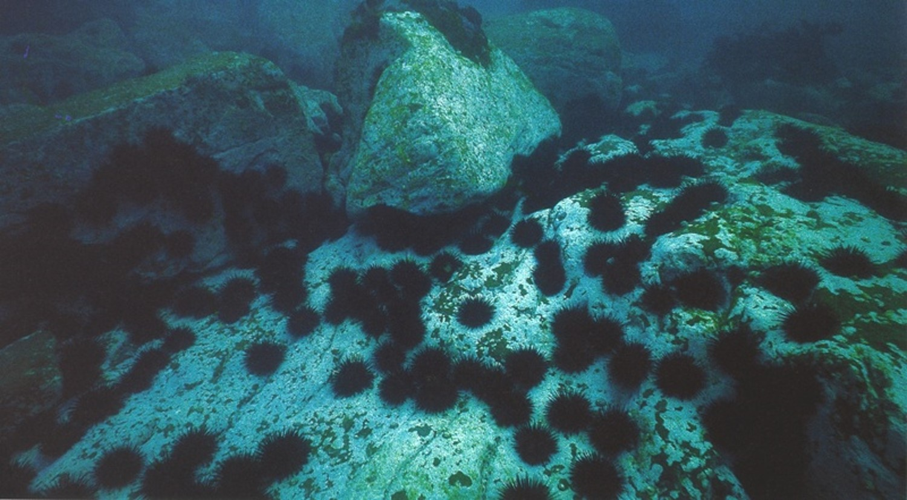

```{r, echo=F, warning =F}
library(knitr)
library(ggplot2)
library(dplyr)
```

### 11) Urchin grazing



Already, you have seen how linear models can analyse data with continuous predictor variables (regression) and categorical predictor variables (ANOVA), but they can also use a combination of categorical and continuous variables. These models can get as complex as you like, but we will look at the simplest version of these - models with one categorical and one continuous variable. These are known as analyses of covariance (ANCOVA).

To explore this analysis, let's look at some data from marine researchers in BEES who were studying sea urchins at Bare Island near the openinG of Botany Bay ([Wright *et al.* 2005](http://www.int-res.com/abstracts/meps/v298/p143-156/)). Urchins are voracious grazers and at high densities can remove entire kelp forests and leave bare areas known as urchin barrens. To study that process, researchers set up five experimental treatments: 1) high urchin densities in a cage, 2) low urchin densities in a cage, 3) no urchins in a cage, 4) an open cage and 5) controls with no manipulation. 

There were 8 replicates per treatment. The % cover of algae and bare rock were measured several times over a 210 day experiment.

**11a)** What is the purpose of the cage controls? 


The following file has the data for the % cover of bare rock:

```{r}
Urchins <- read.csv("Urchins.csv")
```

To test how the differences among treatments affect the cover of bare rock and vary with time, we will run an ANCOVA.

**Step 1**

Visualise the patterns in the data set using the data frame 'Urchins'. Use the number of days as the X axis, cover of bare rock as the Y variable and treatment as a grouping, categorical, variable to colour code each observation.

```{r, eval=F}
ggplot(Urchins, aes(Day, BareRock, color=Treatment)) + geom_point()
```

Looks a bit messy, but ggplot will nicely put lines of best fit with confidence intervals for each treatment if we add a `geom_smooth` argument. The `method="lm"` part is telling it to fit a linear model to each treatment - you can also fit various other models.

```{r, eval=F}
ggplot(Urchins, aes(Day, BareRock, color=Treatment)) + geom_point() + geom_smooth(method="lm")
```

**Step 2. Run the ANCOVA**

For the analysis of covariance we will use the function for any linear model, `lm`, rather than the `aov` function (note that `aov` is just a wrapper for `lm` anyway - use `?aov` to learn more)

The linear model you are testing is : Y = a + Treatment + Day + Treatment*Day

```{r}
Urchins.ANCOVA <- lm(BareRock ~ Treatment*Day, data = Urchins)
```

**Step 3. Check the assumptions of normality and homogeneity of variances**

Don't look at the ANCOVA results quite yet. Check the assumptions of ANCOVA as you did in Step 3 for the one-way ANOVA

**Step 4. Transform the data if necessary**

Try log(X+1) or sqrt(X+1) transformations (as in step 4 for one-way ANOVA), repeat the ANCOVA and check the assumptions again (as in Step 3).


**Step 5. Interpret your results**

Now, you can look at the results from the ANCOVA.

```{r, eval=FALSE}
anova(Urchins.ANCOVA)
```

You will have a test of whether the % cover of bare rock varied among treatments, with time (Day factor), and whether the slopes of the bare rock vs day relationships varied among treatments (Treatment x Day interaction).

Results from ANCOVA are best visualised as scatterplots with the data from each of the levels of the categorical factor presented with different symbols (as above).

Don't assume that these lines of best fit are all that informative. The plotting functions will always put them on the plot regardless of whether they explain any of the variation. You need to go back to the output of the statistical test to decide whether it is useful to include these linear relationships on the plot (e.g., pretty meaningless if your analysis tells you that neither treatment or time was related to the cover of bare rock).

**11b)** An interaction between the two predictor variables would be evident if the slopes of these three lines were not parallel. Does the scatterplot suggest an interaction?


**11c)** The ANCOVA gives a formal test of three slopes being the same. Is that test significant? What does it mean biologically?


**11d)** How does the interaction affect your ability to make simple statements about the main effects. For example, should your results section state "The cover of bare rock increased with time"?

**11e)** The original study did not test time as factor in the analysis, but analysed each time separately. What assumption did we just violate by putting all replicates in a single analysis?
 

