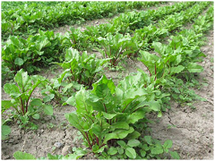

D. Multivariate analyses 1
=======================================
Similarity coefficients and cluster analyses. Week 11
------------------------

**Associate Professor Alistair Poore**

```{r, echo=FALSE}
# If instructor copy, use INST = TRUE to see inline code output.
library(knitr)
INST = FALSE

if (INST == TRUE) opts_chunk$set(fig.keep = 'all', results = 'markup')
if (INST == FALSE) opts_chunk$set(fig.keep = 'none', results = 'hide')

# If eventual desired output is Latex/pdf, use format = 'latex'
format = 'html' # note tables formatted for Latex so may not be great in html
```

These practicals provide an introduction to some of the graphical and analytical techniques used for multivariate data sets (those with more than one dependent variable). The first practical introduces the concept of similarity coefficients (essential for many multivariate analyses), a test for comparing two similarity matrices, and cluster analysis, one of the most widely used multivariate graphing techniques. Questions 1-5 relate to lecture material from week 11.

At the end of both multivariate practicals, you should be able to:

* Calculate a variety of similarity/dissimilarity coefficients to represent the differences among samples (or variables) in multivariate data sets
* Conduct a Mantel's test to compare two similarity matrices
* Create and interpret cluster diagrams to summarise the relationships among samples or variables
* Define a principal component
* Interpret an ordination from a principal components analysis (PCA)
* Interpret an multi-dimenional scaling (MDS) plot
* Understand the logic behind permutational MANOVA

Recommended reading:

* McKillup and Dyar 2010. Chapter 20

R-packages needed for this prac: `vegan`

### 1) Similarity coefficients


A physical geographer is contrasting beach profiles at three beaches around a coral atoll. Using the same methods at each site, the following data were collected from each beach:


```{r, echo = FALSE, results = 'asis'}
library(xtable)
B1 = c(4,10.1,1.85,1.2)
B2 = c(2,5.2,1.47,0.8)
B3 = c(0.8,1.2,0.39,0.7)
Beaches = cbind(B1, B2, B3)
colnames(Beaches) = c("Beach 1", "Beach 2", "Beach 3")
rownames(Beaches) = c("mean sediment size (mm)", "beach slope (degrees)", "mean wave height (m)", "mean current speed (m.s$^-1$)")
print(xtable(Beaches, align = "p{6cm}ccc"), comment = FALSE, hline.after = c(0:4), type = format, sanitize.text.function = identity, include.rownames = TRUE) 
```

**1a)** What are the samples and what are the variables?


First, load the data into R as a data frame called 'Beaches' with three columns, one for each beach.

```{r}
Beaches = read.csv(file = "Beaches.csv", header = TRUE)
```


Visualise the relationships among the variables with a scatter plot matrix.

```{r}
pairs(Beaches)
```


**1b)** Summarise the relationships among samples using the Pearson correlation coefficient.

To obtain the Pearson correlation coefficient:

* Use the `cor` function

```{r}
cor(Beaches)
```

Fill out the following table:

```{r, echo = FALSE, results = 'asis'}
Pear.mat <- data.frame(c("","",""),c("","",""),c("","",""))
rownames(Pear.mat) <- c("Beach 1", "Beach 2", "Beach 3")
colnames(Pear.mat) <- c("Beach 1", "Beach 2", "Beach 3")
kable(Pear.mat)
```

This is a similarity matrix that summarises the relationships among beaches.


**1c)** Summarise the relationships among samples using Euclidean distance

To obtain the Euclidean distance for each pair of samples:

$$d_{y1}_{y2} = \sum_{j=1}^{p}\sqrt{(y_1_j-y_2_j)^2}$$

*y_1* and *y_2* = the values of variable *j* in sample 1 and 2; *p* = the number of variables

* Use the `dist` function with `method = "euclidean", diag = TRUE`
* You need the samples as rows for distance analysis so make sure you transpose the matrix first, using the `t` function, i.e. `(t(Beaches))`

```{r}
dist(t(Beaches), method = "euclidean", diag = TRUE)
```

Fill out the following table:

```{r, echo = FALSE, results = 'asis'}
library(xtable)
Pear.mat = matrix(nrow = 3, ncol = 3)
rownames(Pear.mat) = c("Beach 1", "Beach 2", "Beach 3")
colnames(Pear.mat) = c("Beach 1", "Beach 2", "Beach 3")
print(xtable(Pear.mat, align = "|c|c|c|c|", caption = "Pearson"), caption.placement = "top", comment = FALSE, hline.after = c(-1:3), type = format) 
```


This is also a similarity matrix that summarises the relationships among beaches, but one that uses a different defintion of similarity.


### 2) Mantel's test


A biogeographer wanted to understand the dispersal of lizard species among islands in an archipelago. She used survey data to obtain lists of species that were present on each of eight islands, and used a map to calculate the distance between each pair of islands. She summarised the relationships among lizard communities, and the distances among islands with the following two similarity matrices:


Among lizard communities (Bray-Curtis similarity coefficient):

```{r, echo = FALSE, results = 'asis'}
library(xtable)
BrayC = read.csv(file = "Bray.csv", header = FALSE)
colnames(BrayC) = c("1", "2", "3", "4", "5", "6", "7", "8")
print(xtable(BrayC, align = "|p{1cm}|p{1cm}|p{1cm}|p{1cm}|p{1cm}|p{1cm}|p{1cm}|p{1cm}|p{1cm}|"), comment = FALSE, hline.after = c(-1:8), type = format, floating = FALSE) 
```

 
Distances among islands (km):

```{r, echo = FALSE, results = 'asis'}
library(xtable)
DistIs = read.csv(file = "DistIs.csv", header = FALSE)
colnames(DistIslands) = c("1", "2", "3", "4", "5", "6", "7", "8")
print(xtable(DistIs, align = "|p{1cm}|p{1cm}|p{1cm}|p{1cm}|p{1cm}|p{1cm}|p{1cm}|p{1cm}|p{1cm}|"), comment = FALSE, hline.after = c(-1:8), type = format, floating = FALSE) 
```


We will conduct a Mantel's test to compare the two matrices. This calculates a correlation between each of the elements in the two matrices (i.e., when a pair of islands are close together, do they also share similar lizard communities?)

First, read the two data sets into R.

```{r}
LizardSim = read.csv(file = "LizardSim.csv", header = FALSE)
DistIslands = read.csv(file = "DistIslands.csv", header = FALSE)
```

Second, use the function [`mantel`](http://cc.oulu.fi/~jarioksa/softhelp/vegan/html/mantel.html) in the `vegan` package to conduct the test.


```{r}
library(vegan)
mantel(LizardSim, DistIslands, permutations = 999)
```

The argument `permutations = 999` results in your data being shuffled 999 times to establish how likely your correlation coefficient would occur by chance. Note that by default the `mantel` function in `vegan` tests the null hypothesis that the correlation coefficient, *r* <= 0 (not positively related), however you want to test the null hypothesis that *r* >= 0 (not negatively related). As a result, you must subtract the reported  significance value from 1 to get the correct P value.

**2a)** What is the value of the correlation coefficient (Mantel statistic r)?
  

**2b)** What is the P-value associated with your correlation coefficient?


To see how the P value was calculated, assign the results from the mantel test an object name (e.g. 'LizardMantel').

```{r}
LizardMantel = mantel(LizardSim, DistIslands, permutations = 999)
```

Within the object 'LizardMantel' is a vector of numbers containing all 999 correlation coefficients, each calculated from a single random permutation of the raw data. To see them, view a frequency histogram of all 999 coefficients. Is your r value likely or unlikely?


```{r}
hist(LizardMantel$perm)
```


We can now count precisely how many of the correlation coefficients were more negative than your observed r value? (i.e., had a stronger relationship and thus less likely to occur by chance)

```{r}
length(LizardMantel$perm[LizardMantel$perm<=.5009]) # replace r with your r value
```


Divide this number by the total number of permutations (999) and you should see the P value you obtained earlier.  


**2c)** State whether the biogeographer's results support the hypothesis that islands closer together support more similar lizard communities.


  
### 3) Cluster analysis


Cluster analyses are a widely used technique to visualize similarities in multivariate data sets. Here, we will make a simple one by hand to demonstrate how similarity values are used to make a dendrogram.

The following is a matrix summarising the relationships between five samples using Euclidean distance as the similarity coefficient.

```{r, echo = FALSE, results = 'asis'}
library(xtable)
clustMat = read.csv(file = "cluster.csv", header = FALSE)
colnames(clustMat) = c("1", "2", "3", "4", "5")
print(xtable(clustMat, align = "|p{1cm}|p{1cm}p{1cm}p{1cm}p{1cm}p{1cm}|"), comment = FALSE, hline.after = c(-1,0,5), type = format) 
```

**3a)** Produce a cluster diagram using single linkage by hand. Present the value of the similarity coefficient that joins each cluster.

Step 1. Join the most similar pair of samples
Step 2. Create a reduced version of the similarity matrix which summarises the relationships between the cluster you just made and the remaining samples. When relating a cluster to a sample that is not yet joined, the single linkage method uses the similarity between the unattached sample and the most similar member of the cluster.
Step 3. Join the most similar pair of samples (or clusters)
Step 4. Repeat step 2.
Repeat process until all five samples are joined in the dendrogram.

```{r, echo = FALSE, results = 'asis'}
library(xtable)
drawinbox = matrix(nrow = 30, ncol = 1)
print(xtable(drawinbox, align = "c|p{15cm}|"), table.placement = "!h", include.rownames=FALSE, comment = FALSE, hline.after = c(-1,30), type = format) 
```


### 4) Nutrient enrichment experiment



The effect of nutrient enhancement on the composition of weed species on a farm was investigated. Ten replicate plots were established for each of three treatments: control (no nutrients), low nutrient dose added, and high nutrient dose added. After 12 weeks, all weed seedlings were identified and counted. Twelve species of weeds were recorded.

Produce a cluster diagram to display the relationships among samples.

Read in the datafile "NutrientEnrichment.csv"

```{r}
Nutrients = read.csv(file = "NutrientEnrichment.csv", header = TRUE)
```

The first column is a treatment vector and needs to be reassigned to the row names before cluster analysis:

```{r}
rownames(Nutrients) = Nutrients[,1]
Nutrients = Nutrients[,-1] # This now removes the treatment vector
```


To perform the cluster analysis use the ['hclust'](http://stat.ethz.ch/R-manual/R-patched/library/stats/html/hclust.html) function with the argument `method = "single"` (i.e. single linkage).

```{r}
Nutrient.cluster = hclust(dist(Nutrients, method = "euclidean"), method = "single")
```


Finally plot the object that was created by the `hclust` function.

```{r}
plot(Nutrient.cluster)
```

We can make this a bit neater by plotting it as a dendrogram with all the samples lined up along the bottom

```{r}
plot(as.dendrogram(Nutrient.cluster))
```


**4a)** Using single linkage and Euclidean distance, which two samples (i.e., experimental plots) are most similar to one another?

  

**4b)** Does the cluster analysis suggest any effects of the nutrient treatment? What patterns would you expect with a strong effect of the nutrient treamtment?


**4c)** "The dendrogram clearly shows that adding nutrients affects the abundance of weeds" True or false? Explain with reasons.

    
**4d)** There are many distance measures that can be used to describe the similarity between samples. The `dist()` function in R has "euclidean", "maximum", "manhattan", "canberra", "binary" or "minkowski". Try a few of these and see if the structure of the dendrogram changes much. You will need to replace the `method = "euclidean` argument.

Make some notes on how sensitive the cluster diagrams were to the choice of similarity coefficient.


**4e)** The structure of dendrograms can also be sensitive to algorithm used to construct the tree (the linkage method). In the previous example, you used the single linkage method. The `hclust()` function in R has several available: "ward", "single", "complete", "average", "mcquitty", "median" or "centroid". Try a few of these and see if the structure of the dendrogram changes much. You will need to replace the `method = `single` argument.

Make some notes on how sensitive the cluster diagrams were to the choice of linkage method.
  


### 5) Heavy metals in sediments


Twelve sites in an estuary were sampled for the concentrations of eight heavy metals (Clarke and Warwick, 1994). The sites were aligned along a linear transect with the middle of the transect closest to a sewage dumping area (i.e., 1 and 12 furthest from dump, 6 closest to the dump).

We will produce a cluster diagram to display the relationships among samples.

Read "HeavyMetals.csv" into R...

```{r}
HeavyMetals = read.csv(file = "HeavyMetals.csv", header = TRUE)  
```

As before, assign the first column station to `rownames` before proceeding with the cluster analysis (use single-linkage as you did in Q4).

**5a)** Have a look at the values in the spreadsheet. Why might you standardise these variables?


```{r, echo = INST, message=FALSE, warning=FALSE}
rownames(HeavyMetals) = HeavyMetals$Station
HeavyMetals = HeavyMetals[,-1]
plot(as.dendrogram(hclust(dist(HeavyMetals, method = "euclidean"), method = "single")))
```

Create the cluster diagram with the methods from the last question.


**5b)** Does the cluster analysis suggest any effects of the sewage dump? State reasons.


We can also use a cluster diagram to display the relationships among variables.

Methods as above except you need to make the heavy metals as rows and the stations as columns before running the cluster analysis (use the transpose function, `t`. 

```{r}
t(HeavyMetals)
```

```{r, echo = INST, message=FALSE, warning=FALSE}
plot(as.dendrogram(hclust(dist(t(HeavyMetals), method = "euclidean"), method = "single")))
```


**5c)**	The concentrations of which two metals are mostly highly correlated? 


In this data set, the concentration of the metals vary widely with manganese having values up to 2470 while cobalt has values no higher than 15. Consequently, the similarity between samples using Euclidean distance will be very strongly influences by manganese values and those metals with low concentrations will have little influence. If you wanted to create a plot to explore the composition of contaminants, not just their absolute concentrations, then it is a good idea to standardise the variables before creating any cluster diagrams.

In R, we can use the `scale()` function:

```{r}
HeavyMetals.standardised = as.data.frame(scale(HeavyMetals))
```

The new data frame has all variables now with a mean of zero and variance of 1, and any plots we create will have all metals with a similar influence.

With the methods from above, create a cluster diagram to display the relationships among sites based on standardised metal concentrations.

```{r, echo = INST, message=FALSE, warning=FALSE}
plot(as.dendrogram(hclust(dist(HeavyMetals.standardised, method = "euclidean"), method = "single")))
```


**5d**  Make some notes on how the relationships between sites are altered by standardising the variables.
