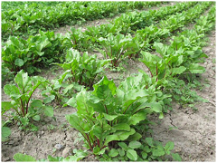

D. Multivariate analyses 2
=======================================
Ordination and multivariate hypothesis testing. Week 12
------------------------

**Associate Professor Alistair Poore**

```{r, echo=FALSE}
# If instructor copy, use INST = TRUE to see inline code output.
INST = FALSE

if (INST == TRUE) opts_chunk$set(fig.keep = 'all', results = 'markup')
if (INST == FALSE) opts_chunk$set(fig.keep = 'none', results = 'hide')

# If eventual desired output is Latex/pdf, use format = 'Latex'
format = 'html' # note tables formatted for Latex so may not be great in html
```

The second practical provides an introduction to two further graphical techniques for presenting patterns in multivariate data (principal components analysis, PCA, and multidimensional scaling, MDS). These are forms of ordination, which aim to represent the relationships among many samples (or variables) in two dimensional space. You will also be introduced to an example of a formal hypothesis test using multivariate data. 


**6) Analysis of leaf shape**

A plant physiologist is attempting to quantify differences in leaf shape between two species of tree. She recorded the following five measurements from ten leaves of each species:


We will use principal components analysis (PCA) to summarise the relationships among the length measurements and explore whether the two species differ.

Read in the file "Leafshape.csv":

```{r}
Leaf.shape = read.csv(file = "Leafshape.csv", header = TRUE)
```

First, have a look at the relationships among all five variables. Use the `pairs` function as for Question 1b)

```{r}
pairs(Leaf.shape[,2:6]) # the [,2:6] code ensures that the Species labels in the first column are not used. 
```


These relationships can also be summarised numerically, by calculating the similarity matrix using the Pearson correlation coefficient.

Check the correlations between the all five leaf measurements.

```{r}
cor(Leaf.shape[,2:6])
```

We obviously can't plot these data in five dimensions, but if you look at just three of the five variables, you can get a sense of what PCA is trying to do - fit a new X-Y plane as close as possible to all points in 5 dimensional space.

Install the rgl package and make a 3D plot of the first three variables.

```{r}
library(rgl)
plot3d(Leaf.shape$Total.length, Leaf.shape$Petiole.length, Leaf.shape$Leaf.length, col="red", size=3)
```

Spin this around with the mouse and see how the data are distributed among all these three variables.


**6a)** What makes this data set particularly suitable for PCA?
	

Conduct a principal components analysis on the leaf data.

Use the `princomp` function in base stats.

```{r}
leaf.pca = princomp(Leaf.shape[,2:6], scale. = FALSE)
```

`scale. = FALSE` indicates you want to use the covariance matrix, which is appropriate when all variables are measured on the same scale)


First, produce the score plot. This is the ordination of all 20 leaf samples in the new two-dimensional space defined by principal component 1 and 2.

```{r}
plot(leaf.pca$scores, pch = 16)
```

You can also produce a biplot with the relationships between the original variables and the principal components overlaid on the score plot.

```{r}
biplot(leaf.pca)
```


Principal components analysis produces a lot of graphical and numerical output. To fully interpret the results you need to understand several things:

How much variance is explained by each component?

This can be found in the summary of the `leaf.pca` object.

```{r}
summary(leaf.pca)
```

**6b)** Enter the proportion explained by the first two principal components as a %

PC 1
PC 2

These are also visualised by a scree plot. Note that the Y-axis presented is not the % of variation explained.

```{r}
screeplot(leaf.pca, type = 'lines')
```


**6c)** Does this two dimensional plot effectively summarise the variation present in the original, five dimensional data set? 


How are the original variables related to the principal components that you have chosen to present the data?

These relationships can be seen in the biplot (above) but also obtained numerically by extracting the loadings from the object produced by the PCA. Note that this output does not print very small values, so the empty cells can be considered close to zero (i.e., no correlation).

```{r}
loadings(leaf.pca)
```

**6d** Which of the original variables is most strongly correlated with principal component 1?


Once you understand those issues, you want to produce a score plot aimed at distinguishing thetwo species. We can do this simply by colour-coding the samples on the score plot.


```{r}
plot(leaf.pca$scores, col = as.numeric(Leaf.shape[,1]), pch = 16)
# this colour codes according to the first column
legend(0,0.4,c("A","B"),pch=16,col=c("red","black"))
# this adds a legend
```

**6d)** Does the principal components analysis suggest any size or shape differences between the leaves of the two species?

	
**6e)** Using the coefficients and the loadings decide which variables are predominantly responsible for the separation of species A and B.


**7) Heavy metals in sediments (2)**


Using the same heavy metal data from last practical, we can compare the output from cluster analysis, principal components analysis and multidimensional scaling.

Conduct a PCA on the heavy metal data:

Read "HeavyMetals.csv" into R...

```{r}
HeavyMetals = read.csv(file = "HeavyMetals.csv", header = TRUE) 
```


Run the principal components analysis:

```{r}
HeavyMetals.PCA = princomp(HeavyMetals[,2:9], scale. = TRUE)
```
The `scale. = TRUE' is appropriate here to use a correlation (not covariance) matrix - needed when variables are measured on very different scales.


Produce the score plots as you did in Q6 (with each station labelled in the score plot)

```{r}
# score plot
plot(HeavyMetals.PCA$scores, pch = 16)
text(HeavyMetals.PCA$scores, labels = HeavyMetals[,1], adj = c(-0.5,1))
```

Produce the biplot:

```{r}
biplot(HeavyMetals.PCA)
```

And examine the loadings numerically:

```{r}
loadings(HeavyMetals.PCA)
```


**7a)** Which variable (i.e., metal) is most strongly correlated with the values of PC1?


	
Now create a MDS ordination of the heavy metal data using the `vegan` package.

```{r, message=FALSE, warning=FALSE}
library(vegan)
```


First, we will move the station labels to become row names and transform the data to reduce the influence of very large values.

```{r}
rownames(HeavyMetals) = HeavyMetals$Station
# this reassigns the Station variable as row names 

HeavyMetals = HeavyMetals[,-1]
# this now removes the Station variable

HeavyMetals.trans = sqrt(HeavyMetals)
# This creates a new data frame with square root transformed values
```


Now, we will use the `vegdist` function to create the similarity matrix, using the Euclidean distance as our distance measure.

```{r}
HeavyMetals.dis = vegdist(HeavyMetals.trans, method = "euclidean")
```


From this similarity matrix, create a MDS plot to visualise the differences among samples

```{r, warning=FALSE}
HeavyMetals.mds = metaMDS(HeavyMetals.dis, trace = FALSE)
# ignore the warning message

plot(HeavyMetals.mds)
# This creates the MDS plot from the object just created

text(HeavyMetals.mds, labels = rownames(HeavyMetals), adj = c(-0.5,1))
# This adds the Station numbers to the samples on the plot
```


**7b)** Before we interpret the MDS plot, we should check the stress value. What does the stress value represent?

```{r}
HeavyMetals.mds$stress
```


Finally, we can compare the output from cluster analysis, principal components analysis and multi-dimensional scaling side by side:

```{r}
par(mfrow = c(1,3))

plot(HeavyMetals.PCA$scores, pch = 16)
text(HeavyMetals.PCA$scores, labels = rownames(HeavyMetals), adj = c(-0.5,1))

plot(HeavyMetals.mds)
text(HeavyMetals.mds, labels = rownames(HeavyMetals), adj = c(-0.5,1))

plot(hclust(dist(HeavyMetals, method = "euclidean"), method = "single"))
```


**7c)** Do the classification or ordination techniques clearly identify sites close the sewage dump?


Before the next question, reset the figures pane to show just one figure at a time:

```{r}
par(mfrow = c(1,1))
```


**8) Nutrient enrichment experiment (2)**



Last week we used a dendrogram to visualise differences between the species composition of weeds in a nutrient enrichment experiment. Today, we will use a MDS plot to visualise the same differences, and a formal statistical test to establish whether there was a significant effect of nutrient enrichment.

Read in the datafile "NutEnrich.csv"

```{r}
Nutrients = read.csv(file = "NutrientEnrichment.csv", header = TRUE)
```

Remember the first column is a treatment vector and needs to be reassigned to the row names before cluster analysis:

```{r}
rownames(Nutrients) = Nutrients[,1]
Nutrients = Nutrients[,-1]
```

To make it comparable to your dendrograms, we will not transform the data (although we probably should).

Instead of creating a similarity matrix and doing the MDS in two steps as you did for the Heavy Metals data, the function `metaMDS` is able to compute dissimilarities and perform MDS directly from the raw community data.

```{r, warning = FALSE, message = FALSE}
Nutrients.mds = metaMDS(Nutrients, distance = "euclidean", trace = FALSE, wascores = FALSE) 

plot(Nutrients.mds, type = "t") #ignore warning message
```

If you want to plot each treatment as a different colour you'll to make a new vector that identifies which treatment each sample belongs to. This can be used as an argument in the `plot` function, and we will use it very soon to test for differences between levels of this treatment.


```{r}
Treatment = rep(c("control","low","high"), each = 10)
Treatment = as.factor(Treatment) # This changes the vector from characters to become a factor
```

Now, we can colour code the plot by Treatment. Note also the need to call the actual x-y coordinates from the ordination. These are held in `Nutrients.MDS$points`.


```{r}
plot(Nutrients.mds$points, col = Treatment, pch = 16)

legend(0.2,0.3,c("control","low","high"), pch=16, col=c("black","green","red"))
# this adds a legend
```


**8a)** Does the ordination distinguish between experimental treatments? Are the results consistent with the cluster analyses?


We would now like to test whether any differences we found between treatments are likely to be due to chance sampling or not. If we had measured just one variable, we would use an independent samples t-test. With many variables measured, we can use multivariate analyses of variance based on the similarity matrix.

Instead of partitioning the variation in the actual values of the variables (ie abundance of our each of the weed species), this analysis partitions the variation in the values of the similarity matrix among and within treatment groups. A good way to think of this is that if there was a strong effect of treatment, then all the replicates within each level of treatment are more likely to be similar to each other than they would be to replicates from another level (i.e., within group similarities higher than among-group similarities).
	

We will use the function `adonis` in `vegan`. Note that you can also use the `anosim` function, but `adonis` is considered to be more robust and also allows for continuous predictor variables. With species-abundance data as these, we will use the Bray-Curtis index to represent the similarity between samples:

```{r}
adonis(Nutrients ~ Treatment, permutations = 999, method = "bray")
```

Like with the previous model formulae you have seen in R, the dependent variables are left of the ~ symbol, and the independent variable are on the right (i.e. Y ~ X is aimed to predict Y from X).

The output should look pretty familiar to you - very similar to an ANOVA table. There are some important differences.
1) the analysis ran on similarities among samples, not the actual values of the original variables.
2) the probability of the test statistic produced (pseudo-F) cannot be obtained from the traditional probability distribution of F. The probabilities here are obtained by permutation. From 999 permutations of the original data versus the treatment labels, it calculates how often a value of pseudo-F as large as yours would occur.


We can investigate the output from `adonis` to see just how likely our value of pseudo-F was.

```{r}
Nutrients.adonis = adonis(Nutrients ~ Treatment, permutations = 999, method = "bray")
plot(density(Nutrients.adonis))
```

This produces a frequency histogram of pseudo-F obtained from the 999 permutations of the raw data. This is best viewed as what would happen if the null hypothesis was true. The value you obtained is noted with the vertical red line.


For various reasons, unlike some commercial software packages, the authors of `vegan` do not provide code for doing pairwise tests.

A work around is to run separate pairwise tests using subsets of data with only two levels of a factor, e.g. However, keep in mind that if you don't correct for multiple comparisons this approach increases the risk of type 1 error.

```{r}
adonis(Nutrients[0:20,] ~ Treatment[0:20], permutations = 999, method = "bray") # control v low

adonis(Nutrients[11:30,] ~ Treatment[11:30], permutations = 999, method = "bray") # low v high

adonis(Nutrients[c(0:10,21:30),] ~ Treatment[c(0:10,21:30)], permutations = 999, method = "bray") # control v high
```


**8b)** What do the multivariate tests and their associated probabilities tell you about the differences in species composition among treatments? Use the pair-wise tests to establish which treatments differ from which.


**9) Species composition in rock pools**


On the Maroubra field trip, one group collected multivariate data that contrasted the species composition of the intertidal community living in rock pools to neighbouring rocky habitats that were emergent at low tide.

We can use a MDS plot to visualise differences in species composition between the habitats, and a multivariate statistical test to determine whether the observed differences were larger than those expected by chance.

Read the Maroubra data into R...

```{r}
RockPools = read.csv(file = "Maroubra_rock_pools.csv", header = TRUE) 

```

Look at the data frame so that you are familiar with the structure of the data collected and know what are the samples, what are the variables and how the samples are grouped by the habitat treatment.

```{r}
View(RockPools)
```


As you have did last week, now reassign the first column (Habitat) to become the row names, and remove the Habitat column to get the data ready for multivariate plots and analyses.

```{r}
rownames(RockPools) = RockPools$Habitat
RockPools = RockPools[,-1]
```


Using the same methods as for the previous questions, produce
a MDS plot to visualise differences in species composition and,
a permutational multivariate analysis of variance to test whether your differences are significant.

To do this you will need to:
decide whether to transform the original variables
decide what similarity metric to use
make a treatment vector called Habitat to identify how many samples belong to each of the levels of our habitat treatment (rock pool vs emergent)

```{r}
Habitat = c(rep("Emergent", ne),rep("Rock pool", nr)) # replace ne and nr with the number of replicate plot in each habitat
Habitat = as.factor(Habitat)
```


Once you have done all that you should be able to answer the following questions:


```{r, echo = INST}
RockPools.trans = sqrt(RockPools)
RockPools.dis = vegdist(RockPools.trans, method = "bray")
RockPools.mds = metaMDS(RockPools.dis, trace = FALSE)
plot(RockPools.mds)


Habitat = c(rep("Emergent", 32),rep("Emergent", 26))
# will need to change this each year depending on sample sizes
Habitat = as.factor(Habitat)

plot(RockPools.mds$points, col = Habitat, pch = 16)
legend(-0.3,0.3,c("Rock pool","Emergent"),pch=16,col=c("red","black"))

adonis(RockPools.trans ~ Habitat, permutations = 999, method = "bray")
RockPools.adonis = adonis(RockPools.trans ~ Habitat, permutations = 999, method = "bray")
densityplot(RockPools.adonis)
```


**9a)** Does the ordination suggest any differences in species composition between rock pools and neighbouring emergent habitats?


**9b)** What is the null hypothesis that the analysis is testing?

 
**9c)** What does the pseudo-F value tell you about the differences in species composition among habitats?


Advanced statistics content! There is considerable current debate in the statistical literature about the best ways to analyse multivariate data sets like the one you just analysed. Analyses that partition variation in the similarity metrics have been [criticised] (http://onlinelibrary.wiley.com/doi/10.1111/j.2041-210X.2011.00127.x/abstract) for:
not accounting for the inevitable problems with homogeneity of variance that are present in environmental data sets. This means that highly abundant species have a very large influence.
lacking an underlying model (i.e. you are not estimating any parameters from your data). This means that there aren't tests for interactions in a traditional sense, and normal diagnostics (like residual vs fitted plots) are not available. This is a problem because you can't check whether any transformations have actually improved your data.

Research at UNSW by [Associate Professor David Warton's group] (http://www.eco-stats.unsw.edu.au/) is focussed on developing methods to better analyse these sorts of data, and they have recently released an R package 'mvabund' that uses model-based approaches to analyse multivariate data sets. David has even promoted his package with a [video] (http://www.youtube.com/watch?v=KnPkH6d89l4) drawing on the considerable talents of 80's pop star [Rick Astley!] (http://www.entertainmentrg.com/ArtistImages/rick-astley.jpg)


 


 

	

