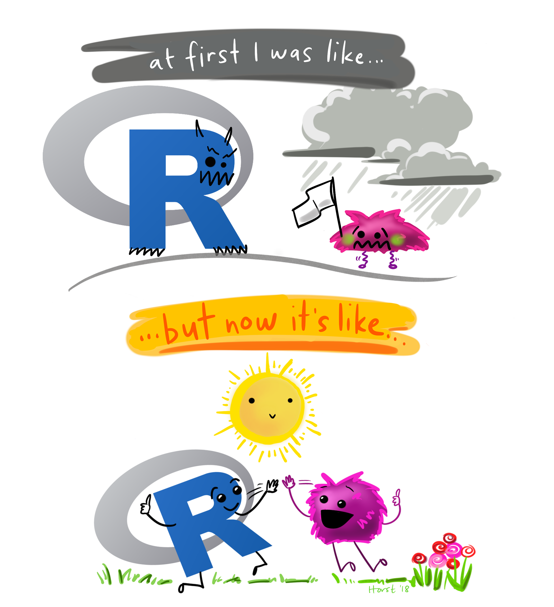

```{r setup, include=FALSE}
knitr::opts_chunk$set(echo = TRUE)

# remotes::install_github("numbats/moodlequiz")
library(moodlequiz)
```

## Intro to R

Learning to code in R is like learning to speaking a new language. Here we will go through some conventions and common vocabulary used in R. With practice, these will become familiar and intuitive - let's get started!

{width=600}

## Code and Comments

<h3>Code and Comments</h3>

Think of the code you will write in this course as instructions. Each time you tell R to run or **"execute"** your code, R will interpret your instructions and do stuff accordingly. Try running these few lines of code. Notice how each line with spit out or "return" a solution. 

<div id="r-editor-2565">
6 + 3 
</div>

Much like a calculator, R uses **operators** like `+`, `-`, `*`, `/` to do maths. The brackets `( )` are used to group together some calculations and set the order of operations. 

As we write code in this course, its often useful to add **comments** throughout our code to give it some context. R treats any text that follows a `#` and on the same line as a comment. Comments help organise your thoughts and serve as a reminder to you and your collaborators of what is happening in your code script. Here I've added some comments to the code above. Run the following code, what do you notice when the comments are run?

<div id="r-editor-2566"><pre>
# Addition
6 + 3 

# Subtraction
100 * 5 

# Some complicated math
(8651 - 734) / (4 * 9) 
</pre>
</div>

**Question:** What does R do when you run code that contains comments?

R `r cloze("reads the comment and does nothing", c("translates comments into Python code", "reads the comment and does nothing", "is confused by the comment and complains"))`.

## Assignment operator

<h3>Assignment operator</h3>

The "assignment" operator `<-`. Its used for creating objects in R. It looks like an arrow right? Think of it as inserting the code on the back of the arrow (right hand side) into the object on the pointy end of the arrow (left hand side). 

<div id="r-editor-2568"><pre>
# Insert the value 13 into the object my_lucky_number
my_lucky_number <- 13 

# Ask R what is stored in `my_lucky_number`
my_lucky_number 
</pre>
</div>

> Some folks like to use `=` instead of `<-` to assign things in R, this is a matter of personal preference - but its good practice to choose style and be consistent throughout. 

**Try:** See for yourself! Change the `<-` to a `=` in the code above and input a different lucky number. Did it work? 

<br>

When creating objects in R, there are few general rules naming things. Object names:

1. should only contain letters, numbers, and only dot or underscore characters e.g. `river_data_2005`

2. should **not** start with a number (e.g. `3obj`), a dot followed by a number (e.g. `.3obj`), or an underscore (e.g. `_obj`)

3. should **not** be a reserved keyword in R (e.g. `for`, `in`, `repeat`, `while`, etc.) (for more reserved keywords see `?reserved`).

**Try:** creating some objects, storing either a single number or even words!

<div id="r-editor-2588"><pre>

</pre>
</div>

## Functions

<h3>Functions</h3>

Another common feature you will use in R are **"functions"**. These are in-built code that performs a specific task.
For example: 

- `c()` is function used to **combine multiple values** into one object 
- `mean()` is a function that calculates the average of a series of numbers. 

<div id="r-editor-2569"><pre>
# Put some numbers in `x`
x <- c(1,2,3,4,5)

# Calculate the mean of what is stored in `x`
mean(x)
</pre>
</div>

**Try:** Join another set of numbers to x and compute the mean

<br>


Functions have **"arguments"**, these are **inputs** to a function that is needed to perform it's task. Think of these as the various settings of a coffee machine. As an example, the `mean()` function has an argument called `na.rm` for removing missing values. By default, the value is always set to false `na.rm = FALSE` but we can change the defaults to adjust the behaviour of a function.

Take this next example, I've added a NA in a series of numbers. NA represents a missing value. Try taking a mean of x now

<div id="r-editor-2570"><pre>
# Add a missing value (`NA`) in `x`
x <- c(1, 2, 3, 4, 5, NA, 7, 8, 9) 

# Calculate the mean of what is stored in `x`
mean(x, na.rm = FALSE)
</pre>
</div>

> R didn't like that right? 

**Try:** adjusting the value for the `na.rm` argument so you can take a mean of a series of number where a missing value is present.

## Data types in R 

<h3>Data types in R</h3>

R has its unique way of classifying data. Data types are fundamental when working in R as they are common entities you will be dealing with regularly.

There are 4 common data types in R: 

- character   `"calico"`
- numeric      
    - double - numbers containing decimals `197.32` (default for all numbers in R)      
    - integer - whole numbers  `5L` (the `L` tells R explicitly that 5 is a whole number)
- logical     `TRUE FALSE`
- complex     `1+4i 2+7i`

**Try:** use the functions `class()`, `typeof()`, `str()` to figure out what type of data you are working with below

<div id="r-editor-2571"><pre>
# Put some types of cats in `cats`
cats <- c("calico", "tabby", "black") # Character 

class(cats)
</pre>
</div>

<div id="r-editor-2571"><pre>
# Put some water volumes in `water_ml`
water_ml <- c(200.34, 190.57, 195.83, 197.32) # Numeric - double

typeof(water_ml)
</pre>
</div>

<div id="r-editor-2571"><pre>
# Put house counts in `number_of_houses`
number_of_houses <- c(5L, 1L, 6L, 8L, 10L) # Numeric - integer

typeof(number_of_houses)
</pre>
</div>

<div id="r-editor-2571"><pre>
# Put walk tracker data in `went_for_a_walk`
went_for_a_walk <- c(TRUE, TRUE, TRUE, FALSE, TRUE, TRUE) # Logical

str(went_for_a_walk)
</pre>
</div>


**Try:** Put several complex numbers into `space_numbers` and check its structure using `str()`

## Object types in R 1

<h3>Object types in R</h3>

Some far we have been working with **vectors**. They are the simplest object in R, `cats`, `water_ml`, `went_for_a_walk` as you seen above are all one dimensional and contains bits of data. 

<br>

**Data frame** is data stored in a table. Think of these like a single spreadsheet, a grid of rows and columns. Usually variables (the attributes you are interested in) are arranged as columns and observations for each entity you are collecting data for are arranged as rows. 

> Take a look at the data frame `mtcars` In rows, are different cars models and in the columns are a number of variables about each car. Their definitions are listed below: 

- `mpg`	Miles/(US) gallon
- `cyl`	Number of cylinders
- `disp`	Displacement (cu.in.)
-	`hp`	Gross horsepower
-	`drat`	Rear axle ratio
-	`wt`	Weight (1000 lbs)
-	`qsec`	1/4 mile time
-	`vs`	Engine (0 = V-shaped, 1 = straight)
-	`am`	Transmission (0 = automatic, 1 = manual)
-	`gear`	Number of forward gears
-	`carb`	Number of carburetors

<div id="r-editor-2572">
mtcars
</div>

**Try:** use the `names()` function to look at the variables in `mtcars`

**Questions:**

- What data type is `cyl`? `r cloze("numeric but technically an integer", c("numeric", "numeric but technically an integer", "number of cyclinders"))`
- What data type is `wt`? `r cloze("numeric but technically a double", c("numeric", "numeric but technically a double", "weight in 1000 lbs"))`
- How many variables are there in `mtcars`? `r cloze("11", c("11", "12", "32"))`
- How many obsevations are there in `mtcars`? `r cloze("32", c("11", "32", "33"))`

**Try:** The `dim()` function to answer the last two questions efficiently

> You can select a variable within your data frame using the `$` operator. Give it a go!

## Object types in R 2

Another common and object data type is a **list**. Lists are objects which can contain a mix of elements, which makes them very flexible.

We create lists using the `list()` function. Here I am creating a list and giving each **element** of my list a name (`car_data`, `cat_types`, `did_i_go_for_a_walk`). Notice I am using the `=` here to store objects into element. 

<div id="r-editor-2573"><pre>
cats <- c("calico", "tabby", "black") 
went_for_a_walk <- c(TRUE, TRUE, TRUE, FALSE, TRUE, TRUE)

useful_info <- list(cat_types = cats, # first element
                    did_i_go_for_a_walk = went_for_a_walk) # second element
</pre>
</div>

> Like a variable in a dataframe, you can access **elements** of your list using the `$` operator. Give it a go!

**Question:**

What happens when you don't provide a name to an element? `r cloze("The element is unnamed and R gives it a number", c("The element disappears", "R throws an error", "The element is unnamed and R gives it a number"))`

## Visualising your data 1

<h3>Visualising your data</h3>

Now that you have the basics under your belt, let's try looking at our data using plots! We will be using functions from an R package called `ggplot2`. R packages are shareable tools and contain functions and data that are not shipped in the base version of R. There are _MANY_ R packages out there, this is the beauty of R. Over time, you will find the right R packages for you and add them to your data science tool belt.

To make use `ggplot2` we need to first install it so we can use it in the browser

> Note that `webr::install()` is strictly used for this browser and won't apply when in working on your own computers. Use `install.packages()` on your computer instead

<div id="r-editor-2574"><pre>
webr::install("ggplot2") # Installation might take a few seconds

library(ggplot2)
</pre>
</div>


Once installed, we can load ggplot2 into R using the `library()` function. 

**Try:** Let's create a boxplot of number of cylinders by weight of the car. We want to know if the weight of cars varies with the number cylinder it has. 

<div id="r-editor-2575"><pre>
library(ggplot2) # Load ggplot2 for use

ggplot(data = mtcars, aes(x = cyl, y = wt, group = cyl)) +  # Point to data and the x-variable and the y-variables
  geom_boxplot() # Create boxplot
</pre>
</div>

Let's talk through the code: 

- `ggplot(data = mtcars)` tells `ggplot`, that we are working with the mtcars data frame
- `aes()` is short **aesthetics**, within this function is where we tell `ggplot` what variables we want to work with.
  - `x = cyl` tells the function that we want to place `cyl` on the x axis 
  - `y = wt` tells the function that we want to place `wt` on the y axis 
  - `group = cyl` tells the function that we want to treat `cyl` as a grouping variable. This means we want to compare between cars with different number of cylinders (4, 6, 8)

**Question:** Now take a look at the plot, what pattern do you see? 

Cars with more cylinders `r cloze("tend to", c("are always", "tend to"))` weigh `r cloze("more", c("more", "less"))` than cars with fewer cylinders.

<br>

## Visualising your data 2

**Question:** How does mileage `mpg` vary between different transmissions `am`? What would the `ggplot` code look like? 

```r
# Specify the data, the x-variable and the y-variable
ggplot(data = mtcars, aes(x = `r cloze("am", colnames(mtcars))`, y = `r cloze("mpg", colnames(mtcars))`, group = `r cloze("am", colnames(mtcars))`)) +  
  geom_boxplot() # Create boxplot
```

**Try:** Change the code above and see for yourself! 

<div id="r-editor-2595"><pre>


</pre>
</div>


**Question:**
`r cloze("Manual", c("Automatic", "Manual"))` cars `r cloze("tend to", c("are always", "tend to"))` have `r cloze("higher", c("higher", "lower"))` mileage. 
