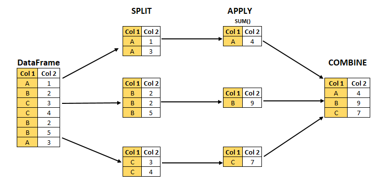

```{r setup, include=FALSE}
knitr::opts_chunk$set(echo = TRUE)

# remotes::install_github("numbats/moodlequiz")
library(moodlequiz)
```

<h3>Data manipulations with Penguins!</h3>

The purpose of this section is to get some hands-on experience with data manipulation an R package **`dplyr`**. You will learn about what **pipes** are in R and some key **data manipulation verbs**!

Recall from the previous page that an R package is a set of related functions and data that can be loaded into R to help you get a specific job done. 

**Meet the penguins!**


> We will be working with the`palmerpenguins` data, which contains size measurements for three penguin species observed on three islands in the Palmer Archipelago, Antarctica.

The `penguins` dataset is from the `palmerpenguins` the R package so we will also need to install and load that into R. 

## Setting up

<h3>Setting up</h3>

Let's go ahead and install these two packages for the browser

> Note if you refresh the browser or check any answers as you are doing the challenges, you will need to install and load `dplyr` and `palmerpengins` again. 

<div id="r-editor-110"><pre>
install.packages(c("dplyr","palmerpenguins"))

library(dplyr) 
library(palmerpenguins) 
</pre>
</div>

## Take a look at the data 

<h3>Take a look at the data</h3>

<div id="r-editor-111"><pre>
penguins
</pre>
</div>

> Notice anything different in how R is presenting the `pengiuns` data compared to `mtcars`?

## But first, have you met the pipe?

Before diving into data wrangling, I want to introduce to you a very *special* operator, the pipe! **`|>`**. The pipe looks like a funnel on its side right? The pipe takes the code from the left side of it and passes it on to the code on the right side.  

Let's talk through an example. I'd like to know how many unique `islands` there are in the `penguins` dataset. Typically, I would use: 

- the `unique()` function which gives me the distinct values in a variable
- the `length()` function which counts the number of elements in a vector

The code would look like this: 

<div id="r-editor-112"><pre>
# Recall `$` allows you to select a variable from a data frame
length(unique(penguins$island)) 
</pre>
</div>

This is not very nice looking code, you have to read from inside out which is not very intuitive. There is where pipes come in handy. 

<div id="r-editor-113"><pre>
penguins |>  # Take the dataset
  unique() |>  # Tell me the distinct values
  length() # Tell me how long the vector is
</pre>
</div>

Here you can read from top to bottom, left to right. You can see the order of steps! 

> Importantly, the pipe pairs well with `dplyr` functions as it allows to do multiple data wrangling steps in one go which you will see more of below

## Working with `dplyr`

<h3>Working with `dplyr`</h3>

> Learn more from [the dplyr guide](https://dplyr.tidyverse.org/articles/dplyr.html), its really comprehensive! 

<h4>Extracting rows</h4>

The `filter()` function allows you to take subsets of a data frame. You have to specify the **condition** for which rows to keep. 

Take this example, the code below gives me data for only `penguins` from the `Dream` Island.

<div id="r-editor-114"><pre>
penguins |> 
  filter(island == "Dream")
</pre>
</div>
 
Let's walk through the code: 

1. The`penguins` dataset is piped to the `filter()` function. 
2. Within the `filter()` function is where we specify our condition. I've used the **equal-to operator** represented by `==` here to tell R, I only want rows from the variable `island` where it's value matches the word "Dream"

We can create more specific conditions using **logical operators** `&`, `|`, `!` 

Try these examples and see if you can understand the conditional statements

> Give me the penguins **ONLY** from Dream island from the year 2008

<div id="r-editor-115"><pre>
penguins |> 
  filter(island == "Dream" & year == 2008)

# The above can also be written using commas instead
penguins |> 
  filter(island == "Dream", year == 2008)
</pre>
</div>

> Give me all the penguins from Dream island *OR* from Torgersen island 

<div id="r-editor-116"><pre>
penguins |> 
  filter(island == "Dream" | island == "Torgersen")
</pre>
</div>

What if we want to filter on some numeric variable? This is where **relational operators** like `>` and `<` come in play. These are useful for selecting **ranges** in your data. 

**Tip:** Pipe your filtered data into `summary()` to check if your code worked or not! 

> Give me all the penguins where their bill size is **GREATER** than 16 AND **LESS** than 20

<div id="r-editor-117"><pre>
penguins |> 
  filter(bill_depth_mm > 16 & bill_depth_mm < 20) 
</pre>
</div>

> Give me all the penguins where their flipper length is **GREATER OR EQUAL TO** than 210 AND **LESS OR EQUAL TO** than 230

<div id="r-editor-118"><pre>
penguins |> 
  filter(flipper_length_mm >= 210 & flipper_length_mm <= 230)
</pre>
</div>

<h4>Keep or dropping columns</h4>

Large datasets with many columns can be tricky to view in R so at times, it may be useful to discard columns that are not relevant for a particular task.

The `select()` allows you to rapidly zoom in on the stack of data you are interested. 

Here, we are only keeping the columns `species`, `island`, `year` and `flipper_length_mm`

<div id="r-editor-119"><pre>
penguins |> 
  select(species, island, year, flipper_length_mm)
</pre>
</div>

You can use the colon operator `:` that is useful for selecting consecutive stacks of data. Here we are keeping columns from `species` **through to** `bill_depth_mm`

<div id="r-editor-120"><pre>
penguins |> 
  select(species:bill_depth_mm)
</pre>
</div>

You can use other `dplyr` verbs such as `starts_with()`, `ends_with()`, `contains()` into make your selection more efficient and specific

<div id="r-editor-121"><pre>
penguins |> 
  select(species, ends_with("_mm"))
</pre>
</div>

Its also a handy way to rearrange the order of your columns. It is a matter of preference data is nicer to navigate when we can see the grouping structure first like this: 

<div id="r-editor-122"><pre>
penguins |> 
  select(species, island, sex, year, where(is.numeric))
</pre>
</div>

<h4>Create and modify columns</h4>

A common task with data analysis is making new variables. For example, a collaborator shared some temperature data from North America (ºF) and Europe (ºF) and you need a way to standardise these  so it can all go into the same analysis. This is where `mutate()` will be useful.

> Here, we are taking the log to the base of 10 of `body_mass_g` so we can very heavy penguins and very light penguins can be viewed on a similar scale. 

<div id="r-editor-123"><pre>
peguins_log10mass <- penguins |> 
  mutate(log_10_mass = log10(body_mass_g)) 

peguins_log10mass
</pre>
</div>

**Note** that we are **assigning** the updated data frame into an object `peguins_log10mass`, if you skip this step, your new variable won't be saved!

<h4>Sorting by columns</h4>

Sorting your data is a quick way to get a sense of data. The `dplyr` function for this is `arrange()`. 

> Here, we are sorting the species and island, by default, `dplyr` sorts the dataset alphabetically

<div id="r-editor-124"><pre>
penguins |> 
  arrange(species, island)
</pre>
</div

You can arrange your data by multiple variables too 

> Here, we are sorting the species and island and body_mass_g by default, `dplyr` sorts the numeric variables in an increasing order

<div id="r-editor-125"><pre>
penguins |> 
  arrange(species, island, body_mass_g)
</pre>
</div

You can use `desc()` if you want to sort a numeric variable in decreasing order too! 

<div id="r-editor-126"><pre>
penguins |> 
  arrange(species, island, desc(body_mass_g))
</pre>
</div

<h4>Compute group summaries</h4>

When working with data, we often want know certain summaries about groups in our data. For example, we may need to report on the average tree canopy cover for each study sites or median house prices of different states. These are classic examples of the **split-apply-combine** paradigm. We want to split our data by group, apply a type of calculation on each of these subgroups and then bring these seperate parts together again. 

{width=70%}

In `dplyr`, the `group_by()` and `summarise()` functions are powerful tools for us to obtain group-level insights. 

Let's say I want to know how `body_mass_g` of penguins varied by `sex`, `year`, `island`. We can achieve this with 3 lines of code! We've set `mean(body_mass_g, na.rm = TRUE)` as some penguins didn't have body mass data. 

<div id="r-editor-127"><pre>
penguins |> 
  group_by(sex, year) |>  # tell dplyr what groups I am interested in
  summarise(mean_body_mass = mean(body_mass_g, na.rm = TRUE)) # Calculate the average body mass and store that info in `mean_body_mass`
</pre>
</div

<h4>Using pipes with dplyr verbs</h4>

> Notice how I used the pipe twice in the code above? This is the power of the pipe + `dplyr` combo as it allows you   to chain multiple steps together to get a data wrangling job done!

Consider this example, let's say we want data for:

- female Gentoo penguins 
- that are larger than body masses greater or equal to 3500g
- mass-corrected flipper and bill length (dividing flipper and bill length by mass)
- the final dataset should only contain the mass-corrected flipper and bill length and year

But with the pipe, you can take the output of one step and pipe it in as input to the next step. E.g. the code above becomes

<div id="r-editor-128"><pre>
penguins |> 
  filter(sex == "female",  # Filter for the target pengins we want
         species == "Gentoo",
         body_mass_g > 3500) |> 
  mutate(mass_corrected_flipper_length_mm = flipper_length_mm / body_mass_g, # Create some new variables for analysis
         mass_corrected_bill_length_mm = bill_length_mm / body_mass_g) |> 
  select(starts_with("mass_corrected"), year) # Keep only the variables we need for our statistical model
</pre>
</div

Without the pipe, you would need to save the output for each step which createsintermediary objects in your environment that will won't need and the code is a bit harder to read as you need to track what object is going into each step

<div id="r-editor-129"><pre>
# Filter for the target pengins we want
target_sample <- filter(penguins, 
                        sex == "female",
                        species == "Gentoo",
                        body_mass_g > 3500)


# Create some new variables for analysis
target_sample_mass_corrected <- mutate(target_sample, 
                                       mass_corrected_flipper_length_mm = flipper_length_mm / body_mass_g, 
                                       mass_corrected_bill_length_mm = bill_length_mm / body_mass_g)

# Keep only the variables we need for our statistical model
target_sample_mass_corrected_analysis_ready <- 
  select(target_sample_mass_corrected, starts_with("mass_corrected"), year)
</pre>
</div

# Data hygiene

## Variable names

<h3>Variable names</h3>

Its often easier to collect data in a spreadsheet that is human-readable e.g. column names that look like this `Date`, `Species`, `Island` `Body Mass (g)`, however these are actually very difficult for machines, like R, to read. 

Machine readable names have some of the following attributes: 

- all in lower case, this makes coding easier!
- do not contain spaces or special characters
- words are separated by underscores `_` or hypthens `-`

The `janitor` R package has a really useful function `clean_names()` that can translate human-readable column names to machine-friendly ones. Let's take it for spin on the `penguins_raw` dataset which is the original, pre-processed version of the `penguins`. 

> Notice I am using the `names()` functions to grab all the column names of the `penguins_raw` dataset

<div id="r-editor-130"><pre>
install.packages(janitor)

library(janitor)

names(penguins_raw)

clean_names(penguins_raw) # HUZZAH! 
</pre>
</div

## Getting familiar with your data

<h3>Getting familiar with your data</h3>

Before launching into any data cleaning or analysis, its good practice to get familiar with your data. Looking at the simple plots and tabulating variables if interest are some of the ways to check your data for any data entry errors or issues. 

<h4>Categorical variables</h4>

For categorical variables, you can take a look at the table of counts of each value using `group_by` and `count()`

<div id="r-editor-131"><pre>
penguins |> 
  group_by(species) |> 
  count()
</pre>
</div

<h4>Numeric variables</h4>

For numeric variables, creating a quick histogram allows you to get a sense of the distribution of values. You can use `ggplot2` but here we are using the basic `hist()` function as its for quick viewing purposes. 
 
<div id="r-editor-132"><pre>
penguins$flipper_length_mm |> hist()

# `ggplot2` alternative (need to install ggplot2 for the browser first though)
#
# library(ggplot2)
# 
# penguins |> 
#   ggplot(aes(x = flipper_length_mm)) + 
#   geom_histogram()
</pre>
</div

<h3>Summaries of whole dataset</h3>

Finally, you can use the `summary()` function to get a quick overview of the range values and any missing data for every variable in your dataset all at once

<div id="r-editor-133"><pre>
summary(penguins)
</pre>
</div

The `skim()` function from the package  `skimr` creates mini data summary report along with histograms for you to get a sense of your data.

<div id="r-editor-134"><pre>
install.packages("skimr")

library(skimr)

skim(penguins)
</pre>
</div
