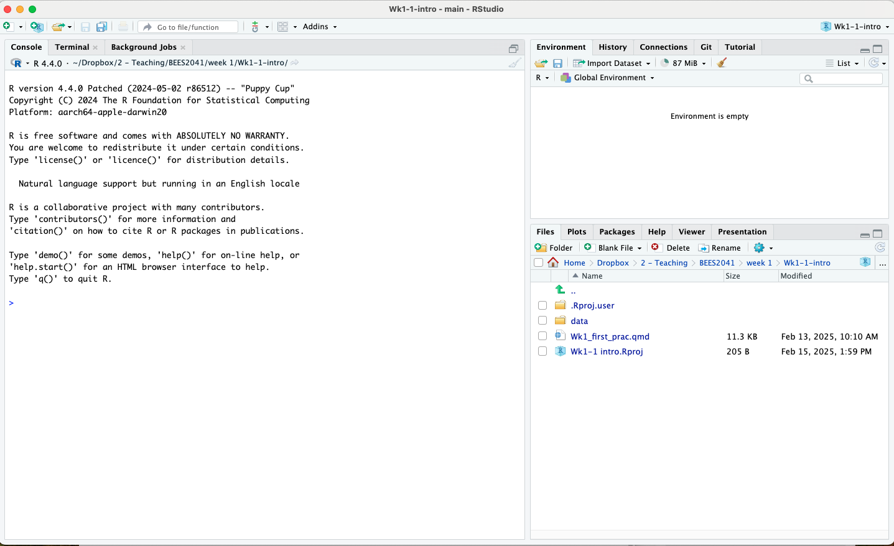
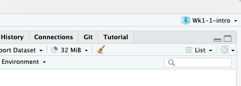
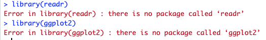
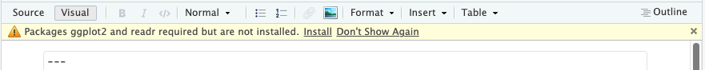
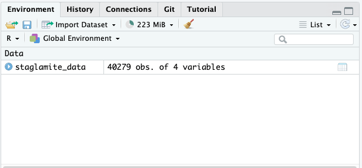

```{r setup, include=FALSE}
knitr::opts_chunk$set(echo = TRUE, eval = FALSE)
```

{width=70%}

## Getting Started in RStudio

<h2>Getting Started in RStudio</h2>

R Studio is an integrated development environment (IDE) that allows you to write and run code and visualise data all in one place.

We will use this program throughout the course and over time you will really know your way around! But first let's get you set up for success...

<h3>Setting up</h3>

1. Create a folder in a meaningful location on your computer called `BEES2041`
2. Download `Wk1-1-materials` from the course page in Moodle. This is a zip file.
3. Move the zip file `Wk-1-intro` into your course folder (`BEES2041`) you created in step 1.
4. Unzip the file by: 
  - MacOS: Double clicking the file `Wk-1-intro`
  - Windows: Right click on the zip file and click "Extract All" 
5. **Click on the `Wk-1-intro.Rproj`** to open the RStudio project and you're in!!!

<h3>The RStudio Layout</h3>

Now that you're in RStudio, let's talk through all the panes and features you can see

{width=100%}
<br>

When you open `Wk-1-intro.Rproj`, you will be greeted by three panels:

- The interactive **R console** (entire left pane)

This is where R lives, and where it will responds and return the outputs you create using code

- **Environment**/History (upper right pane)

This is where all the objects you create will live. The **History** tab is the running tab of all the R code you run, note that is history is not saved but don't worry we have another way of saving code which we'll talk about later!

- **Files**/Plots/Packages/Help/Viewer (lower right pane)

This is where you can see the files in the project. The **Plots** tab is where you will view the plots that you create, the  **Packages** tab is where you can see the R packages you have installed and **Help tab** is where we can pull up help files (more on this later!)

**Tip:** Its a really good sanity check to look at the top right corner of RStudio. If you can see you are in the folder `Wk1-1 intro` we are off to a gooooood start! 

{width=80%}

> If you see `Project: (None)`, close RStudio and **Click on the `Wk-1-intro.Rproj`**

<h3>Project organisation goes a long way</h3>

Let's talk a bit about **RStudio projects** and why they make our data analysis live easier.

A `.Rproj` file will keep all your ducks in a row, all your data and code scripts will now live under the house of `Wk1-1 intro`. This means pointing to data files will be **relative** to the project directory.

**Try**: To illustrate this, type the following code into the R console pane

```{r, eval=TRUE}
# Get your current location also know as 'working directory'
getwd()
```

The `getwd()` function, tells you the 'address' or **file path** that you are currently in. Everyone will have different output because we all created the `BEES2041` folder in a unique location on our computers that makes sense to us. What is *critical* is the latest part `Wk-1-intro`. We are **ALL** working in the project folder `Wk-1-intro`! This minor little detail will make loading our own data into R a smooth process.

<h3>Hello, meet Quarto docs</h3>

> Let's go ahead and click on `Wk_1_first_prac.qmd`

Clicking this file will open the the editor pane in the top right corner. This is where we will start writing our own R code for the rest of this prac.

{width=60%}

<br>

`Wk_1_first_prac.qmd` is a **Quarto document** and its where you can write and format regular text alongside **code chunks** and any pretty figures/tables you produce into one beautiful, seamless page.

The **code chunks** are the grey boxes with the header `{r}` at top left corner. This is where you will write R code. 

> Notice how the font is different in **code chunks**. 

**Try**: There are several ways to run code in a Quarto doc, its a matter of preference. You end up using a combination of these methods:

1. You can run **all code** within each of these chunks but clicking the **green play** on the top right hand corner
2. You can place your mouse cursor on a particular line and click on the **"Run"** button. This allows you to have more targeted control on what line of code to run.
3. OR you can use the keyboard shortcut **CMD/Ctrl + Enter**

<h3>Errors in R</h3>

When you ran the code in the first chunk, you'll notice R was not happy. 


<br>
Getting errors in R are a common experience and they're totally harmless. The error messages usually gives you some clues as to what R is complaining about.

> Here, R is tell us we don't have the R packages `readr` and `ggplot2` installed

<h4>Installing packages</h4>

Let's go ahead and install these on your computer. 

Usually RStudio is clever enough to figure this out and will prompt you at the top of your Quarto doc like this:



<br>

You can click on the "Install" and that should take care of the error.

**Try:** Alternatively, you can use the `install.packages()` function. We've given you the code as a **comment** in the chunk. Recall, that comments in R in are preceded with a `#` and R will ignore these lines. 

> Let's try uncommenting that line by deleting the `#`, then go ahead and run that line of code to install `readr` and `ggplot2`. Once you're done, comment out this line by putting a `#` at the start of the line once you are done, otherwise you will be installing those packages again every you run that chunk!

**Importantly** you only need to install packages **ONCE**. This is different to **loading** packages into R using the `library()` function. You load packages once using `library()` for each Quarto doc right at the start of the document.

<h3>Loading data into R</h3>

Now that we have all the packages we need for this prac installed and loaded (yay!), let's get into some data!! 

The data you need for this prac lives in the `data/` folder that you can see in the **"Files" tab** in the bottom-left pane. There are 2 datasets in the folder: 

- `Laminated stalagmite Dataset.csv` 
- `sydneybeaches.csv`

You can tell these are "comma-seperated values" by the file type `.csv`.

We are going to use the function `read_csv` to load the `Laminated stalagmite Dataset.csv` into R.

```{r}
staglamite_data <- read_csv("data/Laminated stalagmite Dataset.csv")
```

Let's walk through the code:

- Within the `read_csv()` function is where we supply the 'address' or file path to `Laminated stalagmite Dataset.csv`. The file lives inside the `data/` folder so its path is `"data/Laminated stalagmite Dataset.csv"`
- We are using the `<-` operator to store this dataset into an object
- The object that holds the dataset is `stalagmite_data`

> Its crucial to assign the output of `read_csv()` into an object, otherwise R won't hold it in memory for you to use

**Notice:** In the "Environment" tab, we can now see `stalagmite_data` that we just created!



<br> 

Clicking on `staglamite_data` in the "Environment" tab will give you a nice preview of the data. Alternatively, you can type and run the code for R to print the data into the "Console" pane.

```{r}
stalagmite_data
```

> Note that `read_csv()` will always return your data as a tibble data structure

Now you are all set you proceed with the section!
