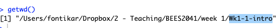

```{r setup, include=FALSE}
knitr::opts_chunk$set(echo = TRUE)
```

## Getting Started in RStudio

R Studio is an integrated development environment (IDE) that allows you to write and run code and visualise data all in one place.

We will use this program throughout the course and over time you will really know your way around! But first let's get you set up for success...

### Setting up

1. Create a folder in a meaningful location on your computer called `BEES2041`
2. Download `Wk1-1-materials` from the course page in Moodle. This is a zip file.
3. Move the zip file `Wk-1-intro` into your course folder (`BEES2041`) you created in step 1.
4. Unzip the file by: 
  - MacOS: Double clicking the file `Wk-1-intro`
  - Windows: Right click on the zip file and click "Extract All" 
5. **Click on the `Wk-1-intro.Rproj`** to open the RStudio project and you're in!!!

### The RStudio Layout

Now that you're in RStudio, let's talk through all the panes and features you can see

{width=100%}
<br>

When you open `Wk-1-intro.Rproj`, you will be greeted by three panels:

- The interactive **R console** (entire left pane)

This is where R lives, and where it will responds and return the outputs you create using code

- **Environment**/History (upper right pane)

This is where all the objects you create will live. The **History** tab is the running tab of all the R code you run, note that is history is not saved but don't worry we have another way of saving code which we'll talk about later!

- **Files**/Plots/Packages/Help/Viewer (lower right pane)

This is where you can see the files in the project. The **Plots** tab is where you will view the plots that you create, the  **Packages** tab is where you can see the R packages you have installed and **Help tab** is where we can pull up help files (more on this later!)

**Tip:** Its a really good sanity check to look at the top right corner of RStudio. If you can see you are in the folder `Wk1-1 intro` we are off to a gooooood start! 

{width=80%}

> If you see `Project: (None)`, close RStudio and **Click on the `Wk-1-intro.Rproj`**

### Project organisation goes a long way

Let's talk a bit about **RStudio projects** and why they make our data analysis live easier.

A `.Rproj` file will keep all your ducks in a row, all your data and code scripts will now live under the house of `Wk1-1 intro`. This means pointing to data files will be **relative** to the project directory.

**Try**: To illustrate this, type the following code into the R console pane

```{r, eval=FALSE}
getwd()
```

The `getwd()` function, tells you the 'address' or **file path** that you are currently in. Everyone will have different output because we all created the `BEES2041` folder in a unique location on our computers that makes sense to us. What is *critical* is the latest part `Wk-1-intro`. We are **ALL** working in the project folder `Wk-1-intro`! 

{width=80%}

### Hello, meet Quarto

> Let's go ahead and click on `Wk_1_first_prac.qmd`

Quarto notebooks (*.qmd) are files that include:

plain text where you can write down the number of the questions, add explanations that will describe to you what any bits of code are doing
R code. These are put into the notebook file as “chunks” and are easily distinguished from your text explanations
the output of any any code that you run (analyses, graphics etc.)
There is obviously lots more to learn about how R works, but we can get started straight away and learn that as we go.

5. Within Rstudio, open the Quarto notebook `Wk_1_first_prac.qmd`

### Where am I? A primer on file paths

```{r}

```

