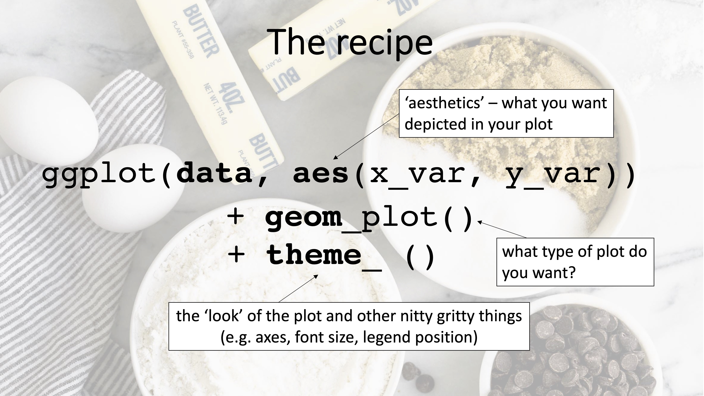

```{r setup, include=FALSE}
knitr::opts_chunk$set(echo = TRUE)

# remotes::install_github("numbats/moodlequiz")
library(moodlequiz)
```

# Data wrangling + visualisation

<h3>Data wrangling + visualisation</h3>

Wrangling your data into the right format is a critical step to data visualisation and analysis. It is a scientist's bread and butter. Today, we will be working primarily with the packages `dplyr` and `ggplot2` and to apply the skills you've learned so far to make some publication-ready plots - let's get started!

{width=70%}
<br>

<h4>Setting up</h4>

**Materials:**

Everything you need for this prac is on Moodle

1. Download the `Wk1-2-materials` zip file from Moodle, from the course page
2. Extract the zip file into your `BEES2041/` folder
3. Unzip the file by: 
  - MacOS: Double clicking the file `Wk-1-intro`
  - Windows: Right click on the zip file and click "Extract All" 
5. **Click on the `Wk-1-2-data-manip.Rproj`** to open the RStudio project and you're in!!!

We will be working with real-world datasets collected by researched in the School of Biological, Earth & Environmental Sciences. These are in the `data/`.

Each dataset is associated with its own Quarto document (`Wk1-2-plant-height.qmd`, `Wk1-2-stalagmites.qmd`). Within each Quarto docs there are several challenges for you to complete on your own devices in order to **answer the questions on Moodle**.

Before we dive in, let's consider what data visualisation means.

### How can we visualise data?

A picture is worth a thousands words. The choice of your visualisation can have a huge impact on the key message you want to give to the viewer. So ask yourself: **What is it that I want to convey?**

Below are a series questions, we want you to try answer with a data viz. 

For each question, work your fellow classmates to determine: 

- what variables you'll need and,
- how to best represent that data. 

Free free to put the white boards/pen and paper to go use!

Get creative, you can also use this [data-to-viz website](https://www.data-to-viz.com/) to explore get inspiration.

**Questions:**

1. What is the distribution of bill depth of each penguin species?
2. How does bill length vary between islands?
3. Which penguin species have the shortest flippers?
4. What is the relationship between bill length and depth in different species?
5. Does this relationship change over time?

Now, let's give you the run down on `ggplot2`

## ggplot2 

`ggplot2` is package for creating graphics, based on [The Grammar of Graphics](https://www.amazon.com/Grammar-Graphics-Statistics-Computing/dp/0387245448/ref=as_li_ss_tl). You provide the data, speak to `ggplot2` about how to map variables to **aesthetics**, what **geometries** to you, and it takes care of the details.

{width=20%}

## The recipe for a `ggplot()`



## Now, your turn!

Now try to make the plots your group discussed, using ggplot.

Take a look at the `ggplot2` cheatsheet

### Setting up

Remember the `palmerpengiuns`? They will also be joining us in this demo. 

```{r}
# install.packges(c("ggplot2", "palmerpenguins"))

library(ggplot2)
library(palmerpenguins)
```


## Bring on the real-world datasets!

Over to you, open either the `plant

