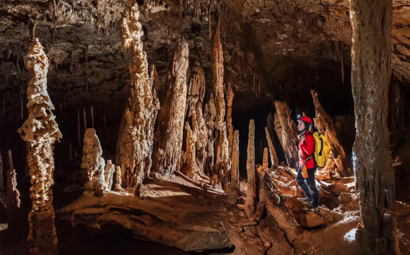

```{r setup, include=FALSE}
knitr::opts_chunk$set(echo=TRUE)

# For maintaining
library(moodlequiz)
library(here)

# Used in Prac
library(readr)
library(ggplot2)
library(dplyr)
library(skimr)
library(janitor)

syd_beach_data <- read_csv(here("R/Wk1/data/sydneybeaches.csv")) |> clean_names()

# Used in final question for readable code
syd_beaches <- c("Clovelly Beach", "Coogee Beach", "Gordons Bay East", "Little Bay Beach","Malabar Beach", "Maroubra Beach","South Maroubra Beach","South Maroubra Rockpool", "Bondi Beach","Bronte Beach", "Tamarama Beach")
```

<h1>Take your skills for a spin!</h1>

> Note: The quiz questions on Moodle are the same as the ones in this Quarto file. Please write and run code in this document in Rstudio and answer the questions in Moodle as you go.

<h2>Set up R packages</h2>

```{r, eval=FALSE}
# install.packages(c("readr", "ggplot2", "dplyr", "skimr", "janitor"))
library(readr)
library(ggplot2)
```


# Stalagmite data

<h2>Stalagmite data</h2>

{width="100%"}

<br>

Stalagmites are mineral formations that grow in caves, preserving environmental records in their layered structure. Paleoclimatologists from the [Climate Change Research Centre](https://www.unsw.edu.au/research/ccrc) collected this data. The thickness of each lamina reflects past climate conditions—thicker layers often indicate wetter periods, while thinner ones suggest drier times. By analysing lamina thickness and age, scientists can reconstruct past climate patterns, track seasonal variations, and identify historical environmental events.

This dataset contains laminated stalagmite measurements, with 40,279 records. It includes the following columns:

-   `entity_id`: Identifier for the stalagmite sample.
-   `seq_id`: Sequence identifier (likely referring to sample grouping).
-   `lamina thickness (mm)`: Thickness of individual laminae in millimeters.
-   `lam_age (BP, 0=1950AD)`: Age of the lamina in years before present (BP), with 0 corresponding to 1950 AD.

> You may find it helpful to use the function `clean_names()` from the `janitor` R package first before delving in. You may need to install this package first. Remember to use `library(janitor)` to load this package into R, put this code in the first R chunk!

Using the functions you've learned so far in this prac, try answer the following questions:

**Questions:**

## How many rows and columns are in `stalagmite_data`?

**How many rows and columns are in `stalagmite_data`?** Rows = `r cloze(40279)`, columns = `r cloze(4)`

##  What type of variable is `lamina_thickness_mm`?

**What type of variable is `lamina_thickness_mm`?** `r cloze("numeric", c("complex number", "integer", "numeric", "character"))`

# Sydney Beaches

<h2>Sydney Beaches</h2>

{width="100%"}

<br>

Sydney-siders LOVE their beaches and want to know the best swimming locations. A team of enviromental scientists from the School of Biological, Earth & Environmental Sciences. The dataset contains water quality measurements for Sydney beaches, It includes records of enterococci levels (cfu per 100ml) across a number of year, along with geographic coordinates. Enterococci levels are used as an indicator of water pollution and safety for swimming.

> We want to try answer the question **which beach is the "cleanest" in Sydney?**, we'll be using the dataset `sydneybeaches.csv`

First, read in the data.

**Questions:**

**Check the structure to make sure the variable types were assigned correctly.**

## Which of these variables were assigned incorrectly?

**Which of these variables were assigned incorrectly?** `r cloze("enterococci_cfu_per_100ml", colnames(syd_beach_data))`

**Change `Enterococci_cfu_per_100ml` to an integer variable.**

## Primer to plot

Use this newly formatted data to visualise the amount of bacteria found at each `Site.`

To make the plot, replace the terms `your_data`, `x_variable`, and `y_variable` with your choice of variables relevant to your question. Using the `dplyr` package here is advised. You may need to:

-   Exclude a potential outlier or not ;) - try both!

-   Apply a transformation on `Enterococci_cfu_per_100ml` e.g `sqrt()` or `log10(nterococci_cfu_per_100ml + 1`) - try both!

-   Try `geom_boxplot()` and `geom_violin()` with `geom_point()`

## Why did we need to transform the data? {type=essay}

**Why did we need to transform the data?**

## What does the shape of the violin plot tells us about the data? {type=essay}

**What does the shape of the violin plot tells us about the data?**

## ...and finally, where would you recommend Sydney-siders to go swimming?

**...and finally, where would you recommend Sydney-siders to go swimming?**

From looking at our plots, `r cloze("Gordons Bay East", c(syd_beaches))` and `r cloze("South Maroubra Beach", c(syd_beaches))` `r cloze("tend to", c("tend to", "almost always"))` have `r cloze("lower", c("lower", "higher"))` levels of Enterococci levels, however we would need further analysis to be sure.


