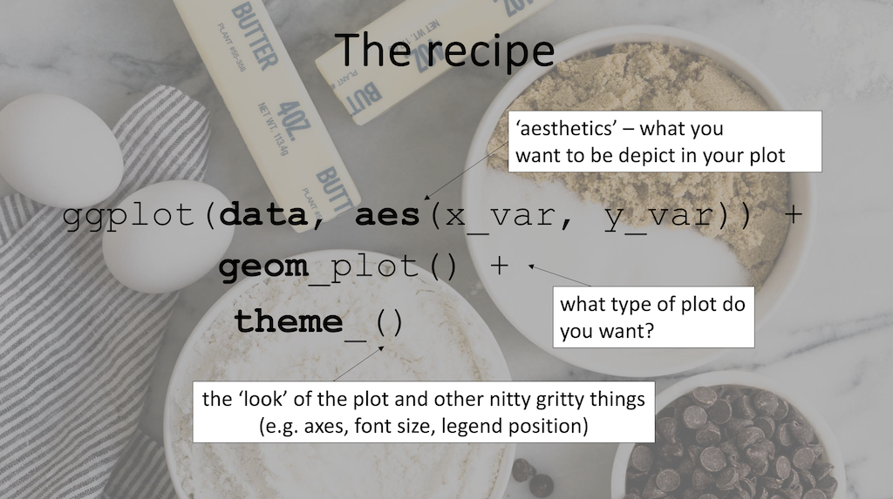
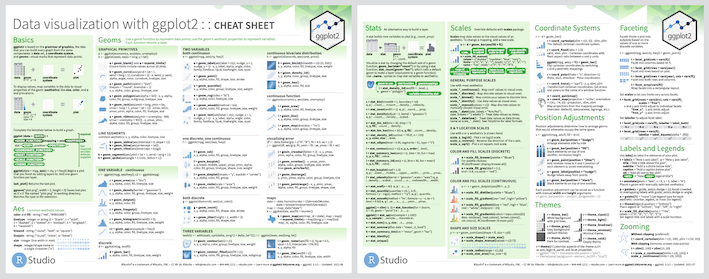

```{r setup, include=FALSE}
knitr::opts_chunk$set(echo = TRUE)

# remotes::install_github("numbats/moodlequiz")
library(moodlequiz)
```

# Data wrangling + visualisation

<h3>Data wrangling + visualisation</h3>

Wrangling your data into the right format is a critical step to data visualisation and analysis. It is a scientist's bread and butter. Today, we will be working primarily with the packages `dplyr` and `ggplot2` and to apply the skills you've learned so far to make some publication-ready plots - let's get started!

{width=70%}
<br>

<h4>Setting up</h4>

**Materials:**

Everything you need for this prac is on Moodle

1. Download the `Wk1-2-materials` zip file from Moodle, from the course page
2. Extract the zip file into your `BEES2041/` folder
3. Unzip the file by: 
  - MacOS: Double clicking the file `Wk-1-intro`
  - Windows: Right click on the zip file and click "Extract All" 
5. **Click on the `Wk-1-2-data-manip.Rproj`** to open the RStudio project and you're in!!!

We will be working with real-world datasets collected by researched in the School of Biological, Earth & Environmental Sciences. These are in the `data/`.

Each dataset is associated with its own Quarto document (`Wk1-2-plant-height.qmd`, `Wk1-2-stalagmites.qmd`). Within each Quarto docs there are several challenges for you to complete on your own devices in order to **answer the questions on Moodle**.

Before we dive in, let's consider what data visualisation means.

<h3>Thinking about data visualisations</h3>

A picture is worth a thousands words. The choice of your visualisation can have a huge impact on the key message you want to give to the viewer - consider: **What is it that I want to convey?**

> Remember the `palmerpengiuns`? They will also be joining us in this prac.


```{r}
# install.packges(c("ggplot2", "palmerpenguins"))

library(ggplot2)
library(palmerpenguins)

penguins
```

**Activity:** 

For each question below, work with your fellow classmates to determine a suitable data viz. Think about:
  
- what are the key variables of interest 
- what are type of variable(s) are you working with e.g numeric or grouping/categorical?
- how to best represent that data using graphics 

Get creative, feel free to put the white boards/pen and paper to good use!
  
> You can also use this [data-to-viz website](https://www.data-to-viz.com/) to explore and get inspired

**Question: What type of plot would be suitable to answer the following questions (Select all that apply):**
  
1. What is the distribution of bill depth of each penguin species? `r cloze(c("boxplot" = 1, "histogram" = 1, "line plot" = 0, "pie chart" = 0, "scatterplot" = 0, "violin" = 1))`,
type = "vertical")`
2. How does bill length vary between islands?  (Select all that apply)`r cloze(c("boxplot" = 1, "histogram" = 1, "line plot" = 0, "pie chart" = 0, "violin" = 1,"scatterplot" = 0, "line plot" = 0))`
3. Which penguin species have the shortest flippers? `r cloze(c("boxplot" = 1, "histogram" = 1, "line plot" = 0, "pie chart" = 0, "scatterplot" = 0, "violin" = 1))`
4. What is the relationship between bill length and depth in different species?`r cloze(c("boxplot" = 0, "histogram" = 0, "line plot" = 1, "pie chart" = 0, "scatterplot" = 1, "violin" = 0))`
5. Does the relationship between bill length and depth change over the years? `r cloze(c("boxplot" = 0, "histogram" = 0, "line plot" = 1, "pie chart" = 0, "scatterplot" = 1, "violin" = 0))`

> Now, let's properly introduce `ggplot2` to you.

## ggplot2 

`ggplot2` is package for creating graphics, based on [The Grammar of Graphics](https://www.amazon.com/Grammar-Graphics-Statistics-Computing/dp/0387245448/ref=as_li_ss_tl). You provide the data, speak to `ggplot2` about how to map variables to **aesthetics**, what **geometries** to you, and it takes care of the details.

{width=20%}

<h3>The recipe for a `ggplot()`</h3>

There are four core components to a `ggplot` :

1. The **data** you are working with e.g `penguins`
2. The **aesthetics** which controls the variables you want to work with
3. The **geometries** dictates the type of plot you want to create
4. The **theme** where you can fine tune the "look" of your plot



<br> 

**Notice** instead of pipes `|>`, we use `+` to add layers of components to a plot. 

Throughout the course, you'll learn to tweak these four components to create beautiful data vizzes. 

> Let's try tackle these questions and plots together

## What is the distribution of bill depth of each penguin species

From the question, we know we need to work with `species` and `bill_depth_mm`, these will be our **aesthetics**. 

- `species` is the grouping variable we want to detect differences, making it an "independent" or **"predictor"** variable. 
- `bill_depth_mm` is the entity we want to use compare, making it a "dependent" or **"response"** variable. 

> Let's make some histograms to view the distributions of `bill_depth_mm` of each species (boxplots/violins are valid choices too!). 

Histograms depict the range of numeric values along the `x` axis and the height of the bars represent the `count` of each value. Here's the code to create a histogram for each species: 

```{r}
ggplot(data = penguins, # `penguins` data 
       aes(x = bill_depth_mm, # what I want to depict on the x axis 
           group = species,  # group level comparisons using `species`
           colour = species, # colour my histograms by `species`
           fill = species)) + #  fill the bars of my histogram by `species`
         geom_histogram() +  # create histogram
         theme_minimal() # minimal styling
```

Let's talk through this code:
  
- `ggplot(data = penguins,`, specify what data frame you are working with 
- `aes()` declaring what you want to show in plot
- `x = bill_depth_mm`, specify what you want to show on the x axis
- `group = species`, tell `ggplot()` you are interested in group comparisons at the `species` level
- `colour = species`, set the colour to change by `species` e.g outline of bars
- `fill = species`, set the fill to change by `species` e.g inside of bars
- `geom_histogram()`, make a histogram
- `theme_minimal()`, apply minimal styling

## How does bill length vary between islands

This question is similar to Q1. We are working with `bill_length_mm` a numeric variable and `islands` a grouping/categorical variable

> Let's make some boxplots to view the distributions of `bill_length_mm` of each island (histograms/violins are valid choices too!). 

Boxplots depict the range of numeric values along the `y` axis and the groups you want to compare on the `x` axis represent the `count` of each value. 

- the **thick bold line** represents the **median** (50th percentile) 
- the *box* represents the **interquartile range** and shows where the middle 50% of the data lies.
  - The bottom of the box is the  first quartile (first quartile, 25th percentile) 
  - The top of the box is the third quartile (third quartile, 75th percentile). 
- the **vertical lines** are the whiskers. 
  - the bottom line extends to the minimum, no further than first quartile - 1.5 x IQR 
  - the top line extends to the maxium, no further than third quartile + 1.5 x IQR 
- outliers that exist beyond these bounds are marked as **dots**

Here's the code to create a boxplot for each species: 
  
```{r}
penguins |> 
  ggplot(data = , # `penguins` data 
         aes(x = island, # what I want to depict on the x axis
             y = bill_length_mm, # what I want to depict on the y axis 
             group = island,  # group level comparisons using `island`  
             colour = island)) + # colour my boxplots by `island`
  geom_boxplot() +  # create boxplot
  labs(x= "Bill length (mm) ", y = "Cbservation counts", title = "Distribution of bill length (mm) by island") +  # Add some nicer axes labels
  theme_minimal() # minimal styling
```

**Notice** the code format didn't change very much from Q1. We've swapped out the all the variables and the `geom_`. We also removed the `fill` setting so we can see the thick bold line of each boxplot.

We used the `labs()` function to create some nicer looking axes labels for the plot

## Which penguin species have the shortest flippers

Like Q1, we are interested in `species` comparisons in `flipper_length_mm`.

> Let's make some violin plots AND boxplots to view the distributions of `flipper_length_mm` of each species (histograms are a valid choice too!)

Violin plots combine aspects of density/histograms to show:

- shape of the distribution (like a smoothed histogram)
- density of the data ()

```{r}
penguins |> 
  ggplot(data = , # `penguins` data 
         aes(x = species, # what I want to depict on the x axis
             y = flipper_length_mm, # what I want to depict on the y axis 
             group = species,  # group level comparisons using `species`  
             colour = species)) + # colour violin by `species`
  geom_violin(aes(fill = species), # create violin, fill the violins by `species`
              alpha = 0.2, # set the transparency of fill
              trim = FALSE) +  # don't crop violin
geom_boxplot(width = 0.1) + 
  coord_flip() + # change axes orientation
  theme_minimal() # minimal styling
```

Here, we are plotting **2 geometries** in one graphic. Think of `ggplots` like a cake, you can add components layer by layer e.g.  violins and then a boxplot. 

Let's talk through the code a little: 

- **Notice** how we have also placed an `aes()` function within `geom_violin()`? This allows you to finely control the fill setting specifically to the violin plot. If you put `fill = species` in `ggplot(aes())`, the fill setting will roll out across layers of the graphic.

- We adjusted the width of the boxplot so they fit nicely within the violins using the `width` argument

- We used `coord_flip()` to swap the `x` and `y` axis to compare the shapes of the distributions more easily.

## What is the relationship between bill length and depth in different species

So far, we have been working with one numeric variable and one grouping/categorical variable. What if we are interested in relationships (correlation) between two numeric variables? This is where `geom_point()` will come in handy.

> Let's make a scatterplot + line plot to view the relationship between `bill_length_mm` and `bill_depth_mm` of each species

```{r}
penguins |> 
  ggplot(data = , # `penguins` data 
         aes(x = bill_depth_mm, # what I want to depict on the x axis
             y = bill_length_mm, # what I want to depict on the y axis 
             group = species,  # group level comparisons using `species`  
             colour = species)) + # colour my points by `species`
  geom_point() + # create scatterplot by `species`
  geom_smooth(method = "lm", # draw line of best fit of linear model
              se = FALSE) +  # don't display confidence interval
  theme_minimal() # minimal styling
```

Code explainer: 
  
  - we specified our numeric variables of interest in  `aes(x = bill_depth_mm, y = bill_length_mm)`
- we are still grouping and colouring by `species`
- `geom_point()` adds points to the plot
- `geom_smooth()` adds a "smoother" on top of the points
- `method = lm` the smoother will take form of a linear model
- `se = FALSE` turn off the confidence intervals

## Does the relationship between bill length and depth for each species change over time

This question expands on Q4. We want to recreate the scatter plot from above for every year we have data for. This is where `facet_wrap()` will be super handy. Remember the "split-apply-combine" paradigm? `facet_wrap()` is a great example of it. `facet_wrap()`  splits your data by what you want to "facet" on and reproduce your plot using the smaller data and then combine all the outputs into one plot. 

> Let's make a scatterplot for each year to view the relationship between `bill_length_mm` and `bill_depth_mm` of each species change over time

```{r}
penguins |> 
  ggplot(data = , # `penguins` data 
         aes(x = bill_depth_mm, # what I want to depict on the x axis
             y = bill_length_mm, # what I want to depict on the y axis 
             group = species,  # group level comparisons using `species`  
             colour = species)) + # colour my points by `species`
  geom_point() + # create scatterplot by `species`
  geom_smooth(method = "lm", # draw line of best fit of linear model
              se = FALSE) +  # don't display confidence interval
facet_wrap(~year) + # produce plot by year
  theme_minimal() # minimal styling
```

## Now, your turn!

Now that you are all geared up with `ggplot2` skills, let's have a go with working  real-world datasets. 

**Activity**

- Complete the exercises in  `Wk1-2-plant-height.qmd` and `Wk1-2-plant-height.qmd`. Start with whichever one you like. 

> Check out the [`ggplot2` cheatsheet](https://posit.co/wp-content/uploads/2022/10/data-visualization-1.pdf) to see the variety of **geometries** and options at your disposal!

{60%}


