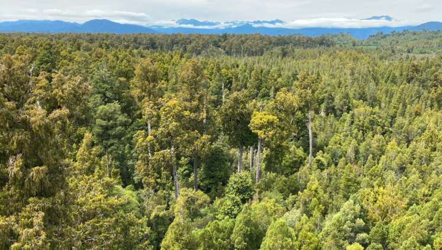

```{r setup, include=FALSE}
knitr::opts_chunk$set(echo = TRUE)

# remotes::install_github("numbats/moodlequiz")
library(moodlequiz)
library(here)

# Libraries for prac
library(tidyverse)
library(janitor)

# Set up for quizes
possible_choices <- c("boxplot", "histogram", "line plot", "pie chart", "scatterplot", "violin")
```

## Overview

{width=60%}

Professor Angela Moles, a professor here at UNSW, used an open-source dataset of maximum height data for 7084 plant species and site combinations to provide the first global, cross-species quantification of the latitudinal gradient in plant height. (You can read more about the original study at [doi:10.1111/j.1365-2745.2009.01526.x](doi.org/10.1111/j.1365-2745.2009.01526.x) or in `docs/Journal of Ecology - 2009 - Moles - Global patterns in plant height.pdf`)

We are going to use this data to do a bit of preliminary analyses and see if we can answer two questions:

**1. How does plant height vary across a latitudinal gradient (from tropics to the poles)?**

**2. Are there taller plants at higher altitudes?**

**Activities:**

- Read in data and wrangle it suited for visualisation

- Create data visualisation that can address the questions

- Draw some initial conclusions from the plots you create

## Setting up

```{r}
# install.packages("tidyverse")
library(tidyverse)
library(janitor)
```

## Assembling the Data

Read in the dataset `plantHeightSingleSpp.csv` from the folder `data/plant_height/`. There are some case and seperator inconsistencies in the column names. Clean these up as you read in the data using the `|>` pipe.

WOAH there are a LOT of variables in this data set. Sometimes it's nice to select only the columns you need for your analysis. This can make things easier in the long-run. Luckily, `dplyr` can help with that!

**Question: Which columns are relevant to these 2 questions? Select all that apply**

`r cloze(c("genus_species", "height", "lat", "alt"), c(colnames(plant_height)))` -->

> Now, create a new data frame with only the relevant columns using `select()`

## Check the distribution for the data

<h3>Check the distribution for `height`</h3>

> Check the distribution of your data to make sure there are no potential outliers in your key variables. 

**Question: What plot would be good for this check?**

A `r cloze(c("boxplot", "histogram"), possible_choices)` are suitable to assess the distribution of `height`

```{r}
plant_height_subset |> 
  ggplot(aes(x = height)) + 
  geom_histogram()

plant_height_subset |> 
  ggplot(aes(x = height)) + 
  geom_boxplot()
```

**Question: Is `height` left skewed or right skewed?** 

The data is `r cloze("left", c("left", "right"))` skewed. 

**Question: Which species is the extreme value? Is the extreme value a true outlier? (Do some research and see verify this value)**

The species with the extreme value for `height` is: `r cloze("Pseudotsuga menziesii", c("Dicksonia antarctica", "Eragrostis dielsii", Pseudotsuga menziesii"))`. It `r cloze(c("is not", c("is indeed", "is not"))` a true outlier.

## Data transformation

<h3>Data transformation</h3>

It is common to transform your data when its heavily skewed as in `height`. 

> Can you `log10()` transform `height` and assign this update into a new data frame?

## Visualisation

<h3>The effects of latitude on plant height</h3>

**Question: What should be the x variable and what should be the y variable?** 

- x variable: `r cloze(c("lat", colnames(plant_height)))`
- y variable: `r cloze(c("height", colnames(plant_height)))`

We'll first create a `ggplot` showing `lat` on the `x`-axis and `height` on the `y`-axis. Then, we'll create the same figure using the `log10` transformed data to see how it changes the patterns.

> Create a plot to visualise the relationship between latitude and height.

**Question: What type of plot is suited to visualise these two variables?**

A `r cloze(c("scatterplot", possible_choices))` is suited to visualise the relationship between these two variables.

> Let's take a look at the line of best fit! To add this to our figure, use `geom_smooth(method="lm")`.

<br>

> Now create the same plot but using your `log10()` transformed variable instead of `height` and include the line of best fit.

**Question: 1. How does plant height vary across a latitudinal gradient (from tropics to the poles)?**

Plant height `r cloze("increases", c("increases", "decrease"))` from tropics to poles.

> Now, we are going to try to answer our second question; Does plant height increase as **altitude** increases?

## Altitude

<h3>The effects of altitude on plant height</h3>

We will continue to use the `log10` transformed `height`

> Make a plot that can help us answer question 2. - add the line of best fit.

**Question: 2. Are there taller plants at higher altitudes?**

There are `r cloze("shorter", c("taller", "shorter"))` trees at higher altitudes.

## Prac reflection {type=essay}

<h3>Prac reflection</h3>

 **Question: Which parts of the coding and the tidyverse you've encountered so far did you find:** 

- most exciting?
- most challenging?
