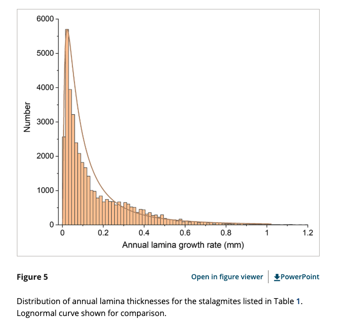
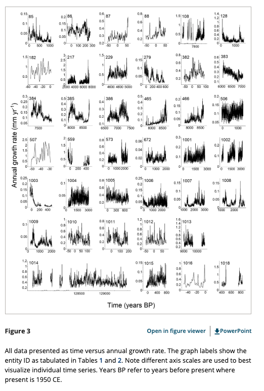
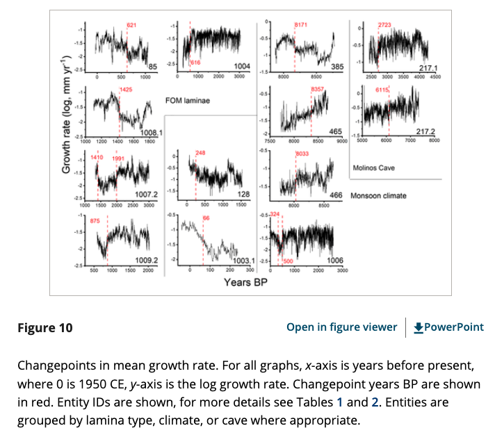
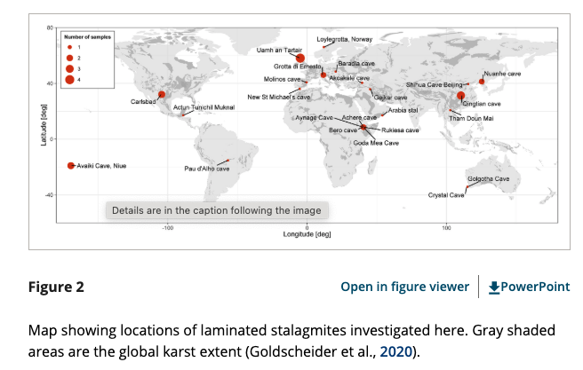

```{r setup, include=FALSE}
knitr::opts_chunk$set(echo = TRUE)

# remotes::install_github("numbats/moodlequiz")
library(moodlequiz)

# Libraries for prac
library(tidyverse)
library(janitor)
library(readxl)
library(leaflet)

# Read data from maintainer perspective
stalagmites_data <- read_csv("week 1/Wk1-2-moodle/data/stalagmites/Laminated stalagmite Dataset.csv") |> clean_names()
stalagmites_sites <- read_xlsx("week 1/Wk1-2-moodle/data/stalagmites/Tables.xlsx") |> clean_names()
```


# Overview

[Stalagmites](https://en.wikipedia.org/wiki/Stalagmite) are a type of rock formation that rises from the floor of a cave due to the accumulation of material deposited on the floor from ceiling drippings.

{width="100%"}

Prof Andy Baker in the UNSW School of Biological, Earth & Environmental Sciences uses stalgmite growth rates to study patterns of rainfall. As stalagmite growth rates depend on the rate of water flow into the soil, records of growth can be used to reconstruct rainfall variability through time.

This section builds off two papers published by Andy and his team:

-   Baker et al (2021). The properties of annually laminated stalagmites-A global synthesis. Reviews of Geophysics, 59, e2020RG000722. https://doi.org/10.1029/2020RG000722 (see file `doc/Baker et al 2021 Reviews of Geophysics.pdf`

-   Baker et al (2015). A composite annual-resolution stalagmite record of North Atlantic climate over the last three millennia (see file `doc/Baker et al 2015.pdf`)

# Aims

Andy asked us to cross check his results, your goal is reproduce some key figures from the paper 2021 paper.
Do these visualisations in your `Wk1-2-stalagmites.qmd` document

# Setting up 

You may need to uncomment the first line and install packages you don't have

```{r}
# install.packages(c("tidyverse", "janitor", "readxl", "leaflet"))

library(tidyverse)
library(janitor)
library(readxl)
library(leaflet)
```

## Loading data

The data is available at https://figshare.com/articles/dataset/Laminated_stalagmite_Dataset_csv/13166639

We've downloaded this into the folder at `data/staligmites/Laminated stalagmite Dataset.csv`

Load this into R use the `read_csv()` function.

## Data structure

Check the structure of the dataset, including the names of the columns. 

This dataset contains laminated stalagmite measurements, with 40,279 records. It includes the following columns:

-   `entity_id`: Identifier for the stalagmite sample.
-   `seq_id`: Sequence identifier (likely referring to sample grouping).
-   `lamina thickness (mm)`: Thickness of individual laminae in millimeters.
-   `lam_age (BP, 0=1950AD)`: Age of the lamina in years before present (BP), with 0 corresponding to 1950 AD.

## Data wrangling

This dataset has some difficult variable names. Perhaps rename to something more R friendly? The function `clean_names()` from the package `janitor` may be useful here. You might need to install the package first.

## Check the data

**Question: Did you notice any errors in the dataset? There is one really weird value in `lamina_thickness_mm`. Which is it? Try spot it using `geom_boxplot()`**

```{r}
ggplot(data = stalagmites_data, aes(y = lamina_thickness_mm)) + 
  geom_boxplot()
```

You check with Andy and he confirms an error in the data entry for this point. Can you remove it?

The `filter()` function could be useful here.

```{r}
stalagmites_data <- stalagmites_data |> 
  filter(!lamina_thickness_mm > 60)
```

# Making plots

Now let's go ahead and make some plots. We're going to try and recreate figures similar to Figure 3, 5, 10 in Baker et al 2021. Don't worry about getting them exact, just close.

### Figure 5

Have a go at creating this plot in  your `Wk1-2-stalagmites.qmd` document


**Question: Interpret this plot, what does this visualisation tell us?**

### Figure 3

Have a go at creating this plot.



Try making a single panel before making a bunch of panels.

1. Start with single sample. Use the `filter()` function to subset your data before plotting it.
2. Now try making a panel of plots. Note the section in the intro on faceting will be helpful for multipanel plots.

**Question: Interpret this plot, what does this visualisation tell us?**

### Figure 10

Have a go at creating this plot. 



It's similar to the one above, but there's data for select values of `seq_id`

**Question: Interpret this plot, what does this visualisation tell us?**

### Figure 2

Finally, can you plot a map of sample locations as in figure 2?



The data with locations is in `data/staligmites/Tables.xlsx`. It's an excel file. We can read it in using the `read_xlsx()` from the package `readxl`. You may need to install this. You might also want to clean up the variable names

```{r, eval=FALSE}
stalagmites_sites <- read_xlsx("data/stalagmites/Tables.xlsx") |> clean_names()
```

**Question: Did you notice any errors in the dataset? There is one row isn't data, which is it?**

```{r}
stalagmites_sites |> filter(row_number() == 1)
```

Exclude this row using the filter function


```{r}
stalagmites_sites <- stalagmites_sites |> filter(!row_number() == 1)
```

** Question: Are `lat` and `long` variables correct type? If not, correct this using the suitable function e.g. `as.numeric()`**

```{r}
stalagmites_sites <- stalagmites_sites |> 
  mutate(lat = as.numeric(lat),
         long = as.numeric(long))
```

First, let's make a map using the standard ggplot. I'll start you off with code for a world map. Your job is to add points and site names with `geom_text()`

```{r}
# create data for world coordinates using
# map_data() function
world_coordinates <- map_data("world")

# create world map using ggplot() function
ggplot(stalagmites_sites, aes(long, lat)) +
  geom_map(data = world_coordinates, map = world_coordinates,  # geom_map() function takes world coordinates  as input to plot world map
           aes(long, lat, map_id = region)) +  
  # geom_point(colour = "red") +
  # geom_text(colour = "red", aes(label = site_name), nudge_y = 2) +
  coord_quickmap() +
  theme_classic()
```

Now try it with Andy's data that you just cleaned up!

**Question: Interpret this plot, what does this visualisation tell us?**

### BONUS:

R is a powerhouse for creating really cool outputs. For fun, here we've provided code for you to create an interactive map application. You will use the package `leaflet`. The code is a little different, don't worry about the details here - we just want to use you the possibilities of R!

```{r, keep}
leaflet() |>
  addTiles() |>
  addMarkers(
    lng = data_sites$long,
    lat = data_sites$lat,
    label =
      paste(
        data_sites$entity_id_1000_sisal_entity_id,
        data_sites$site_name
      )
  )	|>
  addScaleBar()
```
