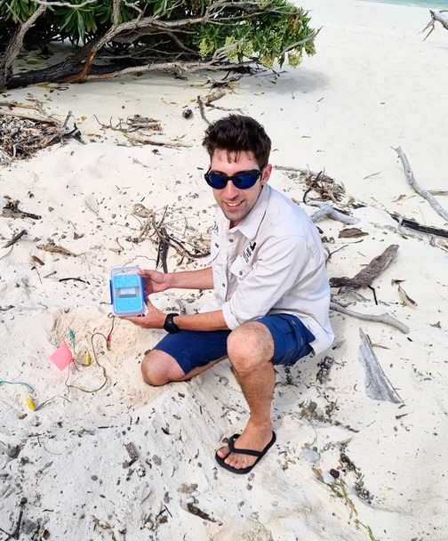
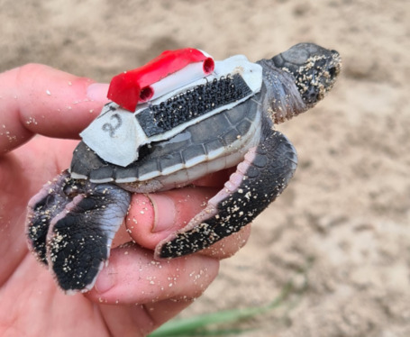

```{r setup, include=FALSE}
knitr::opts_chunk$set(echo = TRUE)

# remotes::install_github("numbats/moodlequiz")
library(moodlequiz)

reditor_count <- 1

class_id <- function() {
  reditor_count <<- reditor_count + 1
  sprintf("r-editor-%d", reditor_count)
}
```

# Introduction

<h3>Sampling from populations</h3>

The natural world is variable. We can't measure everything, so we take samples. We use these samples to estimate the mean and variance of a quantity for the population. In future weeks we'll be looking at how the mean of a population changes with some predictor, x. 

In today's practical we'll learn how to estimate the mean of a population, and the uncertainty in our estimate. 

You may have covered some of this material in MATH1041. Let's revise it again here, as these are core fundamentals underpinning most statistical analyses you'll undertake during your schooling and future work. 

<!-- {width=70%} --> <br>

<h3>Setting up</h3>

**Materials:**

Everything you need for this practical is on Moodle

1.  Download the `Wk2-1-materials.zip` zip file from Moodle, from the course page
2.  Extract the zip file into your `BEES2041/` folder
3.  Unzip the file by:

-   MacOS: Double clicking the zip file
-   Windows: Right click on the zip file and click "Extract All"

4.  Go into the folder `Wk2-1-materials` created by extracting the zip.
5.  Click on the `Wk2-1-Sampling.Rproj` to open the RStudio project and you're in!!!

We will be working with real-world datasets collected by researchers in the School of Biological, Earth & Environmental Sciences. These are in the folder `data/`.

**Packages:**

We will also be working with the packages `dplyr` and `ggplot2`, building on skills from the first practical. You should have these already installed from the first week. Additionally we'll use the `parameters` package from the `easystats` suite of packages. If you don't have this installed, you can install it by running the following code:

```{r, eval=FALSE}
# Run only the lines below for packages you have not previously installed.
#install.packages("tidyverse")
install.packages("parameters")
```

And don't forget to load them


```{r, results='hide', warning=FALSE, message=FALSE}
library(tidyverse)
library(parameters)
```


## A motivating example

<h3>A motivating example</h3>

To get us started, let's consider a real question that a researcher might ask about a population mean.

{width=80%}

This is Davey Dor. Davey is a researcher in the School of Biological, Earth & Environmental Sciences. Davey's research examines the effectiveness of conservation management strategies on the Heron Island Green Turtle population. He is seeking to understand how these strategies affect the development, behaviour, and performance of sea turtle hatchlings.

You can read more about Davey and his research [here](https://www.unsw.edu.au/science/our-schools/bees/about-us/our-people/postgraduate-research-students/davey-dor-grs-profile), and about emergence times in his journal article at the *Proceedings of the Royal Society* [here](https://royalsocietypublishing.org/doi/10.1098/rspb.2024.1702).

## Baby turtle's first challenge

<h3>Baby turtle's first challenge</h3>

The first challenge a baby turtle faces, after hatching is to reach the surface of the sand. Davey wanted to know roughly how long this takes. Some people said it took a really long time. However, he couldn't find any data on this. So he decided to collect some data himself. 

Davey collected data on 10 baby turtles, using some collar accelerometers he attached to the turtles as they hatch. This involved hatching eggs, attaching the collars, and then burying the turtles again, as though they had just emerged from the nest.



Now he wants to know the average time it takes for baby turtles to reach the surface.

Davey could of course just take the average of the 10 turtles he has measured, but he knows that this is just a sample of the population of baby turtles. So he wants to know how confident he can be that the average time he has calculated is the true average time for all baby turtles.

What Davey needs is to estimate the confidence interval for the mean time it takes for baby turtles to reach the surface.

# MATH1041 refresher

<h3>Distributions, probability and sampling</h3>

Before looking at Davey's data, let's review some of the key concepts about probability, that underpin the estimation of confidence intervals.

In MATH1041 (or equivalent), you learned about probability distributions, and how to calculate probabilities of observing a particular value. You also learned about sampling distributions, and how to calculate the probability of observing a particular sample mean.

For this exercise we're going to use the following packages. Recall, when running R in the browser we need to install the packages each time we start a new session.

Install:

<div id=`r class_id()`><pre>
install.packages(c("ggplot2", "dplyr"))
</pre></div>


Then load them so we can use them


<div id=`r class_id()`><pre>
library(ggplot2)
library(dplyr)
</pre></div>


## Probability distributions

<h3>Probability distributions</h3>

Imagine we have a continuous variable that captures something about the natural world. Often (but not always) such variables follows a *normal distribution*.

The normal distribution is a continuous probability distribution that is symmetrical around the mean, $\mu$. It is defined by two parameters:

-   the mean, $\mu$:, which gives the centre of the distribution, and
-   standard deviation, $\sigma$, which describes how spread out the distribution is.

The normal distribution is often denoted by $N(\mu, \sigma)$. The standard normal distribution is a normal distribution with a mean of 0 and a standard deviation of 1, which can be denoted, by $N(0, 1)$.

Let's plot the two normal distributions, the standard normal $N(0, 1)$ and a normal which different mean and variance, $N(2, 2)$.


<div id=`r class_id()`><pre>
# define the parameters of the normal distributions
mu_1 <- 0
sd_1 <- 1

mu_2 <- 2
sd_2 <- 2

# create a vector of x from -8 to 8, used to make our plot
x <- seq(-8, 8, by = 0.01)

# Now create a dataframe with two normal distributions
# Standard normal
data_1 <- tibble(x, label = paste("N", mu_1, sd_1), density = dnorm(x, mean = mu_1, sd = sd_1))
# Different normal
data_2 <- tibble(x, label = paste("N", mu_2, sd_2), density = dnorm(x, mean = mu_2, sd = sd_2))

# combine
data <- bind_rows(data_1, data_2)

# plot the normal distributions
data |>
  ggplot(aes(x = x, y = density, color = label)) +
  geom_line() +
  labs(title = "Normal distributions", x = "Value", y = "Density") +
  theme_classic()
</pre></div>

You can see that the standard normal distribution, $N(0, 1)$, (red) is centred around 0. The other distribution $N(2, 2)$ is centred around 2, and has a wider spread, reflecting its larger deviation.

You can vary the mean and standard deviation in the code above to see how the distribution changes.

## Probability calculations

<h3>Probability of sampling a value</h3>

If we know the mean and standard deviation of the population, we can calculate the probability of observing a particular value for an individual in our population of interest. 
We do have to make the assumption that our population displays a normal distribution, which is true for lots of biological measurements.
For example, for the standard normal, the probability of observing a value \< 1.96 in a standard normal distribution is 0.975, and the probability of observing a value \> 1.96 is 0.025 (=1-0.975).

You may have looked up these values in a previous course using a Z table.

Fortunately, R has a function `pnorm()` that allows us to calculate the probability of observing a value below a particular value.


<div id=`r class_id()`><pre>
y <- 1.96
pnorm(y, mean = 0, sd = 1, lower.tail = TRUE)
</pre></div>


Question: What is the probability of observing a value above 1.96 from the standard normal distribution?

We can also calculate the value corresponding to a particular probability. For example, the value corresponding to a probability of 0.75 in a standard normal distribution is 0.67. That is, 75% of the values in a standard normal distribution are below 0.67.


<div id=`r class_id()`><pre>
p = 0.75
qnorm(p, mean = 0, sd = 1, lower.tail = TRUE)
</pre></div>

Modifying the code above, what is the value corresponding to a probability of 0.25 in the standard normal distribution? 

You should get -0.6744898.

## Chance sampling

<h3>Chance sampling</h3>

However, if this was a real sampling event out in the field, we would not know the population mean and standard deviation. In fact, we would be using our sample to estimate these. The problem is that the mean and standard deviation of our sample will differ from the true population mean and standard deviation, and from sample to sample, simply by chance.

To illustrate the variation that comes from chance sampling, we can simulate the process of taking samples to see how well we can estimate the population mean and standard deviation from a sample.

Let's take a small sample of 10 individuals from a population with distribution $N(5, 2)$. We can use R to simulate (i.e. pretend) we are taking a sample of 10 observations.


<div id=`r class_id()`><pre>
true_mean <- 5
true_sd <- 2

sample <- rnorm(10, mean = true_mean, sd = true_sd)

sample_mean <- mean(sample)
sample_sd <- sd(sample)

sample_mean
sample_sd
</pre></div>


**Question: Did the sample mean and standard deviation match the population mean and standard deviation?**

Rerun the code above a few times to see how the sample mean and standard deviation change. Notice each sample gives a different estimate of the population mean and standard deviation.

## The sampling distribution of the mean

<h3> The sampling distribution of the mean</h3>

Take enough samples and you'll get a sense of the distribution of the sample means. This is the **sampling distribution of the mean**. The sampling distribution of the mean shows us the variety of values we might observe for the mean of a sample of a particular size, from a population with a particular mean and standard deviation. The sampling distribution of the mean is centred around the true population mean, but there is a lot of variability in the sample means. Just by chance, your sample mean could be a lot higher or lower than the true population mean.

The plot below shows the distribution of the sample means, based on 1000 random samples from the true population.


<div id=`r class_id()`><pre>
library(ggplot2)
library(dplyr)

true_mean <- 5
true_sd <- 2

# take 1000 samples of 10 observations from a population with mean 5 and standard deviation 2
sample_means <- replicate(1000, mean(rnorm(10, mean = true_mean, sd = true_sd)))

# create a tibble with the sample means
data <- tibble(sample_means = sample_means)

# plot the distribution of the sample means
data |>
  ggplot(aes(x = sample_means)) +
  geom_histogram(binwidth = 0.5, fill = "skyblue", color = "black") +
  labs(title = "Distribution of sample means", x = "Sample mean", y = "Frequency")
</pre></div>


You can see that the distribution of the sample means is centred around the true population mean of 5, but there is a lot of variability in the sample means. Just by chance, your sample mean could be a lot higher or lower than the true population mean.

## The mean vs population distribution

<h3>The distribution of the means vs population</h3>

How does the sampling distribution of the mean relate to the population distribution?

You can see that the distribution of the sample means has an approximately normal distribution. Is this the same as the original distribution?

Let's compare the distribution of the sample means to the population distribution. The next plot shows, that if we took a sample of 10 observations from the population,

-   (red) the range of possible values we might observe for any one individual,
-   (blue) the range of possible values we might observe for the mean of a sample of 10 observations.


<div id=`r class_id()`><pre>
# create a tibble with the population and sample means

# take a sample of 1000 observations from a population with mean 5 and standard deviation 2
data1 <- tibble(
  value = rnorm(1000, mean = true_mean, sd = true_sd),
  type = "Population of 1000"
)

# take 1000 samples of 10 observations from a population with mean 5 and standard deviation 2
data2 <- tibble(
  value = replicate(1000, mean(rnorm(10, mean = true_mean, sd = true_sd))),
  type = "Sample mean"
)

# combine the population and sample means
data <- bind_rows(data1, data2)

# plot the distribution of the population and sample means
data |>
  ggplot(aes(x = value, fill = type)) +
  geom_histogram(binwidth = 0.5, color = "black", alpha = 0.5) +
  facet_wrap(~type) +
  labs(title = "Distribution of population and sample means", x = "Value", y = "Frequency")
</pre></div>


As you can see, the distribution of the sample means is narrower than the individual samples, and the standard deviation of the sample means is smaller than the standard deviation of the population. This makes sense. When we take a mean of something, it's less variable than the original data.

We could also calculate the mean and standard deviation of both the population and sample means:


<div id=`r class_id()`><pre>
data |>
  group_by(type) |>
  summarise(mean = mean(value), sd = sd(value))
</pre></div>


## Estimating uncertainty

<h3>Estimating uncertainty</h3>

The sampling distribution of the mean shows us that just by chance, your sample mean could be a lot higher or lower than the true population mean.

OK, so what? Well, using some fancy mathematics, statisticians have shown that, for a wide variety of situations, the distribution of the sample means follows a normal distribution. This arises via the central limit theorem. Moreover, the standard deviation of the sample means (known as the standard error) can be estimated using the standard deviation of the sample and the sample size. *This is really cool*, because it means that **we can estimate the range of plausible values for the true mean of the population, based on the mean and standard deviation of the sample**.

This is how confidence intervals are built. We estimate the mean of the sample, then add a dose of uncertainty, based on some assumptions about the distribution of the sample means.

$$\hat{\mu_y} \pm \rm{Uncertainty}$$

## Enter the t-distribution

<h3>Enter the t-distribution</h3>

To estimate the uncertainty, we use the t-distribution. When the sample size is small (n \< 50), the sample standard deviation is a poor estimate of the population standard deviation, and using the normal distribution here would underestimate variability. The t-distribution accounts for this additional uncertainty by having heavier tails, which leads to wider confidence intervals and more conservative hypothesis testing. At larger sample sizes, the t-distribution looks more and more like the normal distribution.

So the equation above becomes

$$\hat{\mu_y} \pm t_{0.05, n-1} \times SE$$

where $t_{0.05, n-1}$ is the value of the t-distribution for a 95% confidence interval and n-1 degrees of freedom, and $SE$ is the standard error of the mean. The standard error of the mean is the standard deviation of the sample means, and is calculated as the standard deviation of the population divided by the square root of the sample size.

{width=50%}

Like the normal distribution, R has functions that can calculate critical values from the t-distribution

-   `pt()` allows us to calculate the probability of observing a mean value above or below a particular value.
-   `qt()` allows us to calculate the value corresponding to a particular probability.

We need the `qt()` function to calculate the critical value for the t-distribution. For a 95% confidence interval, we want to find the value of the t-distribution that corresponds to a probabilities of 0.025 and 0.975. Try assigning different values to `n` to see how `t_05` changes


<div id=`r class_id()`><pre>
n <- 50
t_05 <- qt(c(0.025, 0.975), df = n - 1)
t_05
</pre></div>


## Applying this to turtle data

<h3>Applying this to turtle data</h3>

Let's go back to Davey. Davey has collected data on 10 baby turtles. Davey wants to estimate the average time it takes for all baby turtles to reach the surface, based on his sample. He could of course just take the average of the 10 turtles he has measured, but he knows that this is just a sample of the population of baby turtles. He wants to know how confident he can be that the average time he has calculated is the true average time across all baby turtles.

What Davey needs is to estimate the confidence interval for the mean time it takes for baby turtles to reach the surface.

A confidence interval is a range of values, derived from the sample mean, that is likely to contain the true population mean. The confidence interval is calculated from the sample mean and standard deviation, and the number of observations in the sample. The confidence interval provides an estimate of the range of possible values for the mean of the population.

Here is Davey's data:


<div id=`r class_id()`><pre>
baby_turtles <- tibble(
  time_to_surface = c(83.88, 55.21, 94.17, 31.54, 75.92, 73.91, 57.52, 77.47, 76.21, 75.51)
)

baby_turtles
</pre></div>


There's two ways to estimate confidence intervals. The first way is to do it manually, using the t-distribution. The second way is to use the `lm()` function in R to build a model for the mean of the sample data, and calculate the confidence interval for the mean.

## Estimating the confidence interval (the hard and manual way)

<h3>Estimating the confidence interval (the hard and manual way)</h3>

Let's start with the manual way. This shows you how the process works, though in practice you use the easier method below.

Here's the manual way Davey can estimate the confidence interval for the mean time it takes for baby turtles to reach the surface, based on his sample data:


<div id=`r class_id()`><pre>  
# sample size
n <- nrow(baby_turtles)

# estimate the mean time it takes for baby turtles to reach the surface,
# based on sample data
mean_time <- mean(baby_turtles$time_to_surface)

# estimate the standard error of the mean, based on sample data
se <- sd(baby_turtles$time_to_surface) / sqrt(nrow(baby_turtles))

# calculate the uncertainty, based on the t-distribution, desired probabilities, and sample size
uncertainty <- qt(c(0.025, 0.975), df = n - 1) * se

# calculate the confidence interval for the mean
ci <- mean_time + uncertainty

# print to screen
c(mean_time = mean_time, ci = ci)
</pre></div>


## Estimating the confidence interval (the easy way)

<h3>Estimating the confidence interval (the easy way)</h3>

In practice, Davey can use the `lm()` function in R to estimate the confidence interval for the mean time it takes for baby turtles to reach the surface. `lm` stands for linear model. We're going to use this in coming weeks to see how the mean of a population changes with some predictor, x. But we can also use it to estimate the confidence interval for the mean of a sample, without any x. Importantly, behind the scenes, the `lm()` function calculates the confidence interval for the mean, just like the manual method above.


<div id=`r class_id()`><pre>
# Fit the model to the data. 
fit <- lm(time_to_surface ~ 1, data = baby_turtles)

# Extract the estimates of the mean and confidence interval for the mean
coef(fit)
confint(fit)
</pre></div>


The values calculated here should be the same as those calculated manually above (with some rounding error).

unpackaging the code above,

-   `lm()` function fits a linear model to the data.
-   `time_to_surface ~ 1` tells R to fit a model with the mean of the time to surface as the response variable, and no predictors.
-   `coef()` function extracts the estimate of the mean from the model.
-   `confint()` function calculates the confidence interval for the mean.

**The easystats package makes it even easier**

While we can calculate confidence intervals using the `coef()` and `confint` functions, the package `parameters` from `easystats` provides a more better formatted output.


<div id=`r class_id()`><pre>
# install.packages("parameters")

library(parameters)
</pre></div>


<div id=`r class_id()`><pre>
# estimate the confidence interval for the mean time it takes for baby turtles to reach the surface

pars <- parameters(fit)

pars
</pre></div>


Now let's plot the data and the confidence interval for the mean time it takes for baby turtles to reach the surface.


<div id=`r class_id()`><pre>  
# plot the data and the confidence interval for the mean time it takes for baby turtles to reach the surface
baby_turtles |>
  ggplot(aes(x = "population", y = time_to_surface)) +
  geom_jitter(width = 0.1, col = "red") +  # jitter points for better visualisation
  geom_point(data = pars, aes(y = Coefficient), size = 4) +
  geom_errorbar(data = pars, aes(y = Coefficient, ymin = CI_low, ymax = CI_high), width = 0.1) +
  labs(title = "Baby turtles time to surface", x = "", y = "Time to surface (mins)") +
  theme_classic()
</pre></div>


**Interpreting the confidence interval**

From the data above, you can see the estimate of the mean time it takes for baby turtles to reach the surface (70.1 hr), and a confidence interval for the mean (from 57.5-82.76 hrs). As he used a 95% confidence interval, there is a 95% chance that the true mean time it takes for baby turtles to reach the surface is between 57.5 and 82.76 hours.

## Asking questions using confidence intervals

<h3>Asking questions using confidence intervals</h3>

Confidence intervals around the mean are a powerful tool in our analysis toolbox. For example, Davey could ask:

**Question: Is it likely that the mean time it takes for baby turtles to reach the surface is greater than some value of interest, e.g. 50 hrs?**

To answer this, Davey can look at confidence intervals. The confidence interval tells us the range of plausible values for the mean of the population. If the value of interest is less than the lower limit of the confidence interval, then the mean of the population is most likely to be greater than 50 hours.

As the CI on the mean is 57.5-82.76, we can conclude that the mean time it takes for baby turtles to reach the surface is likely to be greater than 50 hours.

**Question: What is the probability that the mean time it takes for baby turtles to reach the surface is different to zero?**

You'll notice in the output above that the confidence interval for the mean time it takes for baby turtles to reach the surface does not include zero. This means that the mean time it takes for baby turtles to reach the surface is likely to be different to zero. You can also see that a t-statistic and p-value are reported in the parameters table. These are the results of a t-test, comparing the estimated parameter (the mean) to zero.

**Question: How likely is that two samples of baby turtles come from the same population?**

This is equivalent to asking if the confidence intervals for the two samples overlap. If the confidence intervals overlap, then the means of the two samples may come from the same population. If the confidence intervals do not overlap, then the means of the two samples are likely to come from different populations.

**Question: How does the mean time it takes for baby turtles to reach the surface change with the size of the turtles?**

Often we may also be interested in how the mean of the population changes with some predictor, x. We'll be looking at this in future weeks.

## Relationship to t.tests

<h3>Relationship to t-tests</h3>

This test with confidence intervals is equivalent to running a two-sample t-test. You may have covered t-tests in MATH1041. In fact, estimating confidence intervals is closely related to t-tests; they use the same basic maths, and produce identical results.

We can also use the `t.test` function in R to estimate the confidence interval for the mean time it takes for baby turtles to reach the surface. Additionally, the `t.test` function can be used to test if the mean of the population is different to some critical value, by default zero.

Let's run a t-test on the baby turtle data to see if the mean time it takes for baby turtles to reach the surface is different to zero.


<div id=`r class_id()`><pre>
t.test(baby_turtles$time_to_surface, alternative = "two.sided", mu = 0)
</pre></div>

You should see that the results are the same as those calculated above.

The one big advantage of a t-test is that you easily calculate an exact probability that the population mean you estimated is different to some critical value, other than zero. This is harder to do with linear models.

**Comparing the mean to $mu_0$ with a t-test**

<div id=`r class_id()`><pre>
mu_null <- 2
t.test(baby_turtles$time_to_surface, alternative = "two.sided", mu = mu_null)
</pre></div>

**Comparing the mean to $mu_0$ with a linear model**

<div id=`r class_id()`><pre>
# repeating the code we ran above
fit <- lm(time_to_surface ~ 1, data = baby_turtles)
pars <- parameters(fit)

# Compute t-statistic, comparing the mean to mu_null
t_stat <- (pars$Coefficient - mu_null) / pars$SE

# Compute p-value (two-tailed test)
p_value <- 2 * pt(abs(t_stat), df = n - 1, lower.tail = FALSE)

c(t_stat = t_stat, p_value = p_value)
</pre></div>


The reason we're teaching you linear models over t-tests, is that they are more flexible and powerful than t-tests. We can not only use them to estimate the mean of a population, but also how it changes with some predictor, x. Whereas the t-test is limited to comparing the mean of a single population to a specified value or comparing the means of maximum two groups.

As explained in the course text book Warton 2024, technically one-sample & two-sample t-tests are all simple cases of a linear model. We're barely covering t-tests as it's one less tool to remember -- and a tool you will probably use infrequently in research.

## Why sample size matters

<h3>Why sample size matters</h3>

Recall the formula for the standard error (SE) of the mean:

$$SE = \frac{\sigma}{\sqrt{n}}$$

where $\sigma$ is the standard deviation of the population, and n is the sample size.

The standard error of any statistic is the standard deviation of the statistic's sampling distribution. So the SE of the mean is the standard deviation of the sample means.

And the formula for the confidence interval is: $$x \pm t_{0.05, n-1} SE$$

You can see from the above, the standard error decreases as the sample size increases. This is because the standard error is inversely proportional to the square root of the sample size. The larger the sample size, the smaller the SE and the narrower the confidence limits around our estimate of the true mean.

This is why sample size is so important in statistics. The more we sample, the better our mean represents the population, and

-   the less uncertain we become about the mean, AND
-   the more expensive and time consuming the study becomes.

## Your turn!

<h3>Your turn!</h3>

Let's use your new skills to estimate the mean and confidence interval for the following datasets.

# Running tests on your laptop

<h2>Running tests on your laptop</h2>

Let's now run some tests on your laptop to see if you can estimate the mean and confidence interval for some datasets. 

Don't forget to load the packages you need to run the code below.

```{r}
library(tidyverse)
library(parameters)
```

## Lead contamination in soils

<h3> Lead contamination in soils</h3>

An environmental scientist was concerned about lead contamination of soils in a school garden where vegetables were being grown and consumed by the local community. Safety guidelines dictate that lead concentrations in soil should not exceed 400mg/kg. Ten samples were taken from the soil surface at random locations within the playground and analysed for lead concentration with an X-ray Fluorescence (pXRF) spectrometer.

{width=50%}

The data obtained are in the folder `data/` in the file `lead_contamination.csv`. Load the data using `read_csv` from the `tidyverse`.

```{r, echo=FALSE, results='hide', warning=FALSE, message=FALSE}
data <- read_csv("data/lead_contamination.csv")
```

```{r}

```

And then calculate the 95% confidence intervals for the population mean. You should use the `lm()` function to fit a model to the data, and the `parameters()` function to extract the estimates of the mean and confidence interval for the mean. 

```{r}

```

```{r, echo=FALSE, results='hide', warning=FALSE, message=FALSE}
lm_lead <- lm(lead_concentration ~ 1, data = data)
parameters(lm_lead)
```

What are the mean and confidence intervals for the school garden soil lead concentration?

-   mean: `r cloze(272.70, tolerance = 1)`
-   lower CI: `r cloze(230.09, tolerance = 1)`
-   upper CI: `r cloze(315.31, tolerance = 1)`

**Based on the CI, is there evidence that soils from this garden exceeded the safety guidelines?** `r cloze("no", c("yes", "no"))`

## Palmer penguins

<h3>Palmer penguins</h3>

The Palmer penguins dataset contains data on the size of different penguins. A biologist was writing a field guide about the different species and thought to include some information on the size of the penguins. Below we'll focus on the bill length of the different species of penguins. However, you can also explore other variables in the dataset using the same methods.

Recall the data from the `palmerpenguins` package.

```{r}
library(palmerpenguins)

penguins
```

## Chinstraps

**Chinstraps**

{width=50%}


Calculate the mean and 95% confidence intervals for the bill_length_mm of the Chinstrap penguins.

You'll need to extract just the records for the Chinstrap species. Recall, you can filter the data using the `filter()` function from the `dplyr` package (which you have already loaded with the tidyverse).

```{r}
data_chinstrap <- penguins |> filter(species == "Chinstrap")
```

Now calculate the mean and confidence intervals for the bill length of the Chinstrap penguins.

```{r}

```

```{r, echo=FALSE, results='hide', warning=FALSE, message=FALSE}

lm_chinstrap <- lm(bill_length_mm ~ 1, data = data_chinstrap)
parameters(lm_chinstrap)
```

What are the mean and confidence intervals for the bill length of the Chinstrap penguins?

-   mean: `r cloze(48.83, tolerance = 0.1)`
-   lower CI: `r cloze(48.03, tolerance = 0.1)`
-   upper CI: `r cloze(49.64, tolerance = 0.1)`

## Adelie

**Adelie**

{width=50%}

What is the mean and confidence intervals for the bill length of the Adelie penguins?

First filter the `penguins` data to Adelie penguins.

```{r, echo=FALSE, results='hide', warning=FALSE, message=FALSE}
data_Adelie <- penguins |> filter(species == "Adelie")
```

Now calculate the mean and confidence intervals for the bill length of the Adelie penguins.

```{r}

```

```{r, echo=FALSE, results='hide', warning=FALSE, message=FALSE}

lm_Adelie <- lm(bill_length_mm ~ 1, data = data_Adelie)
parameters(lm_Adelie)
```

What are the mean and confidence intervals for the bill length of the Adelie penguins?

-   mean: `r cloze(38.79, tolerance = 0.1)`
-   lower CI: `r cloze(38.36, tolerance = 0.1)`
-   upper CI: `r cloze(39.22, tolerance = 0.1)`

Based on the CIs, is there evidence that the bill length of the Adelie penguins is different to the bill length of the Chinstrap penguins? `r cloze("yes", c("yes", "no"))`

## Gentoo

**Gentoos**

{width=50%}

What is the mean and confidence intervals for the bill length of the Gentoo penguins?

First, filter to Gentoo penguins.

```{r, echo=FALSE, results='hide', warning=FALSE, message=FALSE}
data_Gentoo <- penguins |> filter(species == "Gentoo")
```

Now, calculate the mean and confidence intervals for the bill length of the Gentoo penguins.

```{r}

```

```{r, echo=FALSE, results='hide', warning=FALSE, message=FALSE}

lm_Gentoo <- lm(bill_length_mm ~ 1, data = data_Gentoo)
parameters(lm_Gentoo)
```

What are the mean and confidence intervals for the bill length of the Gentoo penguins?

-   mean: `r cloze(47.50, tolerance = 0.1)`
-   lower CI: `r cloze(46.95, tolerance = 0.1)`
-   upper CI: `r cloze(48.05, tolerance = 0.1)`

Based on the CIs, is there evidence that the bill length of the Gentoo penguins is different to the bill length of the Chinstrap penguins? `r cloze("oh, it's very close!", c("yes", "oh, it's very close!", "no"))`

## Final words and solutions

<h3>Final words and solutions</h3>

Congrats, you've finished the practical!

You can find worked solutions to the practical [here]().

Download these and save them into the same folder as the practical material.

<h3> Why we need linear models! </h3>

Today you've learned how to estimate the mean of a population, and how confident you can be in your estimate.

In general, there are relatively few instances where researchers only have one group of data and want to estimate the mean of only that one population. In most cases, we have two or more groups of data, and we want to estimate the difference between the means of the populations. This is what we started doing with the penguins data above. Next week we'll be looking at how we can compare the means of populations to each other, using a linear model, by including some predictor, x. The foundations you've learned today are the basis for this.
