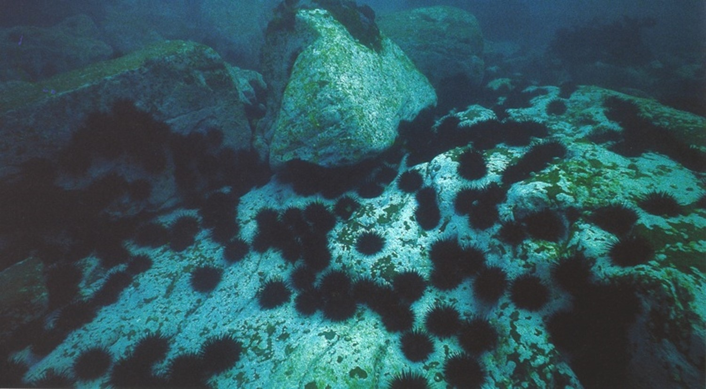

```{r,  echo=FALSE, message=FALSE, warning=FALSE}
# webr counter
source('../../R/webr-counter.R')
library(moodlequiz)
```


```{r setup, include=FALSE}
knitr::opts_chunk$set(echo = TRUE)

# Set the working directory
rprojroot::has_file("BEES2041-code.Rproj") |>
  rprojroot::find_root() |>
  file.path("week 5/Wk5-1-moodle") |>
  setwd()

# remotes::install_github("numbats/moodlequiz")
library(moodlequiz)

# For prac
library(tidyverse)
library(easystats)
library(palmerpenguins)
```

## Introduction

<h3>Introduction</h3>


Welcome back! So far in our linear models, we have been working with linear or generalised linear models with a **single predictor** (i.e one x variable) to explain variation in the response variable. While **single predictors** are straightforward to understand for simple experimental designs, we often need **more than one predictor** to help us capture real-world complexity to answer our research questions. 

First let's briefly recap on variable types, as this will determine the choice of analyses you will do: 

- **continuous variable** is a numerical variable that can take any value within a range, including decimals. e.g `bill_length_mm`

- **categorical variable** is a variable (AKA discrete variable) that represents distinct groups e.g. `islands` `species`

{width=60%}

Today, we will go through three different use cases that have different combinations of predictor variables: 

1. Two **categorical** predictors 
    - main additive effects
    - interactive effects 
2. Two **continuous** predictors
    - main additive effects
    - interactive effects 
3. One **categorical** predictor, one continuous predictor

> Note in all use cases today, our response variable (y) is continuous, but you could apply the same principles to binary or count data in a Generalised Linear Model (GLM).

## Key learning objectives

<h3>Key learning objectives</h3>


Our learning objectives today are:

- **understand** how different predictor variable types can influence your choice of analysis 
- **understand** difference between additive and interactive effects
- **run** a multiple linear regression in R using `lm()`
- **test** for effects of your predictor variables using `anova()`
- **interpret** the output of your multiple regression using `parameters()`, `estimate_means()`, `estimate_contrasts()`
- **extract** the mean and confidence interval for the slope and intercept of the regression line
- **plot** the data and the regression line with confidence intervals

Let’s dive in! 🚀 

## Setting up: Materials

<h3>Setting up: Materials</h3>


Everything you need for this prac is on Moodle

1. Download this week's materials zip file from Moodle, from the course page
2. Unzip the file by: 
  - MacOS: Double clicking the zipfile 
  - Windows: Right click on the zip file and click "Extract All" 
3. Move the extracted folder into the folder where you store materials for `BEES2041/` 
4. **Click on the Rstudio project file, eg. `Wk5-1-multi-regression.Rproj`** to open the RStudio project and you're in!!!

We will be working with various datasets collected. These are in the folder `data/`.

You will work in the relevant Quarto document for this prac. Within each Quarto docs there are several challenges for you to complete on your own devices in order to **answer the questions on Moodle**.

## Setting up: Packages

<h3>Setting up: Packages</h3>


We can use the same familiar packages as previous practicals.

> Remember to load the packages into R to use em!

```{r, results='hide', warning=FALSE, message=FALSE}
library(tidyverse)
library(palmerpenguins)
library(easystats)
library(patchwork)
```

# Two way ANOVA

## Use case 1: Two **categorical** predictors (Two-way ANOVA)

<h3>Use case 1: Two **categorical** predictors (Two-way ANOVA)</h3>


Some research designs are interested in the effects of **two categorical variables** on the continuous response variable. For example, supplement of vitamin C and exercise on the outcome of managing stress or age group and diet in maternal reproductive success. In these instances, we use **Two-way ANOVA** (Analysis of Variance) - a statistical method that help us to examine:

- **Main effects** – The **independent impact** of each categorical variable on the outcome.

- **Interaction effect** – Whether the **effect of one variable depends on the level of the other**.

> Recall that ANOVA at their core, are linear models. 

This means that we can fit a **two-way ANOVA** using the `lm()` function

Using `anova()` on the model fit object, we can **test whether the overall main effect and interaction effect the predictors are important** or not.

## Worked Example: Penguin body mass by sex and species

<h3>Worked Example: Penguin body mass by sex and species</h3>


{width=60%}

We are all familiar with the Palmer Penguins by now, let's get to know them better with two way Anova. 

**Our research question: How much does body mass vary by sex and penguin species?**

The **continuous response** variable (y) is: `body_mass_mm`
The **two categorical predictor** variables (x1, x2) are: `sex` and `species`

First, let's exclude the penguins where `sex` is NA. These are juvenille penguins that won't contribute to answering our question.

```{r}
data_penguins_adults <- penguins |>
  filter(!is.na(sex)) # Exclude sex when its NA

summary(data_penguins_adults) # Get an overview of data
```

Now with our data all prepped, we can fit our linear model for our **two-way ANOVA**. 
Based on **our research question**, we want determine the **main effects** of sex and species, as well as their **interactive effects**. 

This is how we fit our two-way ANOVA:

```{r}
fit_penguin_adults <- lm(body_mass_g ~ sex + species + sex:species, data = data_penguins_adults)
```

> Let's talk through the predictors, here we are fitting: 

- `sex` as a standalone predictor, this means we are interested in the sole effect of sex on body mass
- `species` as a standalone predictor, this means we are interested in the sole effect of species on body mass
- `sex:species` means we are interested in the **interactive effects** of both sex and species. In other words, the effect on body mass may depend sex AND species.

Let's estimate the mean of body mass by sex and species using our model with `estimate_means()` and plot them with the raw data so you can visualise this model better.

```{r}
# Estimate mean of response for sex and species
means_penguin_adults <- estimate_means(fit_penguin_adults, by=c("sex", "species"))

means_penguin_adults
```

Here we are creating violin plots and adding some jitter to the raw data. We added error bars and the mean for each sex and we facetted the plot by species

```{r}
ggplot(data_penguins_adults, aes(x = sex, y = body_mass_g, fill = sex, col = sex)) +
  geom_violin(alpha = 0.3) +
  geom_jitter(width = 0.1) +
  geom_errorbar(data = means_penguin_adults, aes(y = Mean, ymin = CI_low, ymax = CI_high),col = "black", width = 0.2) + 
  geom_point(data = means_penguin_adults, aes(y = Mean), col = "black") + 
  labs(
    x = "Sex",
    y = "Body Mass (g)"
  ) + 
  theme_classic() + 
  facet_wrap(~species)  +
  theme(legend.position = "none") 
```

> Notice we are calling `means_penguin_adults` in `geom_errorbar()` and `geom_point()` as we want to plot the mean body mass and their associated CIs. 

Let's proceed with our two-way ANOVA to test whether we have the main effects of sex and species and their interaction contributes to variation in body mass.

## ANOVA output

<h3>ANOVA output</h3>


To run a two way ANOVA, we call `anova(fit_penguin_adults)`

What can we see? 

```{r}
anova(fit_penguin_adults) 
```

We can see our predictor variables listed as rows. **Each row tests whether an effect signficantly affects body mass**. 

- The first row for  the main effect of `sex`
- The second row for the main effect of ` species` after main effect of `sex`
- The third row for the interactive effect of `sex` and `species` after the two main effects.

This output tells us that both the **main effects** of sex and species and their **interactive effects** have a strong effect on body mass variation in Palmer penguins. 

**Questions:**

**1. Looking at the values for Mean Sq or F value, which main effect explains has a stronger effect on body mass?**

The Mean Sq or F value for `sex` are `r cloze("smaller", c("smaller", "larger"))` than the Mean Sq or F value for `species`. This means that `r cloze("sex", c("sex", "species"))` has a weaker effect on body mass.

**2. Which of the three effects are contributing significantly to variation on body mass? (Select all that applies)**

`r cloze(c("sex", "species", "sex:species"), c("sex", "species", "sex:species"))`

> But how big are the effects of sex, species and their interactive effects on body mass? How much difference in body mass are we talking about?

## Model parameters

<h3>Model parameters</h3>


Typically when we are working with **categorical** predictors, we look at the ANOVA output first to determine whether there is an effect of a predictor before looking at the model output using `paramaters(fit_penguin_adults)`. 

The output of `parameters` gives us a snapshot of the how big of the effect of sex and species for a reference group (female Adelie) but this is not as useful as `anova`. 

> In our penguins study here, the **reference group are the female Adelie** penguins. This is the *Intercept* term in the model. The coefficient is 3368.84 is the mean body mass for female Adelie penguins.

```{r}
parameters(fit_penguin_adults)
```

Knowing this important fact about the *Intercept*, we can start to interpret the other rows in this model output. Recall that in a linear model containing categorical predictors, each row represents the **difference relative to the reference group due to that specific predictor**. 

For example:

- `species [Chinstrap]` is the average **difference in mean body mass between the Adelie and  Chinstrap penguins (158.37)**. This value is positive, implying the Chinstraps are on average larger than the Intercept group (Adelie).

**Questions:**

**3. What does `sex [male]` represent?**

The coefficient for `sex [male]` is `r cloze("674.66", c("674.66", "-262.89", "1310.91"))`. This represents the `r cloze("difference in", c("difference in", "p value for"))` mean body mass between `r cloze("all", c("all", "Adelie", "Chinstrap", "Gentoo"))` female  penguins and male `r cloze("all", c("all", "Adelie", "Chinstrap", "Gentoo"))` penguins.

**4. Interpret the p-value for `species [Gentoo]`**

The p-value for `species [Gentoo]` is `r cloze("< .001", c("< .001", "0.014", "0.089"))`. This indicates that the probability for finding the difference of `r cloze("1310.91", c("1310.91", "3368.84", "674.66"))` in mean body mass between Gentoo penguins and female Adelie pengions is very `r cloze("low", c("low", "male"))`.

## Contrasts

<h3>Contrasts</h3>


After establishing that there are main and interactive effects on body mass in our ANOVA, we may want to use model to get some **estimates of differences in means** between sex and species using `estimate_contrasts()`

What's useful is that you can estimate constrasts for a main effect while holding the other effects constant. 

For example, here we are calculating the difference between the sexes and taking an average over each species, including the main effect and interactions

```{r}
estimate_contrasts(fit_penguin_adults, contrast = c("sex"))
```

Or we can calculate the difference between the species taking an average over sexes,including the main effect and interactions

```{r}
estimate_contrasts(fit_penguin_adults, contrast = c("species"))
```

Importantly, we can also estimate the difference between sexes for each species using `by = "species`

```{r}
estimate_contrasts(fit_penguin_adults, contrast = "sex", by = "species")
```

and the difference between species for each sex using `by = "sex`
```{r}
estimate_contrasts(fit_penguin_adults, contrast = "species", by = "sex")
```

**Questions:**

**5. In the contrasts between species for each sex, which differences are non-significant?**

For both female and male penguins, the difference between `r cloze("Chinstrap", c("Chinstrap", "Gentoo"))` and Adelie were non-significant.

**6. What does the 95% CI represent for `female | Gentoo` penguins?** 

The 95% CI interval for `female | Gentoo` penguins represents the range of values where we would find the true population estimate of body mass for `r cloze("female", c("female", "male"))` `r cloze("Gentoo", c("Adelie", "Chinstrap", "Gentoo"))` 95% of the time.

## Reporting results

<h3>Reporting results</h3>


**Our research question was how much does body mass vary by sex and penguin species?**

Let's report on our findings. 

_ANOVA_

There was a **significant main effect of sex** on body mass, F(1, 327) = 406.15, p < .001, indicating that males and females penguins differ in body mass.

We found a  **significant interaction effect between sex and species**, F(2, 327) = 8.76, p < .001, indicating that the difference in body mass between males and females penguins depends on the species.

Overall, our multiple linear regression model explained R^2 = `r cloze("85%", c("28%", "64%", "85%"))` of variation in body mass.  _Hint: look at output of `summary(fit)`_

_Contrasts_

Generally female/male pengiuns are smaller than male penguins (mean difference = 630.51, 95% CI = 560.27 - 700.75, p-value = <0.001). 

There were `r cloze("no", c("no", "weak", "strong"))` statistical differences in body mass male Chinstrap and male Adelie penguins (Chinstrap-Adelie = -104.52g, 95% CI = -230.90 - 21.85, p-value =  0.105). There were `r cloze("marginal", c("weak", "marginal", "strong"))` differences in body mass between female Chinstrap and female Adelie penguins (Chinstrap-Adelie = 158.37, 95% CI = 31.99 - 284.7, p-value = 0.014). All other pairwise combinations were highly significant. See Figure 1 above. 

## Report on the main effect of `species` {type=essay}

**Report on the main effect of `species`**  _Hint: look at output of ANOVA_


## Report on the contrasts of `species` {type=essay}

**Report on the contrasts of `species`**  _Hint: look at output of `estimate_contrasts()`_


# Over to you: Two way ANOVA

## Exercise Example: Marine Invertebrates Richness 

<h3>Exercise Example: Marine Invertebrates Richness </h3>


{width=50%}

A researcher is testing the **main and interactive effects** of metal contamination on the number of species found in sessile marine invertebrates (sponges, bryozoans and sea squirts etc.) but they also know that the richness of invertebrates can depend on whether the substrate is vertical or horizontal.

**The research question is: How much does copper and substrate effect species richness?**

They ran an experiment where **species richness** was recorded in replicate samples in each of the six combinations of **copper contamination** (None, Low, High) and **substrate orientation** (Vertical, Horizontal)

Your job is to: 

- analyse this data with a **two-way ANOVA**, 
- **estimate contrasts* *for both** main and interactive effects**, 
- **estimate means** for both **categorical predictors**
- produce a **plot** summarising your findings

Using your results, answer questions in Moodle.
 
```{r}

```

**Questions:**

**1. Which effect contributed most to variation in species richness?**

`r cloze("Copper", c("Copper", "Orientation", "Copper:Orientation"))` contributed the most to variable in species richness. This is reflected in the Mean sq / F value / p value

**2. At which level of copper metal contamination did we see the greatest difference between substrate orientation?**

We found the greatest difference in species richness in `r cloze("High", c("High", "Low", "None"))` levels of copper contamination when comparing between horizontal and vertical substrates. 

**3. Which substrate orientation did we find the greatest difference in species richness between different contamination levels?** 

In `r cloze("vertical", c("horizontal", "vertical"))` substrates, we found the greatest difference in species richness between "None" and `r cloze("High", c("High", "Low"))` levels of copper contamination. 

# Two continuous predictors 

## Use case 2: Two **continuous** predictors

<h3>Use case 2: Two **continuous** predictors</h3>


Let's move on to our next use case: **two continuous predictors**. 

> Recall from week 3, Dr Isaac Towers was interested in how leaf construction changed with climate. 

{width=60%} <br>

Previously, we found that leaf mass per area decreased as rainfall increased. 

{width=60%}

Additonally, Isaac asked **whether temperature also had an effect on leaf mass per area**? He first wanted to test the **main (additive) effects** of rainfall and temperature on leaf mass per area.

Let's load the data and fit a linear model to test the main effects of both rainfall and temperature on log10 leaf mass per area.
```{r}
data_leaves <- read_csv("data/towers-2024.csv")
```

Fit a model with rainfall and temperature as predictors.

```{r}
fit_leaves_main <- lm(log10_leaf_mass_per_area ~ log10_rainfall + temperature, data = data_leaves)
```

Now check out the parameters of the model

```{r}
parameters(fit_leaves_main)
```

What can we see?

- The **Intercept** is the mean `log10_leaf_mass_per_area` when both rainfall and temperature are 0.
- The `log10_rainfall` coefficient is the change in `log10_leaf_mass_per_area` for a one unit increase in log10 rainfall, holding temperature constant.
- The `temperature` coefficient is the change in `log10_leaf_mass_per_area` for a one unit increase in temperature, holding rainfall constant. 

**Questions:**

**1. What is the estimated effect (slope) of `log10_rainfall` on `log10_leaf_mass_per_area`?**

`r cloze("-0.54", c("-0.54", "close to zero", "3.81"))`

**2. What is the estimated effect (slope) of `temperature` on `log10_leaf_mass_per_area`?** 

`r cloze("close to zero", c("-0.42", "close to zero", "3.81"))`

**3. Is the effect of `log10_rainfall` significantly different to zero?** `r cloze("yes", c("yes", "no"))`

**4. Is the effect of `temperature` significantly different to zero?** `r cloze("no", c("yes", "no"))`


## Interactive effects

<h3>Interactive effects</h3>


With no main effect of temperature, Isaac wondered  **whether the effect of rainfall on leaf mass per area depended on temperature**. In other words, he wants to test if the **slope of the relationship between rainfall and leaf mass per area changes with temperature**. This is an **interactive effect**.

Let's fit a model with an interaction term between `log10_rainfall` and `temperature`:

```{r}
# fit the model
fit_leaves_interaction <- lm(log10_leaf_mass_per_area ~ log10_rainfall + temperature + log10_rainfall:temperature, data = data_leaves)
```

Note the formula for the model.

- `log10_rainfall` and `temperature` are the **main effects**
- `log10_rainfall:temperature` is the **interaction.** 

Lets check the parameters of the model

```{r}
parameters(fit_leaves_interaction)
```

Interesting! Now all the effects are significant. There's an effect of `log10_rainfall`, and an interaction with temperature. 

So let's plot the relationship between `log10_rainfall` and `log10_leaf_mass_per_area` for different temperatures to understand these effects better.

## Plotting the interactive effect

<h3>Plotting the interactive effect</h3>


As we've done previously, we can use `estimate_means()` to get the means of y with respect to x1 and x2. Specificailly, we can estimate the mean `log10_leaf_mass_per_area` for

- different levels of `log10_rainfall` and `temperature`, and 
- different levels of `log10_rainfall` only, averaging out the effect of `temperature`.

```{r}
# Estimate the means
means_leaves_temp <- estimate_means(fit_leaves_interaction, by = c("log10_rainfall", "temperature"))

# Estimate the overall means for rainfall only
means_leaves_overall <- estimate_means(fit_leaves_interaction, by = c("log10_rainfall"))

# plot
ggplot(data_leaves, aes(x = log10_rainfall, y = log10_leaf_mass_per_area)) +
  geom_point(alpha = 0.5, col = "darkgreen") + # the data`
  geom_line(data = means_leaves_temp, aes(y = Mean, group = temperature, color = temperature)) + # means by temperature
  geom_line(data = means_leaves_overall, aes(y = Mean), col = "orange") + # overall mean
  labs(
    x = "Log 10 Rainfall",
    y = "Log 10 Leaf per mass area"
  ) +
  theme_classic()
```

## Overall effect of rainfall in second model?

<h3>Overall effect of rainfall in second model?</h3>


Say we'd run the model with the interaction term, but we wanted to know the overall effect of `log10_rainfall` on `log10_leaf_mass_per_area`, averaged over the different temperatures. We can use `estimate_slopes` to get this estimate by setting `trend = "log10_rainfall"`. 

This corresponds to the slope of the orange line in the plot above.

```{r}
estimate_slopes(fit_leaves_interaction, trend = "log10_rainfall")
```

You can see the effect estimated here is very close to that we calculated above in the additive model. This makes sense.


**Questions**

**1. Why might Isaac be interested in the interactive effect of rainfall and temperature on leaf mass per area?** 

`r cloze("To better understand the effect", c("To better understand the effect", "To see if the effect of rainfall is significant", "To see if the effect of rainfall is negative"))`

**2. What is the estimated effect of `log10_rainfall` on `log10_leaf_mass_per_area` when averaged over temperature?** `r cloze("-0.52", c("-0.26", "-0.52", "2.94"))`

**3. Based on these results, what can we say about the effect of `log10_rainfall` on `log10_leaf_mass_per_area`?**

`r cloze("It has limited direct effect, but changes the effect of rainfall on leaves", c("It is negative", "It is positive", "It is close to zero", "It has limited direct effect, but changes the effect of rainfall on leaves"))`

# ANCOVA

## Use case 3: One **categorical**, one **continuous** variable 

<h3>Use case 3: One **categorical**, one **continuous** variable </h3>


**Urchin grazing**

{width=60%}

Already, you have seen how linear models can analyse data with continuous predictor variables (regression) and categorical predictor variables (ANOVA), but they can also use a combination of categorical and continuous variables. These are known as **analyses of covariance** (**ANCOVA**). 

These models can get as complex as you like, but we will look at the simplest version of these - let's look at thesimplest scenario: a model with **one categorical and one continuous predictor**.

To explore this analysis, let's look at some data from marine researchers in BEES who were studying sea urchins at Bare Island near the opening of Botany Bay ([Wright et al. 2005](http://www.int-res.com/abstracts/meps/v298/p143-156/)). Urchins are voracious grazers and at high densities can remove entire kelp forests and leave bare areas known as urchin barrens. 

**These researchers wanted to know: "How do urchin densities affect algal cover over time?"**

To study how urchins affect the communities on the rocky reef, researchers set up five experimental treatments on the sea floor:

- cages that enclosed a high density of urchins
- cages that enclosed a low density of urchins
- cages with no urchins (cage control)
- cages with no urchins and no top (open cage)
- control plots with no manipulation.
 
There were 8 replicates per treatment. The % cover of algae and bare rock were measured several times over a 210-day experiment.

The following file has the data for the % cover of bare rock, `data/Urchins.csv`

Read this data in and save it as an object. We're also going to log transform the y vaiable (`BareRock`) as it is a percentage and will be right skewed. (If you like, you can check this by fitting a simple model and checking the fit.)

```{r}
data_urchins <- read_csv("data/Urchins.csv") |>
  mutate(
    logBareRock = log(BareRock + 1)
  )
```   

## Visualising the data

<h3>Visualising the data</h3>


Let's plot the data to see how the % cover of bare rock changes over time for each treatment.

```{r}
ggplot(data_urchins, aes(x = Day, y = logBareRock, color = Treatment)) +
  geom_point() +
  labs(
    x = "Day",
    y = "log(BareRock)"
  ) +
  theme_classic()
```

What would be a good model to fit to this data? 

- `Treatment` is a categorical variable with 5 levels
- `Day` is a continuous variable
- The response variable is `logBareRock`

We expect the % cover of bare rock to change over time, but we also expect  different treatments to have different effects on the % cover of bare rock. Hence, we are really intersted in whether the **slope of the relationship between `Day` and `logBareRock` changes with `Treatment`!**

## Fit the model

<h3>Fit the model</h3>


Go ahead and fit the main effects and their interaction

```{r}
fit <- lm(logBareRock ~ Day + Treatment + Day:Treatment, data = data_urchins)
```

We can look at the parameters of the model to see the estimated effects of `Day`, `Treatment` and the interaction between `Day` and `Treatment`.
```{r}
parameters(fit)
```

Because we have a categorical effect, the `Intercept` is the mean `logBareRock` for the reference group. This is the first level of `Treatment`, which is `cage.control`, when Day = 0. Effects are then the difference for each predictor, relative to this group.

I wonder if there is a better way to look at the results?

## Visualising the results

<h3>Visualising the results</h3>


By now you should be familiar with the worfklow for visualising the results of a linear model. We use `estimate_means()` to get the means of `logBareRock` for each level of `Treatment` at different levels of `Day`, then add layers to a ggplot.

```{r}
means <- estimate_means(fit, by = c("Day", "Treatment"))

p1 <-
  ggplot(means, aes(x = Day, y = Mean, color = Treatment)) +
#  geom_ribbon(aes(ymin = CI_low, ymax = CI_high, fill = Treatment), alpha = 0.2) +
  geom_line() +
  labs(
    x = "Day",
    y = "log(BareRock)"
  ) +
  theme_minimal()

# Compare lines
p1
```

This plot shows the fitted lines only. We've left the ribbon code in there, but it's commented out. You can uncomment it to see the confidence intervals around the lines.

We can also add the data points to the plot to see how well the model fits the data. It get's messy, so it's easier to see facetting by `Treatment`.
```{r}
# Compare lines with data
p1 +
  geom_point(data = data_urchins, aes(y = logBareRock)) +
  facet_wrap(~Treatment)
```   

## Testing the effects

<h3>Testing the effects</h3>


Recall, the `anova()` function can be used to test the overall significance of the main and interactive effects of the predictors.

```{r}
anova(fit)
```

You will have to test: 

- whether the % cover of bare rock varied among treatments, with time (Day) (**main effects**) 
- whether the slopes of the bare rock vs day relationships varied among treatments (**Treatment x Day interction**).

**Questions**

**1. An interaction between the two predictor variables would be evident if the slopes of these five lines were not parallel. Does the scatterplot suggest an interaction?** `r cloze("yes", c("yes", "no"))`

**2. Do the results of the anova function support this? **
`r cloze("yes, indicated by the effect of Day:Treatment", c("yes, indicated by the effect of Day:Treatment", "yes, indicated by the effect of Treatment", "yes, indicated by the effect of Day"))`

**3. Which treatment has the largest effect on the % cover of bare rock,  `cage.control` or `low.urchin`?** `r cloze("cage.control", c("cage.control", "low.urchin"))`

## Contrasts

<h3>Contrasts</h3>


We can use the fitted model to estimate the differences between the treatments at a specific time point.

```{r}
estimate_contrasts(fit, contrast = "Treatment", by = "Day") |>
  filter(Day == 0)

estimate_contrasts(fit, contrast = "Treatment", by = "Day") |>
  filter(Day == 210)   
```

This provides strong evidence that the % cover of bare rock is not different between the treatments at the start of the experiment, but is significantly different between the treatments at the end of the experiment.

# Over to you: ANCOVA

## Exercise Example: Penguins again

<h3>Exercise Example: Penguins again</h3>


{width=50%}

For your final challenge today, we want you test for **differences in relative `bill depth` between `species`**, To do this, we will run an ANCOVA using bill length as a covariate.

We're adding a covariate because we know that as penguins get larger, their beaks get both longer and deeper. We want to know if there are differences in bill depth between species after we account for overall size.

Your job is to: 

- analyse this data with multiple regression (ANCOVA) like in the previous example
- **estimate means** for both **categorical predictors**
- produce a **plot** summarising your findings
- **estimate contrasts** for to compare at a common size

Using your results, answer questions in Moodle. 
 
```{r}

```

**Questions:**

**1. Did the results of the ANOVA suggest that accounting for `bill_length_mm` is a good idea?**

`r cloze("Yes", c("Yes", "No"))`, the significant main effect of `bill_length_mm` suggests it contributes to variation to bill depth.

**2.  What conclusions can we draw from the output of `estimate_contrasts(fit_bill, contrast = "species")`?**

The species contrasts holding bill length at `r cloze("44", c("40", "44", "60"))` mm suggests that there `r cloze("are", c("are", "are not"))` differences in bill depth between species

**3. Redo the analysis NOT accounting for the covariate of bill length. In other words, do one-way ANOVA between bill depth and species and see how your key result changes!**

If we did not account for bill length as a covariate, would our conclusions be the same? `r cloze("same", c("same", "different"))`. 

```{r}

```

