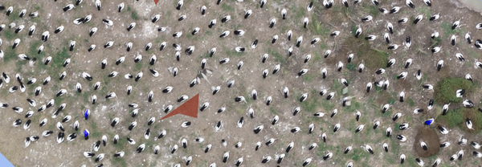

---
title: "Week 8-1 Counting Pelicans with Random Forest"
output: html_output
editor_options:
  chunk_output_type: console
---

```{r setup, include=FALSE}
knitr::opts_chunk$set(echo = TRUE, warning = FALSE, message = FALSE)

# Set the working directory
rprojroot::has_file("BEES2041-code.Rproj") |>
  rprojroot::find_root() |>
  file.path("week 8/Wk8-1-pelicans") |>
  setwd()

library(moodlequiz)
```

# 8-1 Categorical prediction (pelicans)

## Counting birds in nesting colonies

An important role for predictive algorithms is to accelerate routine data collection. Detailed and regular monitoring of nesting sites would be an efficient way to monitor bird populations, as all individuals in a species tend to aggregate in particular locations.  However, it is hard to count birds from the ground without disturbing them. Therefore, there is great interest in the potential to use drones to count birds. Moreover, if we could automate the counting part, i.e. reviewing the drone imagery to actually count the birds, monitoring of bird populations becomes more achievable.

{width=50%}  <br>

**Meet Roxanne!** Dr Roxanne Francis, Post-doctoral Researcher in the School of Biological, Earth & Environmental Sciences at UNSW. Roxanne was once a student in BEES2041! She's now an expert in using drones to monitor bird and plant populations.

{width=50%} <br>

Today’s practical builds off one of Roxanne's current projects, counting pelicans in breeding colonies at Lake Brewster, in North Western NSW. We're going to analyse some of the drone images Roxanne has collected to see how well we can automate the counting process.

This video describes the broader context of Roxanne's work and the types of systems and tech she uses. Counting pelicans is just one of the species she is working with.

<iframe width="560" height="315" src="https://www.youtube.com/embed/euwv2_G7Jlo" title="YouTube video player" frameborder="0" allow="accelerometer; autoplay; clipboard-write; encrypted-media; gyroscope; picture-in-picture; web-share" allowfullscreen=""></iframe> <br>

## Plan for today

So here's the content we're going to cover in today's lab:

1. Learn about classification problems (predictive models with categorical Y)
2. Learn about random forest models (a common machine learning method)
3. Consider how to evaluate predictive models with categorical outcomes (via a confusion matrix and accuracy)
4. Try a test problem using a small dataset
5. Start working with data on pelicans
6. Create a labelled dataset (to use in modelling)
7. Test the predictive capacity of different models (using testing data with known truth)
8. Use your new predictive model to count pelicans (apply the model to solve the ultimate aim of counting pelicans)

## Classification problems

Counting birds is an example of what's called a classification problem. The "data" we have are images taken by a drone. 

{width=50%} <br>

The drone flies in a series of transects across a nesting area, the images are then stitched together into a giant mosaic, which shows the entire nesting area from above. These areas are large and potentially contain tens of thousands of birds.

{width=50%} <br>

There's so many birds! Wouldn't it be nice to automate counting? Although our brain can "see" the birds, the image is just a bunch of pixels with colours. So to automate counting, we need to teach a model to "classify" pixels as belonging to a bird (e.g. blue marks in picture below) or not a bird (red marks). 

{width=50%} <br>

Distinguishing points as belonging to a bird or not is an example of what's known as a classification problem. The target (output, or Y) is a categorical variable with different possible values. The possible values of Y are commonly called classes. 

Y could be a binary variable with 2 classes like, TRUE and FALSE. Or it could have many possible classes (like pelican, duck, cormorant). 

So in a classification problem, what type of variable is the output (Y)? 

`r cloze("Categorical", c("Continuous", "Categorical"))`

## What models?

It's now time to think about the models we're going to fit. In our analysis we're going to use two methods:

1. A Random Forest Classifier: a common machine learning method used for either regression (continuous Y) or classification (categorical Y).
2. Logistic Regression: an extension of the linear regression model we ran earlier in the course, where outputs are turned into a binary TRUE or FALSE.

This video gives a nice introduction to random forests. Watch the first 3:10 for a quick overview: 

<iframe width="600" height="400" src="https://www.youtube.com/embed/yN7ypxC7838">
</iframe> <br>

Both logistic regression and random forests map inputs to outputs. But they work entirely differently. You've seen how linear regression works. By contrast, the random forest model is based on a decision tree structure. In fact, it builds many different decision trees (hence the "forest"), each using different bits of the data, and uses the ensemble of all trees to make its prediction. Whereas a single decision tree is prone to overfitting the data, a random forest is much more robust. 

{width=50%} <br>

For this practical, it is sufficient to know that it is a model that can predict Y from X, but if you're keen, you can read more about [Random Forest](https://en.wikipedia.org/wiki/Random_forest) models here on Wikipedia. 

## Training and testing sets

Recall (from the lectures) that to evaluate predictive models, we need to split our labelled data into training and testing sets. 

{width=50%} <br>

The figure above suggests a 25:75 split but the exact number is flexible. 

- Training data: used to fit the model
- Testing (or validation) data: used to assess how well the model predicts outputs in new data (i.e. data not used to fit the model)
 
Both the training and testing datasets are labelled, meaning we know the 'true' values of Y. When we use the model later to predict stuff in the full mosaic, we won't know the true values of Y. We'll be relying on the model to tell us.

## Evaluating model performance

As well as separating the dataset into two, we want to write a function to evaluate 'within sample' and 'out of sample' predictions. 

Our data has a categorical Y, so we will use a confusion matrix to compare between observed and predicted values for Y. Recall Data Dan discussing the use of Root Mean Square Error (for continuous Y) and Confusion Matrices (for categorical Y) in the lectures (start at 5:00).

In the file, `R/confusion.R`, `evaluate_model()` is a function that will calculate a confusion matrix using the observed vs predicted values. It's not in a package. You make the function available by running the code: 

```{r}
source("R/confusion.R")
```

As well as a table of correct and incorrect values, the table will also print out the number of points and the accuracy. 

Accuracy is given as the number of correct predictions / the number of points. Error = 1 - Accuracy and is the number of incorrect predictions. 

Once loaded, you can call the function like any other function from a package. You can also take a look at the structure of the function by opening the file `R/confusion.R`. Notes have been added to the code so you can follow exactly what it is doing to evaluate your model.


# Random forests with ranger

```{r}
#install.packages("ranger")

library(tidyverse)
library(ranger)

source("R/confusion.R")

```

## RFs with ranger

Training testing example

```{r}
ranger(Species ~ ., data = iris)

train.idx <- sample(nrow(iris), 2/3 * nrow(iris))
iris.train <- iris[train.idx, ]
iris.test <- iris[-train.idx, ]

fit_iris <- ranger(Species ~ ., data = iris.train)

evaluate_model(fit_iris , iris.train, iris.test, y = "Species")
```

## With pelicans

Load data

```{r}

peli_labelled_raw <- read_csv("data/trainingData.csv")

peli_labelled <- 
  peli_labelled_raw |> 
  mutate(
    is_pelican = ifelse(Class==2, "pelican", "background") |> as.factor()) |>
  select(is_pelican, everything()) |> 
  select(-Class)

```

Make training and testing

```{r}

npoints <- nrow(peli_labelled)
train_ids <- sample(npoints, 0.75 * npoints)

peli_labelled_train <- peli_labelled |> slice(train_ids)
peli_labelled_test <-  peli_labelled |> slice(-train_ids)
```

Single covariates

```{r}
fit_rf1 <- ranger(is_pelican ~ b1, data = peli_labelled_train)

evaluate_model(fit_rf1, peli_labelled_train, peli_labelled_test)
```

3 covariate - RGB

```{r}
fit_rf3 <- ranger(is_pelican ~ b1 + b2 + b3, data = peli_labelled_train)

evaluate_model(fit_rf3, peli_labelled_train, peli_labelled_test)
```

RF all covars

```{r}
fit_rf1 <- ranger(is_pelican ~ ., data = peli_labelled_train)

evaluate_model(fit_rf1, peli_labelled_train, peli_labelled_test)

```

Variable importance

```{r}
fit_rf <- ranger(is_pelican ~ ., data = peli_labelled_train, importance = "permutation")

importance(fit_rf)
```

Reduced model (top 5 covariates)

```{r}

top_vars <- importance(fit_rf) |> sort(decreasing = T) |> head(5) |> names() 

fit_rf_top <- 
  ranger(is_pelican ~ ., 
         data = peli_labelled_train |> select(is_pelican, any_of(top_vars))
         )

evaluate_model(fit_rf_top, peli_labelled_train, peli_labelled_test)
```

# Extension

Is many trees (the random forest) better than single decision tree?

```{r}
fit_rf_single <- ranger(is_pelican ~ ., data = peli_labelled_train,   num.trees =1)

evaluate_model(fit_rf_single, peli_labelled_train, peli_labelled_test)

```

Is RF better than regression (regression only works with binary outcome)

```{r}

fit_glm <- glm(is_pelican ~ ., data = peli_labelled_train, family = binomial)

evaluate_model(fit_glm, peli_labelled_train, peli_labelled_test)

```

# Now you can use the model on a big dataset

```{r}

# fit final model, with 100 trees rather default of 500 (faster with fewer trees, and 100 seems like enough here)
fit_rf1 <- ranger(is_pelican ~ ., data = peli_labelled_train, num.trees = 100)

# load mosaic to predict onto
data_mosaic <- readRDS("data/large-files/RasterWithPredictorsPelicans-0000011776-0000011776.rds") 

# make predictions
data_pred <- 
  data_mosaic |>
  mutate(is_pelican = predict(fit_rf1, data = data_mosaic)$predictions)

# Plot direct to file "output.png", works better than plotting to screen for big datastes 
png("output.png", height= 40, width=40, units = "cm", res=600)
ggplot(data_pred, aes(x,y)) +
  geom_tile(aes(fill=is_pelican))
dev.off()

```
