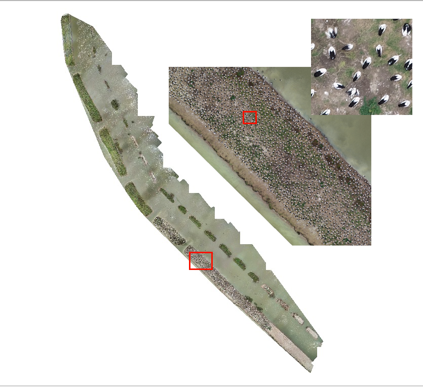
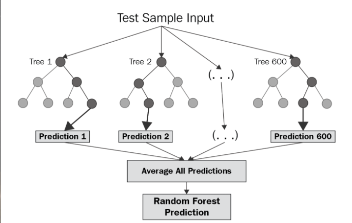
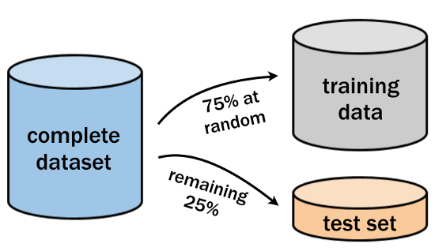
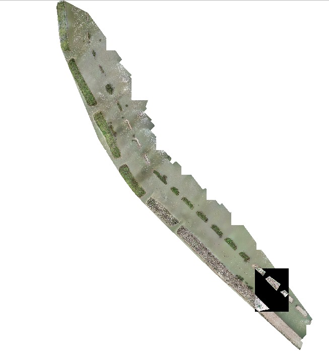

---
title: "Week 8-1 Counting Pelicans with Random Forest"
output: html_output
editor_options:
  chunk_output_type: console
---

```{r setup, include=FALSE}
knitr::opts_chunk$set(echo = TRUE, warning = FALSE, message = FALSE)

# Set the working directory
rprojroot::has_file("BEES2041-code.Rproj") |>
  rprojroot::find_root() |>
  file.path("week 8/Wk8-1-pelicans") |>
  setwd()

library(moodlequiz)
```

# 8-1 Categorical prediction (pelicans)

## Counting birds in nesting colonies

An important role for predictive algorithms is to accelerate routine data collection. Detailed and regular monitoring of nesting sites would be an efficient way to monitor bird populations, as all individuals in a species tend to aggregate in particular locations.  However, it is hard to count birds from the ground without disturbing them. Therefore, there is great interest in the potential to use drones to count birds. Moreover, if we could automate the counting part, i.e. reviewing the drone imagery to actually count the birds, monitoring of bird populations becomes more achievable.

{width=50%}  <br>

**Meet Roxanne!** Dr Roxanne Francis, Post-doctoral Researcher in the School of Biological, Earth & Environmental Sciences at UNSW. Roxanne was once a student in BEES2041! She's now an expert in using drones to monitor bird and plant populations.

{width=50%} <br>

Today’s practical builds off one of Roxanne's current projects, counting pelicans in breeding colonies at Lake Brewster, in North Western NSW. We're going to analyse some of the drone images Roxanne has collected to see how well we can automate the counting process.

This video describes the broader context of Roxanne's work and the types of systems and tech she uses. Counting pelicans is just one of the species she is working with.

<iframe width="560" height="315" src="https://www.youtube.com/embed/euwv2_G7Jlo" title="YouTube video player" frameborder="0" allow="accelerometer; autoplay; clipboard-write; encrypted-media; gyroscope; picture-in-picture; web-share" allowfullscreen=""></iframe> <br>

## Plan for today

So here's the content we're going to cover in today's lab:

1. Learn about classification problems (predictive models with categorical Y)
2. Learn about random forest models (a common machine learning method)
3. Consider how to evaluate predictive models with categorical outcomes (via a confusion matrix and accuracy)
4. Try a test problem using a small dataset
5. Start working with data on pelicans
6. Create a labelled dataset (to use in modelling)
7. Test the predictive capacity of different models (using testing data with known truth)
8. Use your new predictive model to count pelicans (apply the model to solve the ultimate aim of counting pelicans)

## Classification problems

Counting birds is an example of what's called a classification problem. The "data" we have are images taken by a drone. 

{width=50%} <br>

The drone flies in a series of transects across a nesting area, the images are then stitched together into a giant mosaic, which shows the entire nesting area from above. These areas are large and potentially contain tens of thousands of birds.

{width=50%} <br>

There's so many birds! Wouldn't it be nice to automate counting? Although our brain can "see" the birds, the image is just a bunch of pixels with colours. So to automate counting, we need to teach a model to "classify" pixels as belonging to a bird (e.g. blue marks in picture below) or not a bird (red marks). 

{width=50%} <br>

Distinguishing points as belonging to a bird or not is an example of what's known as a classification problem. The target (output, or Y) is a categorical variable with different possible values. The possible values of Y are commonly called classes. 

Y could be a binary variable with 2 classes like, TRUE and FALSE. Or it could have many possible classes (like pelican, duck, cormorant). 

So in a classification problem, what type of variable is the output (Y)? 

`r cloze("Categorical", c("Continuous", "Categorical"))`

## What models?

It's now time to think about the models we're going to fit. In our analysis we're going to use two methods:

1. A Random Forest Classifier: a common machine learning method used for either regression (continuous Y) or classification (categorical Y).
2. Logistic Regression: an extension of the linear regression model we ran earlier in the course, where outputs are turned into a binary TRUE or FALSE.

This video gives a nice introduction to random forests. Watch the first 3:10 for a quick overview: 

<iframe width="600" height="400" src="https://www.youtube.com/embed/yN7ypxC7838">
</iframe> <br>

Both logistic regression and random forests map inputs to outputs. But they work entirely differently. You've seen how linear regression works. By contrast, the random forest model is based on a decision tree structure. In fact, it builds many different decision trees (hence the "forest"), each using different bits of the data, and uses the ensemble of all trees to make its prediction. Whereas a single decision tree is prone to overfitting the data, a random forest is much more robust. 

{width=50%} <br>

For this practical, it is sufficient to know that it is a model that can predict Y from X, but if you're keen, you can read more about [Random Forest](https://en.wikipedia.org/wiki/Random_forest) models here on Wikipedia. 

## Training and testing sets

Recall (from the lectures) that to evaluate predictive models, we need to split our labelled data into training and testing sets. 

{width=50%} <br>

The figure above suggests a 25:75 split but the exact number is flexible. 

- Training data: used to fit the model
- Testing (or validation) data: used to assess how well the model predicts outputs in new data (i.e. data not used to fit the model)
 
Both the training and testing datasets are labelled, meaning we know the 'true' values of Y. When we use the model later to predict stuff in the full mosaic, we won't know the true values of Y. We'll be relying on the model to tell us.

## Evaluating model performance

As well as separating the dataset into two, we want to write a function to evaluate 'within sample' and 'out of sample' predictions. 

Our data has a categorical Y, so we will use a confusion matrix to compare between observed and predicted values for Y. Recall Data Dan discussing the use of Root Mean Square Error (for continuous Y) and Confusion Matrices (for categorical Y) in the lectures (start at 5:00).

In the file, `R/confusion.R`, `evaluate_model()` is a function that will calculate a confusion matrix using the observed vs predicted values. It's not in a package. You make the function available by running the code: 

```{r}
source("R/confusion.R")
```

As well as a table of correct and incorrect values, the table will also print out the number of points and the accuracy. 

Accuracy is given as the number of correct predictions / the number of points. Error = 1 - Accuracy and is the number of incorrect predictions. 

Once loaded, you can call the function like any other function from a package. You can also take a look at the structure of the function by opening the file `R/confusion.R`. Notes have been added to the code so you can follow exactly what it is doing to evaluate your model.

## Introduction to modelling with random forest

Before we get started on the pelican dataset, we'll run through a quick practice example using random forest modelling and a categorical response variable. We are going to see whether we can answer the question: Can you accurately predict species based on phenotypic traits of plants? 

For this short intro, we'll be using the built-in R dataset `iris`. It contains measurements of four features on the flowers of three plant species (setosa, virginica, versicolor). These quantify the morphological variation of the iris flower in its three species, all measurements given in centimetres.

There are two reasons for this exercise:

1. To practice predictive modelling with a categorical response variable 
2. To understand how to interpret a confusion matrix 

First load the packages `tidyverse` and `ranger`. You may need to install the ranger package.

```{r}
# install.packages("ranger")

library(tidyverse)
library(ranger)

source("R/confusion.R") # Load the function from the R script "R/confusion.R"
```

Now take a quick 1 min look at the iris data. 

```{r}
View(iris)
```

We're going to try and predict the species from their flower parts.

To build the model, you need to create training and testing data with the iris data set. 

```{r}
train_idx <- sample(nrow(iris), 2/3 * nrow(iris)) # Generate a sample of row numbers that is 2/3 the size of the iris dataset
iris_train <- iris[train_idx, ] # Subset the iris dataset with the row numbers 
iris_test <- iris[-train_idx, ] # Assign the leftover rows as the test dataset
```

Next, fit a random forest model using the function `ranger()` with the formula `Species ~ .`. Species is a categorical response variable and all other variables are predictor variables (that's what the "." does in this particular formula).

```{r}
fit_rf <- ranger(Species ~ ., data = iris_train) # Fit model
fit_rf # View model
```

Now, to check how well your model could predict species, we want to create a confusion matrix. There are a few packages that you can install on your computer to do this (like `caret` or `ModelMatrix`), but for this practical, Data Dan has built a custom function to create a confusion matrix. 

Load in the custom function and use it to create a confusion matrix

```{r}
source("R/confusion.R") # Read in custom function
evaluate_model(fit_rf, iris_train, iris_test, y = "Species") # Use custom function
```

Noting that each row is an individual record, for how many individuals was species incorrectly predicted? `r cloze(3)`

## What data are we using?

Let's go back to the bird nest counting example now. Roxanne has created the mosaic from the drone images and added a series of covariates, derived from the various light bands of the spectral sensor of the drone. It's a giant file (> 1GB in size, ~3.6 billion pixels)! Here's a screenshot.

{width=50%} <br>

We'll work with a small section of the bigger image and use this to develop a workflow to apply to the whole dataset.

## Creating labels

The next step is to label some data! That means manually looking at individual points (pixels) and marking them as bird or not bird.  Labelling data is an essential part of any predictive workflow. The labelled data helps the model learn what it's looking for.

In this video, the Medical Futurist talks about the importance of labelling for predictive workflows. While the examples are from medical fields, the principle is general and he describes it very well (watch up to 1:40). 

<iframe width="560" height="315" src="https://www.youtube.com/embed/hhzhamJUbmg?start=33" title="YouTube video player" frameborder="0" allow="accelerometer; autoplay; clipboard-write; encrypted-media; gyroscope; picture-in-picture; web-share" allowfullscreen=""></iframe> <br>

So your next job is to create some labelled data by marking points in images as bird or not bird.

Take turns to head over to a labelling station and practise creating some labelled data. Adding more labelled observations strengthens the predictive power of your model. If you are waiting your turn, you can skip this section for now and use the full dataset available (`data/trainingData.csv`) to work on the later sections of this practical. This is real data collected by Roxanne. 

## Creating training and test datasets

### Your labelled dataset (skip this if you haven't gone to the labelling station yet)

Download your labelled data (Data Dan will upload it on Moodle). 

Load your labelled data into R and save it as an object. We'll use `dplyr` to change the class to a label that is either "pelican"  or "background".

```{r}
peli_labelled_raw <- read_csv(...)
peli_labelled <- 
  peli_labelled_raw |>
  mutate(is_pelican = ifelse(Class == 2, "pelican", "background") |> as.factor()) |> # Make a new column `is_pelican`
  select(is_pelican, everything()) |> # Reorder dataframe so that `is_pelican` is the first column, and then everything else
  select(-Class) # Remove class column
```

Inspect the dataset. There's a lot of columns! Each row is the record for a particular pixel (location) in the image. 

The column `is_pelican` is the target or Y variable, which you scored. The other columns are potential predictors. The predictors are derived from four spectral bands of the sensor on the drone. 

Okay, now that we have data, we'll have to create training and testing data from the dataset. 

{width=50%} <br>

So let's go ahead and split the data, using the `slice` function from `tidyverse`:

```{r}
npoints <- nrow(peli_labelled) # Get number of rows
train_ids <- sample(npoints, 0.75 * npoints) # Take a random 3/4 of the points to use for training

peli_labelled_train <- peli_labelled |> slice(train_ids)
peli_labelled_test <-  peli_labelled |> slice(-train_ids)
```

### Full pelican dataset

Load Roxane's labelled data from `data/trainingData.csv` and save it as an object. We'll use `dplyr` to change the Class to a label that is either "pelican" or "background".

```{r}
peli_labelled_full_raw <- read_csv("data/trainingData.csv") # Name it something else to distinguish it from your labelled dataset

peli_labelled_full <- 
  peli_labelled_full_raw |> 
  mutate(
    is_pelican = ifelse(Class == 2, "pelican", "background") |> as.factor()) |> # Make a new column `is_pelican`
  select(is_pelican, everything()) |> # Reorder dataframe so that `is_pelican` is the first column, and then everything else
  select(-Class) # Remove class column
```

Inspect the dataset. There's a lot of columns! Each row is the record for a particular pixel (location) in the image. 

The column `is_pelican` is the target or Y variable, which you scored. The other columns are potential predictors. The predictors are derived from four spectral bands of the sensor on the drone.

Okay, now that we have data, we'll have to create training and testing data from the dataset.

{width=50%} <br>

So let's go ahead and split the data, using the `slice` function from `tidyverse`:

```{r}
npoints <- nrow(peli_labelled_full) # Get number of rows
train_ids <- sample(npoints, 0.75 * npoints) # Take a random 3/4 of the points to use for training

peli_labelled_full_train <- peli_labelled_full |> slice(train_ids)
peli_labelled_full_test <-  peli_labelled_full |> slice(-train_ids)
```

## Fitting random forest models

### Your labelled dataset

To start, let's try to see if a single covariate (`band1`) has enough predictive power to give us a good predictive model. Fit a random forest model with your training data where `is_pelican` is your response variable and `b1` is your predictor variable. Then, use the custom function `evaluate_model` to evaluate your model. 

```{r}
fit_rf1 <- ranger(is_pelican ~ b1, data = peli_labelled_train)

evaluate_model(fit_rf1, peli_labelled_train, peli_labelled_test)
```

Does the model look like it can be improved? `r cloze("Yes", c("Yes", "No"))`

What happens if you include all three bands as covariates (RGB bands)?

Fit a random forest model with the formula `is_pelican ~ b1 + b2 + b3` using your training data. Then evaluate the predictive power of your model.

```{r}
fit_rf3 <- ranger(...add code here...)

evaluate_model(...add code here...)
```

```{r solutions-1}
fit_rf3 <- ranger(is_pelican ~ b1 + b2 + b3, data = peli_labelled_train)

evaluate_model(fit_rf3, peli_labelled_train, peli_labelled_test)
```

Does this make the model more accurate? `r cloze("Yes", c("Yes", "No"))`

Why do you think you are getting low error rates (comparatively speaking) when fitting to the training data, but high error rates when testing your model against the testing data set? {type=essay}

### The maximum model!

Let's try creating a maximum model, i.e. one with all our covariates used as predictors! 

Fit a random forest model with `is_pelican` as the response variable and all other covariates as the predictor variables.

*Hint: remember you can use "." to reference all covariates in a formula, like we did with the iris example.*

```{r}
fit_rf <- ranger(is_pelican ~ ., data = ...)

evaluate_model(...)
```

```{r solutions-2}
fit_rf <- ranger(is_pelican ~ ., data = peli_labelled_train)

evaluate_model(fit_rf, peli_labelled_train, peli_labelled_test)
```

Which model has the lowest error rate when predicting the testing data?

`r cloze("All covariates", c("One covariate", "Three covariates", "All covariates"))`

## Evaluating performance

Now that you've run through this analysis on a small pelican data set that you collected in class, we want to see whether adding many more observations strengthens the predictive power of your model. 

For this, we will use the real data collected from Roxanne. You should have already imported the data from `data/trainingData.csv` and divided it into training and test data sets (Hint: remember we named the objects with different names to distinguish from your own dataset).

Fit a random forest model to Roxane's data with the formula `is_pelican ~ .` where `is_pelican` is our categorical response variable and all other covariates (.) are our predictor variables (the maximum model). 

```{r}
fit_rf_full <- ranger(...)
```

```{r solutions-3}
fit_rf_full <- ranger(is_pelican ~ ., data = peli_labelled_full_train)

evaluate_model(fit_rf_full, peli_labelled_full_train, peli_labelled_full_test)
```

Does having a bigger training dataset lead to better predictive skill? `r cloze("Yes", c("Yes", "No"))`

### Is a simplified model better?

A maximum model is not always the best model. There might be many variables included that aren't properly capturing the variation in the dataset.

It's often a good idea to investigate the maximum model further and try to understand which variables are most important. We'll use the `importance()` function to do this. To use it, you first need to add an extra argument to your model: `importance = "permutation"`:

```{r}
fit_rf_full <- ranger(is_pelican ~ ., data = peli_labelled_full_train, importance = "permutation")

importance(fit_rf_full)
```

What are the top 5 variables and what is the order of importance? 

**NB: We won't give exact answers for you to check here. As there is randomness in the model (it's a random forest) everyone will get slightly different results.**

It looks like many of the variables are not needed in this model. Try creating a reduced model with only the top 5 covariates. 

```{r}
# Detect top variables
top_vars <- importance(fit_rf_full) |> sort(decreasing = T) |> head(5) |> names()

# Create a reduced dataset with only the top variables 
peli_labelled_full_train_top_vars <- peli_labelled_full_train |> select(is_pelican, any_of(top_vars))

# Fit model
fit_rf_top <- ranger(is_pelican ~ ., data = peli_labelled_full_train_top_vars)

evaluate_model(...)
```

```{r solutions-4}
# Detect top variables
top_vars <- importance(fit_rf_full) |> sort(decreasing = T) |> head(5) |> names()

# Create a reduced dataset with only the top variables 
peli_labelled_full_train_top_vars <- peli_labelled_full_train |> select(is_pelican, any_of(top_vars))

# Fit model
fit_rf_top <- ranger(is_pelican ~ ., data = peli_labelled_full_train_top_vars)

# Evaluate model
evaluate_model(fit_rf_top, peli_labelled_full_train, peli_labelled_full_test)
```

Does this model suggest that all of the covariates are needed to accurately predict pelican presence?

`r cloze("False", c("True", "False"))`

## So it's time to count some pelicans

What can you conclude from your analysis thus far? Did you get a model you're happy with, ie. that performs well in testing data? If so you're ready to use the model.

Thinking about the broader goals of this work, developing the predictive model is only one of the steps in the overall workflow.

1. Define goals (what do we want to predict: count pelicans in breeding colony)
2. Collect data (drone imagery)
3. Decide candidate models (random forest with predictors based on bands of drone sensor)
4. Label data for use in model training and testing
5. Develop model and quantify predictive skill
6. Use the model to achieve whatever you wanted to do in step 1

We're now up to step 6. 

{width=50%} <br>

The entire mosaic is huge (>1GB in size, ~3.6 billion pixels). That file is too big for us to work with on our laptops. (For this reason Roxanne does all her analysis in [Google Earth Engine](https://earthengine.google.com/).)

But we can apply the model to a small extract of the larger mosaic. See the dark square in the image below.

{width=50%} <br>

You can load the data from the extra (large) [files available on Moodle](https://moodle.telt.unsw.edu.au/mod/folder/view.php?id=8252490). This step is not worth attempting if your laptop is particularly old or slow. 

- Save the extra files in your project
- The file `RasterWithPredictorsPelicans-0000011776-00000117763.png` is an image of the extract we are working with
- Read the file `RasterWithPredictorsPelicans-0000011776-0000011776.rds` (with the data) into R

**Beware, big data!** However, this routine can consume your laptop, as even the test data has 1.4 million rows. So let's start with a smaller subset. The following code takes the first 3 million rows of data. If that works, you can try larger datasets by varying the number in the `slice` command, or removing it altogether. 

```{r}
data_mosaic <- readRDS(...filename...) |> slice(1:3000000)
```

```{r solutions-5}
data_mosaic <- readRDS("data/RasterWithPredictorsPelicans-0000011776-0000011776.rds") |> slice(1:3000000)
```

Now you could potentially apply your model to make predictions.

```{r}
# Fit final model, with 100 trees rather default of 500 (faster with fewer trees, and 100 seems like enough here)
fit_rf1 <- ranger(is_pelican ~ ., data = peli_labelled_full_train_top_vars, num.trees = 100)

# Make predictions
data_mosaic <- data_mosaic |>
  mutate(y_hat = predict(fit_rf1, data = data_mosaic)$predictions)
```

The code above adds a column to the mosiac with the model preidction, as each pixel being a "pelican" or "backround". To visualise the predictions we can make a image showing the prediction for pixels as being either class. Compare this to the actual image "RasterWithPredictorsPelicans-0000011776-00000117763.png" to see how well we did.

```{r}
# Plot direct to file "output.png", works better than plotting to screen for big datasets 
png("output.png", height = 40, width = 40, units = "cm", res = 600)
ggplot(data_mosaic, aes(x, y)) +
  geom_tile(aes(fill = y_hat))
dev.off()
```

Does it look OK, when you compare to the photo? If so, congrats! You've trained a model to "classify" pixels in an image as belonging to a pelican or not.

There's one final step that Roxanne does, which is to count the **clusters** of pixels to count the number of birds. At the moment we just have the number of pixels that are classified as birds. But hopefully you see how our predictive model fits into the overall workflow and enables you to make an estimate of pelican numbers.

## Extension (optional)

### How good is the random forest method?

This entire practical, we've been using random forest models. Is this the best model to use with this data? What about regression models like we've been doing the last few weeks? 

Often, with a categorical response variable, regressions are not useful. Regressions will only work on binary categorical variables. This means a categorical variable that only has two levels. An example of this kind of data would be presence/absence data, just like our response variable looking at presence/absence of pelicans!

Let's try creating a regression model using the `glm()` function.

```{r}
fit_glm <- glm(is_pelican ~ ., data = peli_labelled_train, family = binomial)

evaluate_model(...)
```

```{r solutions-6}
fit_glm <- glm(is_pelican ~ ., data = peli_labelled_full_train, family = binomial)

evaluate_model(fit_glm, peli_labelled_full_train, peli_labelled_full_test)
```

Is the linear model better at predicting the presence/absence of pelicans than a random forest? `r cloze("False", c("True", "False"))`

## Is using many trees (the random forest) better than a single decision tree?

We've been using a random forest model for today's and Monday's pracs. As we've explained earlier in the lesson, this forest is made up of many permutations (decision trees). However, do we know for certain that using an iterative model like this is actually the most accurate model to be using? Could a single decision tree give you similar (or better) predictions? 

Try fitting a random forest model with a single tree using the argument `num.trees = 1` and then use the custom function to evaluate it.

```{r}
fit_rf_single <- ranger(is_pelican ~ ., data = peli_labelled_full_train, num.trees = 1)

evaluate_model(...)
```

```{r solutions-7}
fit_rf_single <- ranger(is_pelican ~ ., data = peli_labelled_full_train, num.trees = 1)

evaluate_model(fit_rf_single, peli_labelled_full_train, peli_labelled_full_test)
```

Does this model suggest a need for many iterations (decision trees) to accurately predict pelican presence? `r cloze("False", c("True", "False"), feedback = "While the accuracy is slightly better, it doesn't show a drastic difference between the two models. The model is still very accurate with just one tree! It looks like which variables are included in the model might be more important for accuracy.")`
