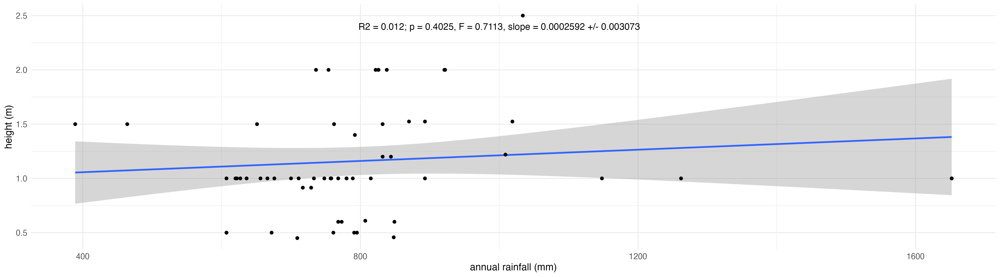

```{r setup, include=FALSE}
knitr::opts_chunk$set(echo = TRUE)

library(moodlequiz)
```

## Reviewing how to express statistical results

<h2>Reviewing how to express statistical results.</h2>

Accurately expressing the results of a statistical test is tricky. Let's review some better and worse ways to express some results. Below is a plot of how plant height shifts across a gradient in annual precipitation, and probably resembles the sort of plot many of your got for Question 2 in your assignment.

{width=100%} <br>

The accompanying statistical output from `summary(height_rainfall)` is:

```{r, eval=FALSE}
height_rainfall <- lm(data = Pimelea_neoanglica, height_edited ~ wc2.1_2.5m_bio_12)

summary(height_rainfall)
```

```
Call:
lm(formula = height_edited ~ wc2.1_2.5m_bio_12, data = Pimelea_neoanglica)

Residuals:
    Min      1Q  Median      3Q     Max 
-0.7160 -0.2584 -0.1318  0.3406  1.2786 

Coefficients:
                   Estimate Std. Error t value Pr(>|t|)    
(Intercept)       0.9534129  0.2559807   3.725 0.000445 ***
wc2.1_2.5m_bio_12 0.0002592  0.0003073   0.843 0.402476    
---
Signif. codes:  0 ‘***’ 0.001 ‘**’ 0.01 ‘*’ 0.05 ‘.’ 0.1 ‘ ’ 1

Residual standard error: 0.5017 on 58 degrees of freedom
Multiple R-squared:  0.01212,	Adjusted R-squared:  -0.004917 
F-statistic: 0.7113 on 1 and 58 DF,  p-value: 0.4025
```

**Ways to express the results**

For each of the following select TRUE if this is a good way to express the statistical results apresented above and FALSE if it could be improved upon.

* *"The relationship between annual precipitation and plant height is weak and not statistically significant (p=0.4025). The model explains only a small proportion of the variation in plant height (R = 0.0012). These results provide strong evidence that precipitation is not associated with variation in plant height."* `r cloze("TRUE", c("TRUE", "FALSE"))`

* *"However with a large p-value of 0.4025, this very weak relationship (R^2 = 0.012) is likely to be by chance."* `r cloze("TRUE", c("TRUE", "FALSE"))`

* *"The results show that for the species Pimelea neoanglica, variation in mean heights has little correlation with annual precipitation. The high P-value of 0.4025 indicates a high likelihood that the results were created by chance."* `r cloze("TRUE", c("TRUE", "FALSE"))`

* *"A high p-value (0.4025), low F-statistic (0.7113), and low R^2 (0.012), indicate that rainfall is only a weak predictor of plant height."* `r cloze("FALSE", c("TRUE", "FALSE"))`

* *"The slope is calculated as 0.0002592 m/mm, but p = 0.4025, so this effect is not statistically significant and has no reliable difference from 0."* `r cloze("TRUE", c("TRUE", "FALSE"))`

* *"However, this relationship was not statistically significant (p = 0.4025) and the model explained a small proportion of the variation in height (R^2 = 0.012). The F-statistic was also low 0.7113). This indicates that there is little evidence for a strong linear relationship between rainfall and height in this species."* `r cloze("FALSE", c("TRUE", "FALSE"))`

* *"The p-value (0.4025) indicates there is a large chance that the results shown here could simply be achieved via chance, rather than a meaningful connection between rainfall amount and plant height."* `r cloze("TRUE", c("TRUE", "FALSE"))`

* *"Further, a p value of 0.4025 reveals that the observed data is consistent with the null hypothesis, meaning that the results displayed are more likely due to random chance than a relationship with rainfall."* `r cloze("TRUE", c("TRUE", "FALSE"))`

* *"The slope = 0.0002592 m/mm, p = 0.4025, but this effect is not statistically significant and has no reliable difference from 0."* `r cloze("TRUE", c("TRUE", "FALSE"))`

* *"Estimated means across rainfall values show minimal variation, supporting the conclusion that, for this species, plant height does not systematically change with rainfall in the observed range.
The p-value of 0.4025 and r2 of 0.012 means that annual rainfall amounts is not a major contributor to Pimelea neoanglica plant heights."* `r cloze("FALSE", c("TRUE", "FALSE"))`
* *"The p-value (0.4025) is larger than 0.05, this suggests the modeled relationship between plant height and rainfall could be a random event."* `r cloze("TRUE", c("TRUE", "FALSE"))`

* *"The very small slope of 0.0002592 indicates that height very slightly increases with rainfall, however this effect is shown to not be statistically significant, as evidenced by a very high p-value of 0.4025."* `r cloze("Bit of both", c("TRUE", "FALSE", "Bit of both"))`


